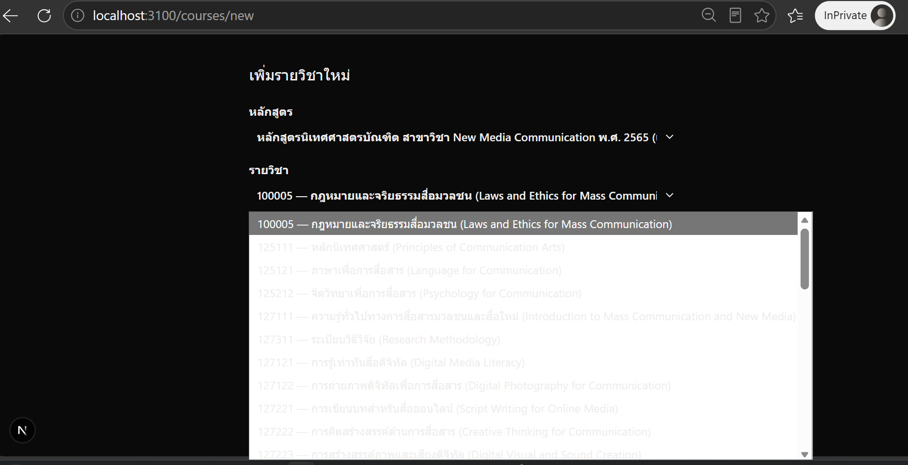
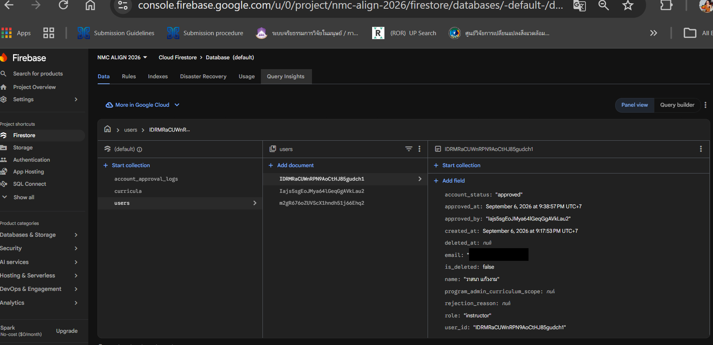

# ALIGN

ระบบติดตามความสอดคล้อง CLO/PLO (สาขา New Media Communication) — อาจารย์ผู้สอนบันทึกการสอนจริงและแนบหลักฐาน ระบบช่วยจับคู่กับ CLO ด้วย AI (เป็นค่าตั้งต้นที่ต้องให้อาจารย์ยืนยันเสมอ) และผู้บริหารหลักสูตรติดตามความครบถ้วนของทั้งหลักสูตร

## URL ออนไลน์

_ยังไม่ได้ deploy — จะเพิ่มลิงก์ตรงนี้หลัง deploy ขึ้น Firebase App Hosting_

## โครงสร้างโปรเจกต์

| โฟลเดอร์/ไฟล์ | คืออะไร |
|---|---|
| `align-app/` | แอปจริง — Next.js 16 + TypeScript + Tailwind CSS, ผูกกับ Firebase project `nmc-align-2026` (Auth/Firestore) |
| `docs/` | เอกสารออกแบบ/สเปคทั้งหมด (Obsidian vault) — requirements, design, testing, retrospectives, log |
| `CLAUDE.md` | คู่มือสำหรับพัฒนาต่อ (สถาปัตยกรรม, คำสั่งที่ใช้บ่อย, กติกาโปรเจกต์) |
| `ACL.md` | ตารางสิทธิ์การเข้าถึงของ 2 บทบาท (อาจารย์ผู้สอน / ผู้บริหารหลักสูตร) |
| `DESIGN.md` | ระบบดีไซน์ (สี/ฟอนต์/คอมโพเนนต์) สำหรับหน้าจอ prototype |
| `SCOPE.md` | เปรียบเทียบโครงสร้างข้อมูลกับแอปตัวอย่าง (สำหรับการบ้านคนละโปรเจกต์ที่แยกไว้) |

## รันโปรเจกต์ในเครื่อง

```bash
cd align-app
npm install
npm run dev
```

เปิด `http://localhost:3000` (หรือพอร์ตที่ระบุ) — ต้องมี `align-app/.env.local` ก่อน (ดูรูปแบบใน `align-app/.env.example`, ใส่ค่า config จริงของ Firebase project เอง ไฟล์นี้มีข้อมูลอ่อนไหว **ห้าม commit**)

### บัญชีสำหรับทดสอบ

- **อาจารย์ผู้สอน**: สมัครเองได้ที่หน้า `/register` (สถานะเริ่มต้น "รออนุมัติ")
- **ผู้บริหารหลักสูตร**: สร้างได้เฉพาะผ่าน `node scripts/seed-program-admin.mjs <email> <password> [ชื่อ]` เท่านั้น (ไม่มีหน้าสมัครในระบบ ตามสเปค) — ถ้าต้องการ credential ของบัญชีที่ seed ไว้แล้วสำหรับทดสอบ/ตรวจงาน ติดต่อขอแยกต่างหาก ไม่เผยแพร่ในไฟล์นี้เพราะ repo เป็น public

## ภาพหน้าจอ

**หน้าเพิ่มรายวิชา** — เลือกหลักสูตร/รายวิชาจริงจาก dropdown (ไม่พิมพ์เอง):



**ข้อมูลใน Cloud Firestore จริง** (ไม่ใช่ mock — บัญชีนี้เป็นข้อมูลทดสอบ ชื่อสมมติ, อีเมลถูกลบออกก่อนเผยแพร่):



## เอกสารเพิ่มเติม

อ่าน `CLAUDE.md` ก่อนแก้ไขโค้ด — มีรายละเอียดสถาปัตยกรรม กฎทางธุรกิจ และคำสั่ง build/lint/test ครบ
