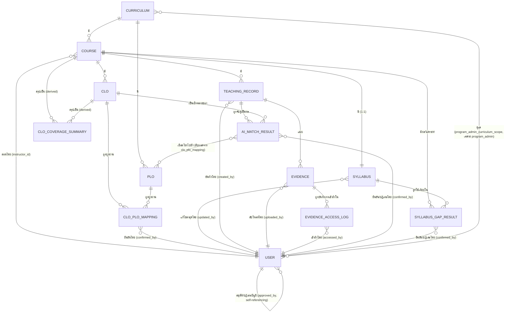

# API Spec + Database Schema (Conceptual): ระบบติดตามความสอดคล้อง CLO/PLO (ALIGN)

เอกสารนี้เป็น**ระดับแนวคิด (conceptual)** ของ ER Diagram, รายละเอียดฟิลด์ต่อ entity, และ API Spec — ตั้งใจ**ไม่ผูกมัดกับ technical stack ใดๆ** (ไม่มีชื่อ database engine, ORM, API framework, ภาษาโปรแกรม, cloud provider) เพื่อให้สื่อสารได้กับทุกฝ่ายที่เกี่ยวข้อง ไม่ใช่แค่ทีมพัฒนา — คำถาม "จะ implement/deploy ด้วยอะไร" อยู่ที่ [[align-technical-design#5. Tech Stack — ข้อเสนอ (ยืนยันกับทีมพัฒนาก่อนเริ่มจริง)|align-technical-design §5]] แทน

**ความสัมพันธ์กับเอกสารอื่น**:
- [[align-high-level-architecture|align-high-level-architecture]] — ชั้นแนวคิดที่มาก่อน ใช้ชื่อ logical component (เช่น "ประตูควบคุมสิทธิ์และสถานะบัญชี", "แกนประสานงานและบังคับใช้กฎทางธุรกิจ", "กลไกจับคู่/วิเคราะห์ด้วย AI") เอกสารนี้อ้างอิงชื่อเดียวกันเวลาระบุว่า endpoint ไหนอยู่ในความรับผิดชอบของ component ไหน
- [[align-technical-design|align-technical-design]] §2 (Database Schema) และ §3 (API Design) — เป็น**ฐาน**ที่เอกสารนี้ต่อยอด ไม่ขัดแย้งกัน แต่ทำละเอียดกว่าเดิม (เพิ่ม ER Diagram, เพิ่มรายละเอียด per-entity ที่ยังขาด เช่น indexing เชิงแนวคิด/PDPA flag ต่อฟิลด์/CRUD ที่ prototype ต้องการแต่ยังไม่มี endpoint) — ฟิลด์/endpoint ที่มีอยู่แล้วใน align-technical-design.md คงชื่อ/ความหมายเดิมทุกจุด
- [[../01-prototypes/align-app-screens|align-app-screens]] และ [[../01-prototypes/align-program-admin-screens|align-program-admin-screens]] — ใช้ตรวจว่า schema/API รองรับทุก field/flow ที่หน้าจอต้องการจริง
- [[../../01-requirements/02-plan/product-backlog|product-backlog]] — ทุก endpoint/entity อ้าง AC ที่เกี่ยวข้อง

> หมายเหตุคุมทั้งเอกสาร (สืบทอดจาก align-technical-design.md): ทุกที่ที่มีคำว่า **หลักสูตร (curriculum)** หมายถึงกลุ่มหลักสูตร **2565** หรือ **2570** เท่านั้น ห้ามมี entity หรือ query ใดที่ผสาน/จับคู่ข้อมูลข้าม 2 กลุ่มนี้

---

## 1. Conceptual Data Model (ภาพรวม)

ระบบ ALIGN เก็บข้อมูลเป็น 6 กลุ่มหลักที่เกี่ยวโยงกันตามลำดับการใช้งานจริง (E1 → E6):

1. **กลุ่มโครงสร้างหลักสูตร** (`curriculum`, `plo`, `clo`, `clo_plo_mapping`) — เป็นข้อมูลตั้งต้นที่ต้องมีก่อนสิ่งอื่นทั้งหมด แยกขาดกันเด็ดขาดระหว่างกลุ่มหลักสูตร 2565/2570 (ทั้ง `plo` และ `clo` ต้องรู้ตัวเองว่าอยู่กลุ่มไหนเสมอ และการผูก `clo_plo_mapping` ทำได้เฉพาะภายในกลุ่มเดียวกัน)
2. **กลุ่มรายวิชาและแผนการสอน** (`course`, `syllabus`) — รายวิชาแต่ละวิชาสังกัดกลุ่มหลักสูตรเดียวและมีอาจารย์ผู้สอนหลัก 1 คน, syllabus ผูกกับรายวิชาแบบ 1:1 เก็บทั้งไฟล์ทางการ (อ้างอิงเฉยๆ) และหัวข้อรายสัปดาห์ (ใช้วิเคราะห์ gap จริง)
3. **กลุ่มหลักฐานการสอนจริง** (`teaching_record`, `evidence`) — ข้อมูลที่อาจารย์บันทึกหลังสอนจริงแต่ละครั้ง พร้อมไฟล์แนบที่อาจมีข้อมูลส่วนบุคคลของนักศึกษาปะปน (ต้องควบคุมสิทธิ์ตาม PDPA)
4. **กลุ่มผลลัพธ์จาก AI (draft/confirmed)** (`ai_match_result`, `clo_coverage_summary`, `syllabus_gap_result`) — ทุก entity ในกลุ่มนี้ต้องมี state แยก draft/confirmed ชัดเจนตามกฎ #3 เพราะเป็นค่าตั้งต้นที่ต้องผ่านการยืนยันของอาจารย์ก่อนใช้เป็นข้อมูลจริง — `clo_coverage_summary` เป็นค่าที่ derived มาจาก `ai_match_result` ที่ confirmed เท่านั้น จึงสืบทอด "ความน่าเชื่อถือ" มาโดยอัตโนมัติแต่ไม่ต้องมี state ของตัวเองซ้ำอีกชั้น
5. **กลุ่มบัญชีผู้ใช้และการอนุมัติ** (`user`) — 2 บทบาทเท่านั้น (`instructor`/`program_admin`) พร้อมสถานะบัญชี (`pending`/`approved`/`rejected`) ที่ gate การเข้าถึงทุกอย่างข้างต้น
6. **กลุ่ม audit trail ของ PDPA** (`evidence_access_log`) — บันทึกทุกครั้งที่มีการเข้าถึงไฟล์หลักฐาน แยกจากข้อมูลหลักเพื่อไม่ให้ปนกับ business data

ทิศทางการไหลของข้อมูลคร่าวๆ: กลุ่ม 1 → 2 ต้องเสร็จก่อนกลุ่ม 3 จะเริ่มได้ (กฎ #1) → กลุ่ม 3 ป้อนเข้ากลุ่ม 4 (ผ่าน AI, เป็น draft เสมอ) → อาจารย์ยืนยันกลุ่ม 4 → กลุ่ม 4 ที่ confirmed แล้วเท่านั้นถูกใช้สร้างเอกสารส่งออก (E5, ไม่ได้สร้าง entity ใหม่ในเอกสารนี้เพราะเป็นผลลัพธ์ชั่วคราวที่ประกอบจากข้อมูล confirmed ไม่ใช่ข้อมูลที่ระบบเก็บถาวรเป็นตารางแยก) — กลุ่ม 5 คร่อมทุกอย่างเป็น access gate และกลุ่ม 6 บันทึกร่องรอยการเข้าถึงกลุ่ม 3

---

## 2. ER Diagram

**อ่านไดอะแกรมนี้อย่างไร**:
- `CURRICULUM ||--o{ PLO`, `CURRICULUM ||--o{ COURSE` — หลักสูตร 1 กลุ่ม มี PLO/รายวิชาได้หลายรายการ (1:N) แต่ PLO/รายวิชา 1 รายการสังกัดหลักสูตรเดียวเท่านั้น (บังคับ ไม่ nullable)
- `CLO`–`PLO` เป็น **N:M ผ่าน `CLO_PLO_MAPPING`** — CLO 1 ข้อผูกได้หลาย PLO และ PLO 1 ข้อถูกผูกได้จากหลาย CLO แต่**ต้องอยู่ curriculum เดียวกันเสมอ** (constraint นี้บังคับที่ระดับ application/insert-time ไม่ใช่ cardinality ของ diagram แต่ระบุกำกับไว้ในป้ายความสัมพันธ์)
- `COURSE ||--|| SYLLABUS` — 1:1 บังคับ (unique FK) ตามที่ align-technical-design.md §2.6 กำหนดไว้แล้ว
- `TEACHING_RECORD ||--o{ AI_MATCH_RESULT`, `CLO ||--o{ AI_MATCH_RESULT` — บันทึกการสอน 1 รายการถูกจับคู่ได้กับหลาย CLO (แต่ละคู่เป็น 1 แถวใน `ai_match_result`), CLO 1 ข้อก็ถูกจับคู่ได้จากหลายบันทึกการสอน — จึงเป็นความสัมพันธ์แบบ N:M ระหว่าง `teaching_record` กับ `clo` โดยมี `ai_match_result` เป็น entity ตัวกลางที่เก็บ state/ค่าความมั่นใจต่อคู่นั้น (ไม่ใช่ pure junction table เพราะมีฟิลด์ของตัวเอง)
- `AI_MATCH_RESULT }o--o{ PLO` — N:M เชิงแนวคิด (ai_match_result หนึ่งรายการเชื่อมได้หลาย PLO ที่สืบทอดมาจาก `clo_plo_mapping` ของ CLO นั้น) — **[ยืนยันแล้ว, ดูหัวข้อ 5.3]** เก็บเป็น **array field ในแถว `ai_match_result` เดียว** (denormalize) ไม่แยก junction table และไม่ derive สดจาก `clo_plo_mapping` — ค่านี้เป็น **snapshot ณ ตอนยืนยันผล** เพื่อให้เอกสาร export อ้างอิงค่าที่ถูกต้อง ณ ตอนที่อาจารย์ยืนยันเสมอ แม้ `clo_plo_mapping` จะถูกแก้ไขภายหลัง
- `COURSE ||--o{ CLO_COVERAGE_SUMMARY`, `CLO ||--o{ CLO_COVERAGE_SUMMARY` — เอนทิตี derived มี key ประกอบ (`course_id`, `clo_id`) ต่อ 1 แถว ไม่มี PK ของตัวเองแยกต่างหาก
- `USER }o--o{ CURRICULUM` (ผ่าน `program_admin_curriculum_scope`) — เฉพาะบัญชี `program_admin` เท่านั้นที่มีความสัมพันธ์นี้ (`instructor` ไม่มี scope นี้)
- `USER ||--o{ USER` — self-referencing แทน `approved_by` (ผู้บริหารหลักสูตรที่อนุมัติ/ปฏิเสธบัญชีอาจารย์ผู้สอนอีกคน)

ทุก entity ที่กล่าวถึงในเอกสารนี้ (13 entity) ปรากฏในไดอะแกรมข้างต้นครบทุกตัว ไม่มี entity ตกหล่น

---

## 3. รายละเอียดแต่ละตาราง (Per-Entity Detail)

ทุกตารางด้านล่างมีคอลัมน์ **PDPA/Draft-Confirmed** เพื่อกำกับชัดว่าฟิลด์ใดมีข้อมูลส่วนบุคคลของนักศึกษา/ต้องควบคุมสิทธิ์ (กฎ #5) หรือฟิลด์ใดเป็นผลลัพธ์จาก AI ที่ต้องมี state แยก draft/confirmed (กฎ #3) — เขียน "—" เมื่อไม่เกี่ยวข้อง

### 3.1 `curriculum` (กลุ่มหลักสูตร)

| ฟิลด์ | ชนิดเชิงแนวคิด | Constraint | ความสัมพันธ์ | PDPA/Draft-Confirmed |
|---|---|---|---|---|
| curriculum_id | PK | required, unique | เป็นเป้าหมาย FK จาก `plo`, `course`, `user.program_admin_curriculum_scope` | — |
| year_code | enum('2565','2570') | required, unique | ค่าคงที่ 2 ค่าตามสเปค ห้ามเพิ่มค่าใหม่โดยไม่ยืนยันกับสเปคก่อน | — |
| name | string | required | ชื่อหลักสูตรเต็ม | — |
| is_active | boolean | required, default true | ใช้กรองหลักสูตรที่ยังใช้งานอยู่ (ทั้งสองกลุ่มยังใช้งานคู่ขนานได้ตามสเปค) | — |

**Indexing เชิงแนวคิด**: ดัชนีที่ `year_code` (unique) เพราะเป็นคีย์ที่ path ของ API ใช้ค้นหาแทบทุกครั้ง (`/curricula/{year}/...`)

### 3.2 `plo` (Program Learning Outcome)

| ฟิลด์ | ชนิดเชิงแนวคิด | Constraint | ความสัมพันธ์ | PDPA/Draft-Confirmed |
|---|---|---|---|---|
| plo_id | PK | required, unique | เป้าหมาย FK จาก `clo_plo_mapping` | — |
| curriculum_id | FK → curriculum | **required, ห้ามแก้ไขหลังสร้าง** (ป้องกันย้าย PLO ข้ามกลุ่มโดยไม่ตั้งใจ) | PLO 1 ข้อสังกัดหลักสูตรเดียวเสมอ | — |
| code | string | required, **unique ภายใน curriculum_id เดียวกัน** (ไม่บังคับ unique ข้าม 2 กลุ่ม เพราะ 2565/2570 มีรหัส "PLO1..PLO9" ซ้ำกันได้) | — | — |
| description | text | required | — | — |
| is_deleted | boolean | required, default `false` | **[ยืนยันแล้ว — หัวข้อ 5.1]** ธง soft-delete — PLO นี้ยังคง "มีอยู่จริง" ในฐานข้อมูลเสมอเพื่อรักษาความสมบูรณ์ของข้อมูลย้อนหลัง (mapping/เอกสารที่เคยอ้างอิงยังคงถูกต้อง) แต่ถูกซ่อนจากตัวเลือกที่ใช้งานได้ใหม่ (เช่น dropdown ผูก CLO–PLO) | — |
| deleted_at | datetime, nullable | ต้อง not-null คู่กับ `is_deleted = true` | — | — |

**Indexing เชิงแนวคิด**: ดัชนีที่ `curriculum_id` เพราะทุก query PLO ต้องกรองตามกลุ่มหลักสูตรก่อนเสมอ (cross-cutting rule) — ควรมีดัชนีที่ `is_deleted` ร่วมด้วย เพราะแทบทุก query ที่แสดง PLO ให้เลือกใช้งานต้องกรอง `is_deleted = false` เสมอ

**Delete/Deactivate — [ยืนยันแล้ว, หัวข้อ 5.1]**: `DELETE /curricula/{year}/plos/{plo_id}` เป็น **soft-delete เสมอ** (ตั้ง `is_deleted = true`, `deleted_at = now()`) ไม่ลบแถวจริง — PLO ที่มี `clo_plo_mapping` ผูกอยู่แล้วยังคง valid ในข้อมูลย้อนหลังทั้งหมด (mapping เดิม, `ai_match_result.linked_plo_ids` ที่เคย snapshot ไว้, เอกสาร Word ที่เคย export) ไม่ต้องบล็อกการลบด้วย 409 อีกต่อไป — สิ่งที่ backend ต้องทำเพิ่มหลัง soft-delete: (1) ไม่แสดง PLO นี้เป็นตัวเลือกให้ผูกใหม่อีก, (2) ถ้าการ soft-delete ทำให้ CLO ใดเหลือ PLO ที่ `is_deleted=false` ผูกอยู่ 0 ข้อ ต้อง re-evaluate `course.clo_plo_ready` ทันที (อาจทำให้กลับไปเป็น `false` และล็อกการบันทึกการสอนใหม่ ตามกฎ #1)

### 3.3 `clo` (Course Learning Outcome)

| ฟิลด์ | ชนิดเชิงแนวคิด | Constraint | ความสัมพันธ์ | PDPA/Draft-Confirmed |
|---|---|---|---|---|
| clo_id | PK | required, unique | เป้าหมาย FK จาก `clo_plo_mapping`, `ai_match_result`, `clo_coverage_summary` | — |
| course_id | FK → course | required, **ห้ามแก้ไขหลังสร้าง** | CLO 1 ข้อสังกัดวิชาเดียวเสมอ | — |
| curriculum_id | FK → curriculum | required, **denormalized จาก `course.curriculum_id`** เพื่อ query/ตรวจ constraint ข้าม curriculum ได้เร็วโดยไม่ต้อง join ทุกครั้ง (ตัดสินใจแล้วใน align-technical-design.md §2.3 — เอกสารนี้คงตามเดิม) | ต้องตรงกับ `course.curriculum_id` ของ course ที่สังกัดเสมอ (ตรวจตอน insert/update) | — |
| code | string | required, unique ภายใน `course_id` เดียวกัน | — | — |
| description | text | required | — | — |
| is_deleted | boolean | required, default `false` | **[ยืนยันแล้ว — หัวข้อ 5.1]** ธง soft-delete — เช่นเดียวกับ `plo` | — |
| deleted_at | datetime, nullable | ต้อง not-null คู่กับ `is_deleted = true` | — | — |

**Indexing เชิงแนวคิด**: ดัชนีที่ `course_id` (ทุกหน้าจอ CLO list กรองตามวิชา), ดัชนีที่ `curriculum_id` (ใช้ตรวจ constraint ข้ามกลุ่มก่อนเขียน `clo_plo_mapping`) และดัชนีที่ `is_deleted` (กรองออกจากรายการที่ใช้งานได้)

**Delete/Deactivate — [ยืนยันแล้ว, หัวข้อ 5.1]**: `DELETE /courses/{id}/clos/{clo_id}` เป็น **soft-delete เสมอ** (ตั้ง `is_deleted = true`, `deleted_at = now()`) — CLO ที่มี `ai_match_result` (รวมที่ confirmed แล้ว) อ้างอิงอยู่ยังคง valid ในข้อมูลย้อนหลังทั้งหมด ไม่ต้องบล็อกด้วย 409 อีกต่อไป — สิ่งที่ backend ต้องทำเพิ่มหลัง soft-delete: (1) ไม่แสดง CLO นี้ในรายการ CLO ของวิชาอีก, (2) re-evaluate `course.clo_plo_ready` ทันที (นับเฉพาะ CLO ที่ `is_deleted=false` ที่มี PLO ผูกอยู่), (3) `total_clo_count` ใน `clo_coverage_summary` (หัวข้อ 3.10) ต้องนับเฉพาะ CLO ที่ `is_deleted=false` ของวิชานั้นเท่านั้น (ฐาน 100% ไม่รวม CLO ที่ถูกลบแล้ว)

### 3.4 `clo_plo_mapping`

| ฟิลด์ | ชนิดเชิงแนวคิด | Constraint | ความสัมพันธ์ | PDPA/Draft-Confirmed |
|---|---|---|---|---|
| mapping_id | PK | required, unique | — | — |
| clo_id | FK → clo | required | — | — |
| plo_id | FK → plo | required | — | — |
| confirmed_by | FK → user | required | ผู้ยืนยันการผูก (อาจารย์ผู้สอนวิชานั้น) | — |
| created_at | datetime | required | — | — |

**Constraint สำคัญที่สุดของเอนทิตีนี้** (สืบทอดจาก align-technical-design.md §2.4, คงเดิม): `clo_plo_mapping.clo.curriculum_id == clo_plo_mapping.plo.curriculum_id` เสมอ — บังคับที่ระดับ application ก่อน insert และควรมี DB-level check เพิ่มถ้าเป็นไปได้ (ห้ามผูก CLO กับ PLO ต่างหลักสูตรกันเด็ดขาด ตรงกฎทางธุรกิจ + AB-03)

**Uniqueness**: คู่ `(clo_id, plo_id)` ควร unique — ผูกซ้ำคู่เดิมไม่ควรสร้างแถวใหม่ (ป้องกัน `clo_coverage_summary`/นับซ้ำผิดพลาด)

**Indexing เชิงแนวคิด**: ดัชนีที่ `clo_id` (เช็ค `clo_plo_ready` ของวิชาต้องนับจำนวน mapping ต่อ CLO บ่อยมาก) และดัชนีที่ `plo_id` (ใช้แสดง "PLO นี้ถูกผูกจาก CLO ใดบ้าง" ในแดชบอร์ดหลักสูตร)

**Delete**: การ "ปลด" การผูก CLO–PLO (unlink) เป็นการลบแถวนี้จริง (hard-delete) ได้โดยไม่ขัดกฎ PDPA/หลักฐาน เพราะ mapping เองไม่ใช่หลักฐานการสอน — `plo`/`clo` ใช้ **soft-delete** (หัวข้อ 3.2/3.3) แต่ `clo_plo_mapping` เองไม่อยู่ในรายการ 5 entity ที่ตัดสินใจ soft-delete ([ยืนยันแล้ว, หัวข้อ 5.1] ระบุเฉพาะ `plo`, `clo`, `teaching_record`, `evidence`, `user`) จึง hard-delete แถว mapping ได้ตามปกติเมื่อกด unlink — backend ต้อง re-evaluate `course.clo_plo_ready` ทันทีหลัง unlink (ถ้าทำให้ CLO ที่ผูก PLO เหลือ 0 ข้อ ต้องล็อกการบันทึกการสอนใหม่ทันที แม้จะมี `teaching_record`/`ai_match_result` ที่ confirmed แล้วอยู่ก่อนหน้า — ข้อมูลเก่ายังคงอยู่ ไม่ถูกลบย้อนหลัง) — **หมายเหตุเพิ่มเติมจากการยืนยัน soft-delete ของ `plo`/`clo`**: ถ้า `plo` หรือ `clo` ฝั่งใดฝั่งหนึ่งของ mapping ถูก soft-delete (`is_deleted=true`) ในภายหลัง แถว `clo_plo_mapping` เดิม**ไม่ถูกลบตาม**และไม่ถือเป็น error แต่ backend ต้องไม่นับ mapping ที่ชี้ไปยัง CLO/PLO ที่ `is_deleted=true` เป็นส่วนหนึ่งของเงื่อนไข "ผูก CLO–PLO ครบแล้ว" (`clo_plo_ready`) อีกต่อไป

### 3.5 `course` (รายวิชา)

| ฟิลด์ | ชนิดเชิงแนวคิด | Constraint | ความสัมพันธ์ | PDPA/Draft-Confirmed |
|---|---|---|---|---|
| course_id | PK | required, unique | เป้าหมาย FK จากแทบทุก entity อื่น | — |
| curriculum_id | FK → curriculum | **required, ห้ามแก้ไขหลังสร้าง** | ทุกวิชาต้องระบุกลุ่มหลักสูตรก่อนป้อน CLO ได้ (AB-02) | — |
| code | string | required, unique (ทั่วทั้งระบบ — รหัสวิชาจริงไม่ซ้ำข้าม 2 หลักสูตรตามข้อมูลจริงใน plo-course-master-data) | — | — |
| name | string | required | — | — |
| instructor_id | FK → user | required, `user.role = 'instructor'` เท่านั้น | อาจารย์ผู้สอนหลัก ใช้ตรวจสิทธิ์ PDPA เข้าถึง `evidence` ของวิชานี้ | — |
| clo_plo_ready | boolean (computed) | ไม่ใช่ input ตรง — คำนวณจาก `COUNT(clo_plo_mapping) WHERE clo.course_id = course_id) > 0` | ใช้เป็นเงื่อนไข gate ก่อนบันทึกการสอน (กฎ #1) | — |
| created_at / updated_at | datetime | required | — | — |

**Indexing เชิงแนวคิด**: ดัชนีที่ `curriculum_id` (ตัวกรองหลักของแทบทุก query ในระบบ), ดัชนีที่ `instructor_id` (หน้า "รายวิชาของฉัน" และตรวจสิทธิ์ PDPA), unique index ที่ `code`

### 3.6 `syllabus` (course syllabus)

| ฟิลด์ | ชนิดเชิงแนวคิด | Constraint | ความสัมพันธ์ | PDPA/Draft-Confirmed |
|---|---|---|---|---|
| syllabus_id | PK | required, unique | — | — |
| course_id | FK → course | required, **unique** (1:1) | ไม่มี `curriculum_id` แยก — สืบทอด scope จาก `course.curriculum_id` | — |
| content | โครงสร้างยืดหยุ่น (list of `{week_no, topic, detail}`) | required เมื่อใช้เป็น input gap analysis (ไม่บังคับตอนสร้าง syllabus ครั้งแรกถ้ายังไม่มีข้อมูล) | ใช้เทียบกับ `teaching_record.topic` ใน `syllabus_gap_result` | — |
| origin_file_ref | ตัวชี้ไฟล์ (file reference) | **required** — สาขากำหนดต้องมีไฟล์ทางการ | ชี้ไฟล์ในที่เก็บหลักฐาน แต่**ไม่ถูก parse อัตโนมัติ** | ไม่ใช่ชิ้นงานนักศึกษา จึงไม่ต้องมี flag PII เหมือน `evidence` (เอกสารสาขา ไม่ใช่ข้อมูลส่วนบุคคล) |
| updated_by | FK → user | required | อาจารย์ผู้แก้ไขล่าสุด | — |
| updated_at | datetime | required | update-in-place ไม่มี version history (Accepted Risk ตาม align-technical-design.md §2.6 — คงตามเดิม) | — |

**Indexing เชิงแนวคิด**: unique index ที่ `course_id` (บังคับ 1:1)

### 3.7 `teaching_record` (บันทึกการสอน)

| ฟิลด์ | ชนิดเชิงแนวคิด | Constraint | ความสัมพันธ์ | PDPA/Draft-Confirmed |
|---|---|---|---|---|
| record_id | PK | required, unique | เป้าหมาย FK จาก `evidence`, `ai_match_result` | — |
| course_id | FK → course | required — backend ต้องปฏิเสธ insert ถ้า `course.clo_plo_ready = false` (กฎ #1) | — | — |
| topic | string | required | หัวข้อการสอนจริง — ใช้เป็น input เทียบกับ `syllabus.content` | ไม่ใช่ข้อมูลส่วนบุคคลของนักศึกษา (เป็นหัวข้อวิชา) |
| week_no | integer | required | ใช้ทำแผนที่ CLO×สัปดาห์ | — |
| taught_at | date | required, ค่าเริ่มต้น = วันนี้ ไม่รับวันที่ในอนาคต (validate ที่ backend ไม่ใช่แค่ UI) | สื่อว่าเป็นการบันทึกหลังสอนจริง ไม่ใช่แผนล่วงหน้า | — |
| created_by | FK → user | required, ต้องเป็น `instructor_id` เดียวกับ `course.instructor_id` | — | — |
| status | enum('draft_ai_pending','confirmed') | required, default `draft_ai_pending` | สถานะการยืนยันผล AI ของบันทึกนี้โดยรวม (แยกจาก state รายรายการใน `ai_match_result`) | ระบุ state ระดับบันทึกการสอน — เปลี่ยนเป็น `confirmed` เมื่ออาจารย์ยืนยัน `ai_match_result` ที่เกี่ยวข้องอย่างน้อย 1 รายการ (หรือยืนยันครบตาม policy ที่ทีมพัฒนากำหนด) |
| is_deleted | boolean | required, default `false` | **[ยืนยันแล้ว — หัวข้อ 5.1]** ธง soft-delete | — |
| deleted_at | datetime, nullable | ต้อง not-null คู่กับ `is_deleted = true` | — | — |

**Indexing เชิงแนวคิด**: ดัชนีที่ `course_id` (แทบทุก query กรองตามวิชา), ดัชนีที่ `(course_id, week_no)` (แผนที่ CLO×สัปดาห์ต้อง group ตามสัปดาห์บ่อย), ดัชนีที่ `is_deleted`

**Delete — [ยืนยันแล้ว, หัวข้อ 5.1]**: soft-delete เสมอ (`is_deleted=true`, `deleted_at=now()`) — บันทึกการสอนที่เคยถูกใช้คำนวณ `ai_match_result`/ปรากฏในเอกสาร Word ที่ export ไปแล้วยังคง valid ครบถ้วนตามกฎ #4 แม้อาจารย์จะ "ลบ" ออกจากหน้าจอที่ใช้งานอยู่ก็ตาม — แผนที่ CLO×สัปดาห์ (หน้าจอ 7) และ `clo_coverage_summary` ต้องกรอง `is_deleted=false` ก่อนคำนวณ/แสดงผลเสมอ เพื่อไม่ให้บันทึกที่ถูก "ลบ" แล้วยังถูกนับเป็นข้อมูลปัจจุบัน แต่เอกสารเก่าที่เคย export ไปแล้วยังอ้างอิงข้อมูลเดิมได้ครบ (ไม่กระทบย้อนหลัง)

### 3.8 `evidence` (ชิ้นงาน/หลักฐาน)

| ฟิลด์ | ชนิดเชิงแนวคิด | Constraint | ความสัมพันธ์ | PDPA/Draft-Confirmed |
|---|---|---|---|---|
| evidence_id | PK | required, unique | เป้าหมาย FK จาก `evidence_access_log` | — |
| teaching_record_id | FK → teaching_record | required | แนบได้หลายไฟล์ต่อ 1 บันทึกการสอน (AB-06) | — |
| file_ref | ตัวชี้ไฟล์ | required | ชี้ไฟล์ในที่เก็บหลักฐาน/ชิ้นงานควบคุมสิทธิ์ตาม PDPA — ไม่เก็บไฟล์จริงในตารางนี้ | **PDPA: สูง** — ไฟล์ที่ชี้ถึงอาจมีข้อมูลส่วนบุคคลของนักศึกษา |
| file_name | string | required | — | **PDPA: กลาง–สูง** — ชื่อไฟล์อาจมีชื่อนักศึกษา/กลุ่มปะปน — ห้ามแสดงในหน้าจอที่ผู้ใช้ไม่มีสิทธิ์ (ตาม UX Rule 4 ที่ prototype ระบุ) |
| uploaded_by | FK → user | required | — | — |
| uploaded_at | datetime | required | — | — |
| contains_student_pii | boolean | required, **default true** (ระมัดระวังไว้ก่อน) | ใช้เป็น flag ประกอบการควบคุมสิทธิ์ PDPA | **PDPA: ฟิลด์ตัวกำกับหลักของทั้งเอนทิตี** |
| is_deleted | boolean | required, default `false` | **[ยืนยันแล้ว — หัวข้อ 5.1]** ธง soft-delete — สำคัญที่สุดในบรรดา 5 entity ที่ตัดสินใจ soft-delete เพราะเป็น "หลักฐานจริง" ตามกฎ #4 โดยตรง | **PDPA: ต้องยังคงบังคับสิทธิ์เข้าถึงเดิมแม้ `is_deleted=true` แล้ว** (ไม่ใช่เปิดให้ทุกคนเข้าถึงไฟล์ที่ "ลบแล้ว" ได้ง่ายขึ้น) |
| deleted_at | datetime, nullable | ต้อง not-null คู่กับ `is_deleted = true` | — | — |

**Indexing เชิงแนวคิด**: ดัชนีที่ `teaching_record_id`, ดัชนีที่ `is_deleted`

**Access control**: ผู้เข้าถึงต้องเป็น `instructor_id` ของ course ที่สังกัด หรือ `program_admin` ที่มี `curriculum_id` ของ course นั้นอยู่ใน `program_admin_curriculum_scope` เท่านั้น (กฎ #5) — ตรวจที่ backend ทุกครั้งที่ return ไฟล์/URL ไม่ใช่พึ่ง UI ซ่อนอย่างเดียว — กติกานี้ใช้เหมือนกันไม่ว่า `is_deleted` จะเป็น `true` หรือ `false`

**Delete — [ยืนยันแล้ว, หัวข้อ 5.1]**: `DELETE /teaching-records/{id}/evidence/{evidence_id}` เป็น **soft-delete เสมอ** (ตั้ง `is_deleted=true`, `deleted_at=now()`) ทั้งกรณีลบไฟล์ที่แนบผิดก่อนยืนยันบันทึก (AB-06) และกรณีอื่นใด — ไม่ลบแถว/ไฟล์จริงทันที เพื่อ (1) รักษาความสมบูรณ์ของเอกสาร Word ที่เคย export อ้างอิงไฟล์นี้ไปแล้วตามกฎ #4 และ (2) รักษา audit trail ของ PDPA ว่าเคยมีไฟล์ใดถูกแนบ/ถอดออกบ้าง (กฎ #5) — หน้าจอ Evidence Attachment List (หน้าจอ 5) และรายการหลักฐานที่ใช้สร้างเอกสาร export ต้องกรอง `is_deleted=false` เสมอ เพื่อไม่ให้ไฟล์ที่ถูก "ลบ" ปรากฏเป็นตัวเลือกที่ใช้งานได้อีก — การลบไฟล์จริงออกจากที่เก็บหลักฐาน (physical storage) ถ้าต้องการทำเพื่อประหยัดพื้นที่/ตามนโยบายเก็บรักษาข้อมูล เป็นรายละเอียดเชิง implementation ที่ทีมพัฒนา/technical-designer กำหนดแยกต่างหาก (เช่น job ลบไฟล์จริงหลังพ้นระยะเวลาที่กำหนด) ไม่ใช่ส่วนหนึ่งของ schema เชิงแนวคิดนี้

### 3.9 `ai_match_result` (ผลจับคู่ CLO/PLO ต่อบันทึกการสอน — draft/confirmed)

| ฟิลด์ | ชนิดเชิงแนวคิด | Constraint | ความสัมพันธ์ | PDPA/Draft-Confirmed |
|---|---|---|---|---|
| match_result_id | PK | required, unique | — | — |
| teaching_record_id | FK → teaching_record | required | — | — |
| clo_id | FK → clo | required, ต้องอยู่ curriculum เดียวกับ `course` ของ `teaching_record` (ตรวจตอนสร้าง — ป้องกันข้ามหลักสูตร ตาม AB-08) | — | — |
| match_confidence | decimal (0–100 หรือ 0–1 แล้วแต่ทีมพัฒนา) | required | ค่าความมั่นใจของ AI ต่อคู่นี้โดยเฉพาะ — **ไม่ใช่** ค่า "% ความสอดคล้อง" ระดับวิชาที่แสดงในแดชบอร์ด (นั่นคือ `clo_coverage_summary.coverage_percent`) | **Draft-Confirmed: ค่าตั้งต้นจาก AI** — ต้องผ่านยืนยันก่อนใช้จริง |
| linked_plo_ids | FK[] → plo (array field, denormalized) | required, ทุก PLO ต้องอยู่ curriculum เดียวกัน (สืบทอดจาก `clo_plo_mapping` ที่มีอยู่ ณ ตอนสร้าง/แก้ไข ไม่ใช่ AI เดา) | **[ยืนยันแล้ว, หัวข้อ 5.3]** เก็บเป็น array field ในแถวนี้เอง ไม่แยก junction table และไม่ derive สดจาก `clo_plo_mapping` ทุกครั้งที่อ่าน — ค่าเริ่มต้นถูกดึงมาจาก `clo_plo_mapping` ปัจจุบันตอนสร้าง `ai_match_result` (state=draft), แก้ไขได้ระหว่างที่ยัง `draft`/`edited`, และ**ถูกล็อกเป็น snapshot ถาวรทันทีที่ `state` เปลี่ยนเป็น `confirmed`** — หลังจากนั้นแม้ `clo_plo_mapping` จะถูกแก้ไข/ปลดในภายหลัง ค่าที่ยืนยันไว้แล้วนี้จะ**ไม่เปลี่ยนตาม** เพื่อให้เอกสาร export และแดชบอร์ดอ้างอิงค่า PLO ที่ถูกต้อง ณ ตอนอาจารย์ยืนยันจริงเสมอ (ตรงเจตนารมณ์กฎ #4) | — |
| state | enum('draft','edited','confirmed','rejected') | required, default `draft` | **draft** = ค่าตั้งต้นจาก AI; **edited** = อาจารย์แก้ไขก่อนยืนยัน; **confirmed** = ยืนยันแล้ว นับเป็นหลักฐานจริง; **rejected** = ไม่นับ | **Draft-Confirmed: ฟิลด์ state หลักของเอนทิตีนี้ — พลาดไม่ได้ตามกฎ #3** |
| confirmed_by | FK → user, nullable | ต้อง not-null เมื่อ `state = 'confirmed'` | ต้องเป็นอาจารย์ผู้สอนวิชานั้นเท่านั้น (ไม่ใช่ program_admin — human-in-the-loop เป็นหน้าที่ผู้สอน) | — |
| confirmed_at | datetime, nullable | คู่กับ `confirmed_by` | — | — |

**กฎสำคัญที่สุด**: เฉพาะ `state = 'confirmed'` เท่านั้นที่ถูกนับเป็น "การแมทช์" ใน `clo_coverage_summary`, แผนที่ CLO×สัปดาห์, และเอกสาร Word export — draft/edited/rejected ไม่ถูกนับเป็นหลักฐานจริงไม่ว่ากรณีใด (กฎ #3, #4)

**Indexing เชิงแนวคิด**: ดัชนีที่ `teaching_record_id`, ดัชนีที่ `(clo_id, state)` (คำนวณ `clo_coverage_summary` ต้อง query "CLO นี้มีกี่แถวที่ confirmed" บ่อยที่สุดในระบบ)

### 3.10 `clo_coverage_summary` (สรุป % ความสอดคล้อง + ความถี่ที่แมทช์ระดับวิชา — derived)

| ฟิลด์ | ชนิดเชิงแนวคิด | Constraint | ความสัมพันธ์ | PDPA/Draft-Confirmed |
|---|---|---|---|---|
| course_id | FK → course (ส่วนหนึ่งของ composite key) | required | ขอบเขตการคำนวณ = รายวิชา | — |
| clo_id | FK → clo (ส่วนหนึ่งของ composite key) | required, ต้องอยู่ curriculum เดียวกับ course | — | — |
| total_clo_count | integer | required, เท่ากันทุกแถวของ course เดียวกัน | = `COUNT(clo) WHERE clo.course_id = course_id` (ฐาน 100% ตาม AB-20) | — |
| match_frequency | integer | required, default 0 | จำนวนแถว `ai_match_result` ที่ `state = 'confirmed'` สำหรับ CLO นี้ตลอด (สะสมไม่ reset ตามภาคการศึกษา — ยืนยันแล้วตาม AB-21) | **Draft-Confirmed: สืบทอดความน่าเชื่อถือจาก ai_match_result.state='confirmed' โดยอัตโนมัติ** ไม่มี state ของตัวเอง |
| total_teaching_record_count | integer | required, default 0, เท่ากันทุกแถวของ course เดียวกัน (นับระดับวิชา ไม่ใช่ระดับ CLO — เหมือน `total_clo_count`) | = `COUNT(teaching_record) WHERE teaching_record.course_id = course_id` — นับสะสม**ทั้งหมด**ที่มีอยู่ในระบบสำหรับวิชานี้ ไม่แยก/ไม่ reset ตามภาคการศึกษา (ตัวหารของสูตร "% ความถี่ที่แมทช์" — ยืนยันแล้วตาม AB-21, 2026-08-20) | — |
| match_frequency_percent (derived) | decimal (percentage) | — เมื่อ `total_teaching_record_count = 0` ถือว่ายังไม่มีฐานคำนวณ ให้แสดงเป็น "ไม่มีข้อมูล" แทน 0% (ป้องกันหารด้วยศูนย์) | = (`match_frequency` ÷ `total_teaching_record_count`) × 100 — สูตร "% ความถี่ที่แมทช์" ตามคำตอบยืนยันแล้วของ AB-21 (2026-08-20, ดู `test-plan-align.md` §6.1 และ `product-backlog.md` AB-21); **เป็นคนละค่ากับ `coverage_percent` (AB-20) ห้ามรวมเป็นตัวเลขเดียว** — ต้องแสดง**คู่กัน**กับ `match_frequency` (raw count) เสมอในหน้าเดียวกัน ไม่ใช่แสดงแทนกัน | **Draft-Confirmed: สืบทอดจาก `match_frequency`/`ai_match_result.state='confirmed'` เช่นเดียวกับข้างต้น** — เป็นค่าที่คำนวณต่อจากฟิลด์ที่สืบทอด confirmed state มาแล้ว ไม่มี state ของตัวเอง |
| is_matched (derived) | boolean | — | `true` เมื่อ `match_frequency > 0` | — |
| coverage_percent (derived) | decimal | — | = (จำนวน CLO ที่ `is_matched=true` ของวิชานี้ ÷ `total_clo_count`) × 100 | **Draft-Confirmed: เช่นเดียวกับข้างต้น** — ค่านี้คือ "% ความสอดคล้อง" ที่แสดงต่ออาจารย์ทุกจุด |

**Implementation note (ไม่ผูก stack)**: เอนทิตีนี้จะถูก implement เป็นตารางสรุปที่ recompute เป็นระยะ หรือเป็น query/materialized view แบบ near-real-time ก็ได้ — เอกสารนี้ไม่ฟันธงวิธี (เหมือน align-technical-design.md §2.10)

**Indexing เชิงแนวคิด**: ดัชนีที่ `course_id` (ทุกครั้งที่โหลดหน้าสรุปวิชา/แดชบอร์ด)

### 3.11 `syllabus_gap_result` (ผลวิเคราะห์ gap เทียบ syllabus — draft/confirmed, แยกจาก ai_match_result)

| ฟิลด์ | ชนิดเชิงแนวคิด | Constraint | ความสัมพันธ์ | PDPA/Draft-Confirmed |
|---|---|---|---|---|
| gap_result_id | PK | required, unique | — | — |
| course_id | FK → course | required | — | — |
| syllabus_id | FK → syllabus | required, ต้องเป็น syllabus ของ course เดียวกัน | — | — |
| missing_topics | list เชิงโครงสร้าง (JSON list) | required (อาจว่างได้) | หัวข้อใน `syllabus.content` ที่ยังไม่พบ `teaching_record` รองรับ | ไม่ใช่ข้อมูลส่วนบุคคล (เป็นหัวข้อวิชา) |
| extra_topics | list เชิงโครงสร้าง (JSON list) | required (อาจว่างได้) | หัวข้อที่สอนจริงแต่ไม่พบใน syllabus | เช่นเดียวกับข้างต้น |
| generated_at | datetime | required | เวลาที่ AI ประมวลผลรอบนี้ | — |
| state | enum('draft','edited','confirmed','rejected') | required, default `draft` | รูปแบบเดียวกับ `ai_match_result` | **Draft-Confirmed: พลาดไม่ได้ตามกฎ #3 เช่นเดียวกับ 3.9** |
| confirmed_by | FK → user, nullable | ต้อง not-null เมื่อ `state = 'confirmed'` | — | — |
| confirmed_at | datetime, nullable | คู่กับ `confirmed_by` | — | — |

**กฎสำคัญ**: เฉพาะ `state = 'confirmed'` เท่านั้นที่ใช้ในแดชบอร์ด (AB-23) และเอกสาร Area of Improvement (AB-16) — เป็นผลวิเคราะห์**แยก**จากการจับคู่ CLO/PLO โดยสิ้นเชิง (คนละ entity คนละปุ่มยืนยัน)

**Indexing เชิงแนวคิด**: ดัชนีที่ `course_id` (ดึงผลล่าสุดของวิชา), อาจต้องดัชนีที่ `(course_id, generated_at)` ถ้าต้องเก็บประวัติหลายรอบต่อวิชา — หมายเหตุ: `syllabus_gap_result` **ไม่ได้อยู่ในรายการ 5 entity** ที่ตัดสินใจ soft-delete ในหัวข้อ 5.1 (ระบุเฉพาะ `plo`, `clo`, `teaching_record`, `evidence`, `user`) เรื่องการเก็บประวัติหลายรอบ/การลบผลวิเคราะห์รอบเก่าของ entity นี้จึงยังเป็นรายละเอียดที่ยังไม่ถูกกำหนด — ถ้าจำเป็นต้องตัดสินใจในอนาคต ให้ยกเป็นคำถามเปิดใหม่แยกต่างหาก

### 3.12 `user` / role

| ฟิลด์ | ชนิดเชิงแนวคิด | Constraint | ความสัมพันธ์ | PDPA/Draft-Confirmed |
|---|---|---|---|---|
| user_id | PK | required, unique | เป้าหมาย FK จากแทบทุก entity (created_by/confirmed_by/instructor_id ฯลฯ) | — |
| name | string | required | — | ข้อมูลส่วนบุคคลของ**ผู้ใช้ระบบ** (อาจารย์/ผู้บริหารหลักสูตร) ไม่ใช่นักศึกษา — อยู่นอกขอบเขตกฎ #5 ที่พูดถึงข้อมูลนักศึกษาโดยเฉพาะ แต่ยังควรจัดการอย่างเหมาะสมทั่วไป |
| email | string | required, **unique** | ใช้ตรวจ 409 ตอนสมัครซ้ำ | เช่นเดียวกับข้างต้น |
| password_hash | string (ค่าที่ผ่านการเข้ารหัสทางเดียว) | required | — | — |
| role | enum('instructor','program_admin') | required | 2 บทบาทเท่านั้น — ห้ามเพิ่มค่า `qa` หรือค่าอื่นใด (Out of Scope) | — |
| account_status | enum('pending','approved','rejected') | required, default `pending` | gate การเข้าถึงทุก endpoint ที่ต้อง login (กฎ #6) | — |
| approved_by | FK → user, nullable | ต้อง not-null เมื่อ `account_status != 'pending'` | ผู้บริหารหลักสูตรที่อนุมัติ/ปฏิเสธล่าสุด | — |
| approved_at | datetime, nullable | คู่กับ `approved_by` | — | — |
| rejection_reason | text, nullable | ไม่บังคับกรอก (ยืนยันแล้ว) | — | — |
| program_admin_curriculum_scope | FK[] → curriculum, nullable | เฉพาะ `role = 'program_admin'` | จำกัด scope การเข้าถึงข้อมูล/หลักฐานข้ามหลักสูตร | — |
| created_at | datetime | required | เวลาสมัคร | — |
| is_deleted | boolean | required, default `false` | **[ยืนยันแล้ว — หัวข้อ 5.1]** ธง soft-delete — ใช้เมื่ออาจารย์/ผู้บริหารหลักสูตรพ้นสภาพ (เช่น ลาออก) แยกจาก `account_status` โดยสิ้นเชิง (`account_status` คือสถานะการอนุมัติใช้งาน E1–E5, `is_deleted` คือบัญชีถูกปิดใช้งานถาวรแล้ว) | ข้อมูลบัญชีผู้ใช้ระบบ ไม่ใช่นักศึกษา แต่ยังต้องรักษาความสมบูรณ์เพื่อ audit trail (`created_by`/`confirmed_by`/`approved_by` ที่ชี้มาที่บัญชีนี้) |
| deleted_at | datetime, nullable | ต้อง not-null คู่กับ `is_deleted = true` | — | — |

**Indexing เชิงแนวคิด**: unique index ที่ `email`, ดัชนีที่ `account_status` (คิวอนุมัติต้อง filter ตามสถานะบ่อย), ดัชนีที่ `role`, ดัชนีที่ `is_deleted`

**Delete — [ยืนยันแล้ว, หัวข้อ 5.1]**: soft-delete เสมอ (`is_deleted=true`, `deleted_at=now()`) — บัญชีที่ถูก soft-delete ต้อง**ถูกปฏิเสธการ login ทันที**เสมือนเป็นอีกเงื่อนไข gate หนึ่งที่ **ประตูควบคุมสิทธิ์**ต้องตรวจคู่กับ `account_status = 'approved'` (เพิ่มเติมจากกฎ #6 เดิม — บัญชีที่ `is_deleted=true` ต้องเข้าถึงอะไรไม่ได้เลยไม่ว่า `account_status` จะเป็นค่าใด) — ข้อมูลที่บัญชีนี้เคยสร้าง/ยืนยันไว้ (`teaching_record.created_by`, `ai_match_result.confirmed_by` ฯลฯ) ยังคง valid ครบถ้วนตามกฎ #4 ไม่ได้รับผลกระทบ เพราะ FK ยังชี้ถึง `user_id` เดิมได้ปกติ

### 3.13 `evidence_access_log`

| ฟิลด์ | ชนิดเชิงแนวคิด | Constraint | ความสัมพันธ์ | PDPA/Draft-Confirmed |
|---|---|---|---|---|
| log_id | PK | required, unique | — | — |
| evidence_id | FK → evidence | required | — | — |
| accessed_by | FK → user | required | ผู้เข้าถึง (instructor หรือ program_admin ที่ผ่านการตรวจสิทธิ์แล้วเท่านั้น — log เฉพาะการเข้าถึงที่**สำเร็จ**) | ข้อมูลระบุตัวผู้ใช้ระบบที่เข้าถึง — ไม่ใช่ข้อมูลนักศึกษาโดยตรง แต่เป็น**กลไก PDPA หลัก**ของทั้งระบบ |
| accessed_at | datetime | required | — | — |
| action | enum('view','download') | required | — | — |

**Indexing เชิงแนวคิด**: ดัชนีที่ `evidence_id`, ดัชนีที่ `accessed_by`, ดัชนีที่ `accessed_at` (หน้าจอ Evidence Access Log ของผู้บริหารหลักสูตรกรองตามช่วงวันที่)

**Retention**: log นี้เป็นหลักฐานตรวจสอบย้อนหลังตาม PDPA — ควร**ไม่ลบ**ตลอดอายุของ `evidence` ที่อ้างอิง (write-only, append-only โดยเจตนา — ไม่มีเหตุผลทางธุรกิจให้แก้ไข/ลบ log นี้เลย จึงไม่เข้าข่ายคำถามเปิดที่ 5.1 เหมือน entity อื่น)

---

## 4. API Spec (Conceptual)

รูปแบบ REST-style เป็นแนวทางหลัก (pattern ทั่วไป ไม่ผูกยี่ห้อ framework) — จัดกลุ่มตาม Epic เช่นเดิม ทุก endpoint ที่ต้อง login ต้องผ่าน **ประตูควบคุมสิทธิ์และสถานะบัญชี** (ตรวจ `account_status='approved'` ก่อนเสมอ ยกเว้น 2 endpoint ที่ระบุไว้ใน E6) แล้วจึงตรวจสิทธิ์ตามบทบาท/ขอบเขตหลักสูตร/PDPA ต่อ — เอกสารนี้**ไม่ทำซ้ำ**ตารางที่มีอยู่แล้วครบใน [[align-technical-design#3-api-design|align-technical-design §3]] ทุกช่อง แต่จะ (ก) สรุปของเดิมแบบย่อพร้อมอ้างอิงสิทธิ์ที่ต้องตรวจชัดเจนขึ้น และ (ข) **เพิ่ม endpoint ที่ backlog/prototype ต้องการแต่ยังไม่มีในเอกสารเดิม**

### 4.0 หลักการทั่วไป (ใช้ร่วมกับทุก endpoint ด้านล่าง)

- **Pagination — [ยืนยันแล้ว, หัวข้อ 5.2]**: endpoint ที่ return รายการ (เช่น `GET /admin/accounts`, `GET /curricula/{year}/plos`, `GET /curricula/{year}/courses/status-overview`, `GET /admin/evidence-access-log`) **ยังไม่ต้องมี pagination ในชั้นนี้** — คืนรายการทั้งหมดที่ผู้ใช้มีสิทธิ์เห็นในการเรียกครั้งเดียว (ขนาดข้อมูลของระบบเล็กพอ — สาขาเดียว, 2 กลุ่มหลักสูตร) ทีมพัฒนาเพิ่ม pagination ในเวอร์ชันถัดไปได้ถ้าพบว่าปริมาณข้อมูลโตจนกระทบ performance จริง โดยไม่ถือเป็นการเปลี่ยนโครงสร้าง endpoint หลัก (เพิ่ม query parameter ใหม่แบบ optional ภายหลังได้)
- **Versioning — [ยืนยันแล้ว, หัวข้อ 5.4]**: **ไม่ทำ API versioning ในชั้นนี้** — ทุก path ในเอกสารนี้และ align-technical-design.md §3 ไม่มี prefix เวอร์ชัน (เช่น `/v1/`) เพราะระบบมี frontend/backend ที่ deploy คู่กันเสมอ ไม่มี third-party consumer ภายนอกที่ต้องรองรับหลายเวอร์ชันพร้อมกัน — ถ้าในอนาคตมี breaking change ที่จำเป็นจริง ให้ทีมพัฒนาพิจารณากลยุทธ์ versioning ใหม่อีกครั้งตอนนั้น (ไม่ผูกมัดล่วงหน้า)
- **Error handling ที่กระทบกฎทางธุรกิจ** (หลักการ ไม่ใช่ payload สมบูรณ์):
  - พยายามบันทึกการสอน (`POST /courses/{id}/teaching-records`) ก่อนผูก CLO–PLO ครบ (กฎ #1) → ตอบ **409 Conflict** พร้อมเหตุผลเชิงธุรกิจที่ระบุชัดว่า "ต้องผูก CLO อย่างน้อย 1 ข้อกับ PLO อย่างน้อย 1 ข้อก่อน" ไม่ใช่ 400/500 ทั่วไปที่ไม่สื่อสาเหตุ (ให้ frontend พาไปหน้าจัดการ CLO/PLO ได้ตรงจุด)
  - พยายามผูก `clo_plo_mapping` ข้ามกลุ่มหลักสูตร (CLO 2565 ↔ PLO 2570) → ตอบ **422 Unprocessable Entity** (ข้อมูลถูกต้องเชิงรูปแบบแต่ผิดกฎทางธุรกิจ) ไม่ใช่ 400 ทั่วไป เพื่อให้ frontend แยกแยะ "ผิดฟอร์แมต" กับ "ผิดกฎธุรกิจ" ได้
  - เรียก endpoint ที่ต้อง login ด้วยบัญชี `account_status != 'approved'` → ตอบ **403 Forbidden** พร้อม error code เฉพาะ (เช่น `ACCOUNT_NOT_APPROVED`) เพื่อให้ frontend พากลับไปหน้าจอสถานะบัญชี ไม่ใช่ error message ทั่วไป (กฎ #6)
  - เรียก endpoint ที่แตะ `evidence`/เอกสาร export โดยไม่มีสิทธิ์ตาม PDPA scope → ตอบ **403 Forbidden** (ไม่ใช่ 404) แต่**ต้องระวังไม่ leak การมีอยู่ของข้อมูล** — ยึดหลักเดียวกับที่ prototype ระบุไว้แล้ว (ซ่อนแท็บ/รายการที่อยู่นอก scope แทนการ disable) จึงควรพิจารณาตอบ 404 แทน 403 ในบาง endpoint ที่ตัวตนของทรัพยากรเองก็ไม่ควรถูกเปิดเผย (เช่น `GET /courses/{id}` ของวิชานอกหลักสูตรที่ตนดูแล) — ทีมพัฒนาเลือกให้เหมาะกับ endpoint แต่ละจุด
  - สั่งสร้างเอกสาร Word (`POST /courses/{id}/export-word`) ในสถานะที่ยังไม่มีข้อมูล confirmed เลยสักรายการ → ตอบสำเร็จ (2xx) แต่เอกสารที่ได้ต้องระบุชัดว่า "ยังไม่มีข้อมูลยืนยันสำหรับวิชานี้" แทนที่จะปฏิเสธ (ไม่ใช่ error เพราะเป็นสถานะที่ถูกต้องตามระบบ เพียงยังไม่มีข้อมูล — สอดคล้องกับ Empty State ที่ prototype ใช้)
- **Indexing เชิงแนวคิด (ภาพรวม endpoint)**: endpoint แทบทั้งหมดกรองด้วย `curriculum_id`/`course_id`/`account_status` เป็นเงื่อนไขหลัก — ควรทำดัชนีที่ฟิลด์เหล่านี้เป็นอันดับแรกตามที่ระบุไว้ต่อ entity ในหัวข้อ 3

### 4.1 E1 — ตั้งค่า CLO/PLO/Syllabus แยกตามหลักสูตร

ครบตามที่ [[align-technical-design#e1-ตั้งค่า-clo-plo-แยกตามหลักสูตร|align-technical-design §3 (E1)]] ระบุไว้แล้ว (`POST/GET /curricula/{year}/plos`, `POST /courses`, `POST /courses/{id}/clos`, `POST /courses/{id}/clo-plo-mappings`, `GET /courses/{id}/setup-status`, `GET /curricula/{year}/courses/status-overview`, `PUT/GET /courses/{id}/syllabus`, `POST /courses/{id}/syllabus/upload`) — สิทธิ์ที่ต้องตรวจทุก endpoint: `account_status='approved'` + (สำหรับ endpoint แก้ไข CLO/syllabus ของวิชา ต้องเป็น `instructor_id` ของวิชานั้น หรือ role `program_admin` สำหรับ endpoint อ่านอย่างเดียวอย่าง status-overview)

**เพิ่มเติมจากเอกสารเดิม (เติมช่องว่างที่ prototype ต้องการแต่ align-technical-design.md ยังไม่มี endpoint รองรับ):**

| Method & Path | จุดประสงค์ | Request/Response สำคัญ | สิทธิ์ที่ต้องตรวจ |
|---|---|---|---|
| `GET /me/courses` | รายวิชาของฉัน (หน้าจอ 2, ทางเข้า AB-02/AB-19) — list ต่างจาก `/me/dashboard` ตรงที่ไม่รวมค่าคำนวณ coverage แต่เน้นสถานะการตั้งค่า | res: `[{course_id, code, name, curriculum_year, clo_plo_ready}]` | `account_status='approved'`, กรองเฉพาะ `instructor_id = ตนเอง` |
| `GET /courses/{id}` | รายละเอียดวิชา 1 รายการ (หัวหน้าของหน้าจอ 3/4/5/8) | res: `{course_id, code, name, curriculum_id, curriculum_year, instructor_id, clo_plo_ready}` | `account_status='approved'` + (`instructor_id`ตรงกับตนเอง หรือ `program_admin` ที่ curriculum อยู่ใน scope) |
| `PUT /curricula/{year}/plos/{plo_id}` | แก้ไข PLO (ปุ่ม "แก้ไข" ที่หน้าจอ 1 ฝั่งผู้บริหารหลักสูตร) — ปฏิเสธถ้า `is_deleted=true` (404/409 แล้วแต่ทีมพัฒนาเลือก) | req: `{code?, description?}` | `account_status='approved'`, role `program_admin` เท่านั้น, curriculum ตรง scope |
| `DELETE /curricula/{year}/plos/{plo_id}` | **[ยืนยันแล้ว, หัวข้อ 5.1]** soft-delete PLO — ตั้ง `is_deleted=true`, `deleted_at=now()` เสมอ ไม่ลบแถวจริง ไม่บล็อกด้วย 409 แม้มี `clo_plo_mapping` ผูกอยู่แล้ว (ดูผลกระทบที่ §3.2/3.4) | res: `{plo_id, is_deleted: true, deleted_at}` | เช่นเดียวกับข้างต้น |
| `PUT /courses/{id}/clos/{clo_id}` | แก้ไข CLO — ปฏิเสธถ้า `is_deleted=true` | req: `{code?, description?}` | `account_status='approved'`, `instructor_id` ของวิชานั้นเท่านั้น |
| `DELETE /courses/{id}/clos/{clo_id}` | **[ยืนยันแล้ว, หัวข้อ 5.1]** soft-delete CLO — ตั้ง `is_deleted=true`, `deleted_at=now()` เสมอ ไม่ลบแถวจริง ไม่บล็อกด้วย 409 แม้มี `ai_match_result` (รวมที่ confirmed) อ้างอิงอยู่แล้ว — backend re-evaluate `clo_plo_ready`/`total_clo_count` ทันทีหลัง soft-delete (ดู §3.3) | res: `{clo_id, is_deleted: true, deleted_at}` | เช่นเดียวกับข้างต้น |
| `DELETE /courses/{id}/clo-plo-mappings/{mapping_id}` | ปลดการผูก CLO–PLO (unlink) | — | `account_status='approved'`, `instructor_id` ของวิชานั้น — สำเร็จแล้ว backend ต้อง re-evaluate `clo_plo_ready` ทันที |

### 4.2 E2 — บันทึกการสอน + แนบหลักฐาน

ครบตามที่ [[align-technical-design#e2-บันทึกการสอน-แนบหลักฐาน|align-technical-design §3 (E2)]] ระบุไว้แล้ว — สิทธิ์ที่ต้องตรวจทุก endpoint: `account_status='approved'` + `instructor_id` ของวิชานั้นเท่านั้น (E2 ไม่มี endpoint สำหรับ `program_admin` โดยตรง — ผู้บริหารหลักสูตรเข้าถึง evidence ผ่าน E5/audit log แทน) — endpoint `POST /courses/{id}/teaching-records` ต้องตอบ **409** (ไม่ใช่ 403/400) เมื่อ `clo_plo_ready=false` ตามหลักการใน §4.0

**เพิ่มเติม**: ไม่มี endpoint ใหม่ที่จำเป็นสำหรับ E2 นอกเหนือจากที่มีอยู่แล้ว — schema/flow ของ prototype หน้าจอ 5 ครบถ้วนตาม `POST/GET/DELETE .../evidence` เดิม

### 4.3 E3 — AI ประมวลผลจับคู่ CLO/PLO + วิเคราะห์ gap เทียบ syllabus

ครบตามที่ [[align-technical-design#e3-ai-ประมวลผลจับคู่-clo-plo-วิเคราะห์-gap-เทียบ-course-syllabus|align-technical-design §3 (E3)]] ระบุไว้แล้ว (`POST/GET .../ai-match`, `PATCH/POST .../confirm`/`reject` ของ `ai-match-results`, `GET .../clo-coverage`, `POST/GET .../syllabus-gap-analysis`/`syllabus-gap-results`, `PATCH/POST .../confirm`/`reject` ของ `syllabus-gap-results`) — สิทธิ์ที่ต้องตรวจทุก endpoint: `account_status='approved'` + `instructor_id` ของวิชานั้นเท่านั้น (**ยืนยันผล AI เป็นสิทธิ์ของอาจารย์ผู้สอนเท่านั้น ไม่ใช่ program_admin** — ตรงกับหมายเหตุใน 3.9)

**Error handling เพิ่มเติมที่ควรระบุชัด**: `POST /ai-match-results/{id}/confirm` ที่เรียกซ้ำกับรายการที่ `state` เป็น `confirmed`/`rejected` ไปแล้ว ควรตอบ **409 Conflict** (state transition ไม่ถูกต้อง) ไม่ใช่ทำซ้ำเงียบๆ — เช่นเดียวกับ `syllabus-gap-results/{id}/confirm`

### 4.4 E4 — แดชบอร์ดและแจ้งเตือน

ครบตามที่ [[align-technical-design#e4-แดชบอร์ดและแจ้งเตือน|align-technical-design §3 (E4)]] ระบุไว้แล้ว (`GET /me/dashboard`, `GET /courses/{id}/clo-week-map`, `GET /curricula/{year}/dashboard`, `GET /courses/{id}/teaching-vs-syllabus`) — สิทธิ์ที่ต้องตรวจ: `account_status='approved'` เสมอ + (`instructor_id`ของตนเองสำหรับ endpoint ระดับวิชา, หรือ `program_admin_curriculum_scope` ตรงกับ `{year}` สำหรับ endpoint ระดับหลักสูตร)

### 4.5 E5 — ออกเอกสาร Word

ครบตามที่ [[align-technical-design#e5-ออกเอกสาร-word|align-technical-design §3 (E5)]] ระบุไว้แล้ว (`POST /courses/{id}/export-word`, `GET /export-jobs/{id}`, `GET /curricula/{year}/courses/{id}/export-word`) — สิทธิ์ที่ต้องตรวจ: `account_status='approved'` + (`instructor_id`ของวิชา สำหรับ endpoint แรก, `program_admin_curriculum_scope` สำหรับ endpoint สุดท้าย)

**เพิ่มเติมจากเอกสารเดิม (เติม endpoint ที่หน้าจอ 5 ของ [[../01-prototypes/align-program-admin-screens|align-program-admin-screens]] ต้องการแต่ align-technical-design.md ยังไม่มี):**

| Method & Path | จุดประสงค์ | Request/Response สำคัญ | สิทธิ์ที่ต้องตรวจ |
|---|---|---|---|
| `GET /admin/evidence-access-log` | ผู้บริหารหลักสูตรดูประวัติการเข้าถึงหลักฐาน (หน้าจอ 5, AB-07) พร้อมตัวกรอง | req query: `{curriculum_id?, course_id?, date_from?, date_to?}` → res: `[{log_id, accessed_by_name, accessed_by_role, action, accessed_at, course_id, curriculum_year}]` — **ไม่รวม `file_name` ของ evidence** ในผลลัพธ์ (ป้องกัน leak ข้อมูลอ่อนไหวซ้อนอีกชั้นตามที่ prototype ระบุไว้) | `account_status='approved'`, role `program_admin` เท่านั้น (403 ถ้า role อื่นเรียก) — กรองผลลัพธ์เฉพาะ course ที่อยู่ใน `program_admin_curriculum_scope` ของผู้ใช้เท่านั้น ห้ามให้พารามิเตอร์ query ข้าม scope ได้ |

### 4.6 E6 — สมัครและอนุมัติบัญชีผู้ใช้

ครบตามที่ [[align-technical-design#e6-สมัครและอนุมัติบัญชีผู้ใช้-user-registration-approval|align-technical-design §3 (E6)]] ระบุไว้แล้ว (`POST /auth/register`, `GET /auth/me/account-status`, `GET /admin/accounts`, `POST /admin/accounts/{user_id}/approve`, `POST /admin/accounts/{user_id}/reject`) — เป็น 2 endpoint เดียวในทั้งระบบที่**ยกเว้น**การตรวจ `account_status='approved'` (`POST /auth/register`, `GET /auth/me/account-status`) ตามที่ align-technical-design.md §2.12 ระบุไว้แล้ว — `GET /admin/accounts` และ endpoint approve/reject ต้องตรวจ role `program_admin` เท่านั้น (403 ถ้า role อื่นเรียก, admin-only visibility ตาม AB-26)

---

## 5. ประเด็นที่เคยเป็นคำถามเปิด — สถานะ: ยืนยันแล้วทั้ง 4 ข้อ

หัวข้อนี้เกิดจากการตรวจสเปค/backlog/prototype/align-technical-design.md อย่างละเอียดแล้วพบว่า**ยังไม่มีคำตอบชัดเจน**สำหรับประเด็น data-modeling/API-design 4 ข้อด้านล่าง — เอกสารนี้เสนอ 3 แนวทางพร้อมข้อดี-ข้อเสียให้ผู้ใช้ตัดสินใจก่อน (ตามกฎของ agent นี้ที่ห้ามสมมติเงียบๆ) แล้ว**ผู้ใช้ตอบกลับและยืนยันแล้วทั้ง 4 ข้อ** — ตารางข้อดี/ข้อเสียยังคงเก็บไว้เป็นบันทึกเหตุผลประกอบการตัดสินใจ (decision log) ไม่ลบทิ้ง ส่วนหัวข้อ 3/4 ที่เกี่ยวข้องได้อัปเดตให้ตรงกับการตัดสินใจนี้แล้วทุกจุด (ตามลิงก์ที่กำกับไว้ในแต่ละหัวข้อย่อย)

### 5.1 Soft-delete หรือ Hard-delete สำหรับ entity ที่มีผลย้อนหลัง — **[ยืนยันแล้ว: แนวทาง A]**

**บริบท**: entity ที่กระทบมากที่สุดคือ `plo`, `clo`, `teaching_record`, `evidence`, `user` — เพราะถูกอ้างอิงจากข้อมูลที่อาจ "ยืนยันแล้ว" และถูกใช้สร้างเอกสาร Word ไปแล้ว (กฎ #4) หรือเป็นหลักฐานที่ต้องตรวจสอบย้อนหลังได้ตาม PDPA (กฎ #5) — ปัจจุบัน align-technical-design.md ไม่ได้ระบุพฤติกรรมการลบไว้เลยในทุก entity

| แนวทาง | ข้อดี | ข้อเสีย |
|---|---|---|
| **A. Soft-delete ทุก entity ที่มีผลย้อนหลัง** (เพิ่มฟิลด์ เช่น `is_deleted`/`deleted_at` แทนการลบจริง) | รักษาความสมบูรณ์ของเอกสารที่เคย export ไปแล้วเสมอ (ตรงกับกฎ #4 ที่สุด); รองรับ PDPA audit trail แบบเต็มรูปแบบ (กฎ #5); ย้อนกู้ข้อมูลที่ลบผิดพลาดได้ | เพิ่มความซับซ้อนของทุก query ทั่วระบบ (ต้องกรอง `is_deleted=false` ทุกที่); ข้อมูลที่ "ลบแล้ว" ของนักศึกษายังคงอยู่ในระบบ ซึ่งอาจขัดหลัก data minimization ของ PDPA ถ้าไม่มีนโยบายลบถาวรในภายหลัง |
| **B. Hard-delete ทุก entity (ลบจริงทันที)** | Schema/query เรียบง่ายที่สุด; สอดคล้องหลัก data minimization ของ PDPA (ลบข้อมูลที่ไม่จำเป็นออกจริง) | เสี่ยงขัดกฎ #4 ถ้าลบ `evidence`/`clo`/`teaching_record` ที่เอกสาร Word เคยอ้างอิงไปแล้ว (เอกสารเก่าจะอ้างอิงถึงสิ่งที่ไม่มีอยู่จริง); ไม่มีทางตรวจสอบย้อนหลังว่าเคยมีอะไรอยู่ก่อนถูกลบ (กระทบ audit ตาม PDPA) |
| **C. Hybrid — Soft-delete เฉพาะ entity ที่เป็น "หลักฐาน/ถูกอ้างอิงจากเอกสารที่ยืนยันแล้ว" (`evidence`, `teaching_record`, `ai_match_result`/`syllabus_gap_result` ที่ confirmed, `user`) ส่วน entity ที่เป็นแค่ "การตั้งค่า" ที่ยังไม่ถูกใช้จริง (`plo`, `clo` ที่ยังไม่มี `ai_match_result` ใดๆ อ้างอิง) ให้ hard-delete ได้ตามปกติ** | สมดุลระหว่างความสมบูรณ์ของหลักฐาน (กฎ #4) กับความเรียบง่าย — เฉพาะ CLO/PLO ที่ "เคยถูกใช้จริงแล้ว" เท่านั้นที่ถูกกันไว้ ไม่ปนกับ CLO ที่แค่ป้อนผิดแล้วยังไม่ทันใช้งาน | Logic การตัดสินใจ "ลบได้จริงหรือต้อง soft-delete" ซับซ้อนกว่า A/B (ต้องเช็คก่อนทุกครั้งว่ามี reference อยู่หรือไม่) — ต้องนิยามให้ชัดว่า "ถูกใช้จริงแล้ว" หมายถึงระดับไหน (มี `ai_match_result` ที่ draft ก็นับหรือต้อง confirmed เท่านั้น) |

**ผลการตัดสินใจ**: ผู้ใช้เลือก **แนวทาง A — soft-delete ทุก entity ที่มีผลย้อนหลัง** สำหรับ 5 entity ที่ระบุไว้ชัดเจน คือ `plo` (§3.2), `clo` (§3.3), `teaching_record` (§3.7), `evidence` (§3.8), และ `user` (§3.12) — ทุก entity นี้เพิ่มฟิลด์ `is_deleted`/`deleted_at` แล้ว และปรับ endpoint `DELETE` ที่เกี่ยวข้องในหัวข้อ 4.1 ให้เป็น soft-delete แทนการปฏิเสธด้วย 409 ตามที่เคยเสนอไว้เป็น draft — entity อื่นที่ไม่ได้อยู่ในรายการนี้ (`curriculum`, `course`, `clo_plo_mapping`, `syllabus`, `ai_match_result`, `clo_coverage_summary`, `syllabus_gap_result`, `evidence_access_log`) **ไม่ได้อยู่ในขอบเขตของการตัดสินใจนี้** — ถ้าในอนาคตต้องออกแบบพฤติกรรมการลบของ entity เหล่านี้เพิ่มเติม (เช่น `course` ที่ยกเลิกทั้งวิชา) ให้ยกเป็นคำถามเปิดใหม่แยกต่างหาก ไม่ใช้แนวทาง A นี้แบบเหมารวมโดยไม่ถามก่อน

### 5.2 กลยุทธ์ Pagination สำหรับ endpoint ที่ return รายการ — **[ยืนยันแล้ว: แนวทาง C]**

**บริบท**: endpoint เช่น `GET /admin/accounts`, `GET /curricula/{year}/plos`, `GET /curricula/{year}/courses/status-overview`, `GET /admin/evidence-access-log` return รายการที่อาจยาวขึ้นเรื่อยๆ ตามเวลา — align-technical-design.md เดิมไม่ได้ระบุกลยุทธ์ pagination ไว้เลย

| แนวทาง | ข้อดี | ข้อเสีย |
|---|---|---|
| **A. Page-based (page number + page size)** เช่น `?page=1&page_size=20` | เข้าใจง่ายที่สุดสำหรับทุกฝ่าย (รวมผู้ที่ไม่ใช่ทีมพัฒนา); ทำ UI แบบ "หน้า 1/5" ได้ตรงไปตรงมา | ข้อมูลเปลี่ยนแปลงระหว่างเปิดหน้า (เช่น มีบัญชีสมัครใหม่ระหว่างดูคิวอนุมัติ) อาจทำให้รายการเลื่อน/ซ้ำ/หายได้ (data drift) |
| **B. Cursor-based (ใช้ตัวชี้ตำแหน่งล่าสุดที่เห็น)** | ทนทานต่อข้อมูลที่เปลี่ยนแปลงบ่อยระหว่างเรียกดู (เหมาะกับคิวอนุมัติบัญชี/log ที่เพิ่มเรื่อยๆ); performance ดีกว่าเมื่อข้อมูลมาก | ทำ UI แบบ "กระโดดไปหน้า N" ไม่ได้ตรงไปตรงมา; อธิบายแนวคิดยากกว่าสำหรับผู้ที่ไม่ใช่ทีมพัฒนา |
| **C. ไม่ต้องมี pagination ในชั้นนี้ — return รายการทั้งหมดเสมอ พร้อมหมายเหตุว่าต้องเพิ่มทีหลังถ้าปริมาณข้อมูลโตเกินจุดหนึ่ง** | ง่ายที่สุดในการเริ่มพัฒนา MVP; สอดคล้องกับ align-high-level-architecture.md §4.2 ที่ระบุไว้แล้วว่าสเปคไม่ได้กำหนดปริมาณผู้ใช้/ข้อมูลคาดการณ์ ไม่ตั้งสมมติฐานเรื่อง scale เอง | เสี่ยง performance แย่ลงเมื่อข้อมูลสะสมมาก (เช่น log การเข้าถึงหลักฐานหลายปี); ต้องกลับมาแก้ API contract ภายหลังซึ่งอาจกระทบ frontend ที่พัฒนาไปแล้ว |

**ผลการตัดสินใจ**: ผู้ใช้เลือก **แนวทาง C — ยังไม่ต้องมี pagination ในชั้นนี้** เพราะขนาดข้อมูลของระบบเล็กพอ (สาขาเดียว, 2 กลุ่มหลักสูตร) — ทุก endpoint แบบ list ในหัวข้อ 4 คืนรายการทั้งหมดที่ผู้ใช้มีสิทธิ์เห็นในการเรียกครั้งเดียว (ดูหัวข้อ 4.0 ที่อัปเดตแล้ว) — เก็บแนวทาง A/B ไว้เป็นทางเลือกสำรองถ้าต้องเพิ่มในอนาคต

### 5.3 Normalize หรือ Denormalize `linked_plo_ids` ใน `ai_match_result` — **[ยืนยันแล้ว: แนวทาง A]**

**บริบท**: align-technical-design.md §2.9 เขียนไว้เป็น `FK[] → plo` (ลักษณะ array field ในแถวเดียว) แต่ไม่ได้ยืนยันว่าเป็นการตัดสินใจ denormalize จริงหรือแค่เขียนย่อ — เอกสารนี้ต้องเลือกให้ชัดเพราะกระทบ ER diagram ว่าเป็น entity อิสระ (junction table) หรือไม่

| แนวทาง | ข้อดี | ข้อเสีย |
|---|---|---|
| **A. Denormalize เก็บเป็น array field ในแถว `ai_match_result` เดียว** (ตามที่ align-technical-design.md เขียนไว้เดิม) | อ่านผลจับคู่ 1 รายการพร้อม PLO ที่เชื่อมได้ในครั้งเดียวไม่ต้อง join เพิ่ม — เหมาะกับการแสดงผลหน้าจอ 6 (AI Review Panel) ที่ต้องโชว์ต่อ CLO 1 ข้อพร้อม PLO ที่เชื่อมทันที | query แบบ "PLO นี้ถูกจับคู่มาจาก ai_match_result กี่รายการ" (ถ้าต้องการในอนาคต) ทำยากกว่า; แก้ไข/ลบ PLO หนึ่งตัวออกจากหลายแถวพร้อมกันทำได้ยากกว่า junction table |
| **B. Normalize แยกเป็น junction table ใหม่ เช่น `ai_match_result_plo_link (link_id, match_result_id, plo_id)`** | โครงสร้างสอดคล้องกับรูปแบบ N:M มาตรฐานเดียวกับ `clo_plo_mapping`; query ย้อนกลับ (PLO → ai_match_result) ทำได้ตรงไปตรงมา; ขยายในอนาคต (เช่น เพิ่มฟิลด์ต่อคู่) ทำได้ง่ายกว่า | เพิ่ม entity ใหม่ 1 ตัวในระบบที่ไม่มีในเอกสารเดิมเลย (ต้องอัปเดต ER diagram/align-technical-design.md ให้ตรงกัน); เพิ่ม join 1 ชั้นสำหรับการแสดงผลหน้าจอ 6 ที่เป็น use case หลักที่สุดของข้อมูลนี้ |
| **C. ไม่เก็บ `linked_plo_ids` ซ้ำเลย — คำนวณ derive สดทุกครั้งจาก `clo_plo_mapping` ของ `clo_id` ที่มีอยู่แล้ว (ไม่ต้องมีฟิลด์นี้ใน `ai_match_result` เลย)** | ไม่มีข้อมูลซ้ำซ้อนที่ต้องเก็บ sync เลย (PLO ที่เชื่อมโยงเปลี่ยนตาม `clo_plo_mapping` ปัจจุบันเสมอ ไม่มีวันไม่ตรงกัน) | ถ้าอาจารย์ปลด CLO–PLO mapping *หลัง* ยืนยันผล AI ไปแล้ว ผล PLO ที่เคยเห็นตอนยืนยันจะเปลี่ยนไปแบบย้อนหลังในหน้าจอ/เอกสารเก่า (ขัดหลัก "เอกสารอ้างอิงสิ่งที่ยืนยัน ณ ตอนนั้นจริง" ซึ่งใกล้เคียงเจตนารมณ์กฎ #4) |

**ผลการตัดสินใจ**: ผู้ใช้เลือก **แนวทาง A — เก็บเป็น array field ในแถว `ai_match_result` เอง** ตามที่ align-technical-design.md เขียนไว้เดิม พร้อมชี้ชัดเพิ่มเติมว่าเป็น **snapshot ณ ตอนยืนยันผล** (ล็อกค่าถาวรทันทีที่ `state` เปลี่ยนเป็น `confirmed` — แก้ไขได้ตามปกติก่อนหน้านั้นตอนยัง `draft`/`edited`) เพื่อให้เอกสาร export อ้างอิงค่า PLO ที่ถูกต้อง ณ ตอนยืนยันเสมอ แม้ `clo_plo_mapping` จะถูกแก้ไขภายหลัง — ไม่มี entity ใหม่ (`ai_match_result_plo_link`) เพิ่มเข้า ER diagram ในหัวข้อ 2

### 5.4 กลยุทธ์ Versioning ของ API — **[ยืนยันแล้ว: แนวทาง A]**

**บริบท**: align-technical-design.md §3 ไม่ได้ระบุ versioning ไว้เลย (`POST /courses` ไม่มี prefix version ใดๆ) — ยังไม่มีการตัดสินใจว่าระบบจะรองรับการเปลี่ยนแปลง API แบบ breaking change ในอนาคตอย่างไร

| แนวทาง | ข้อดี | ข้อเสีย |
|---|---|---|
| **A. ไม่ทำ versioning เลยในชั้นนี้** (คงรูปแบบ path ปัจจุบันตามที่ align-technical-design.md ระบุไว้แล้ว) | เรียบง่ายที่สุด เหมาะกับระบบภายในองค์กรเดียว ผู้ใช้ frontend/backend deploy พร้อมกันเสมอ (ไม่มี third-party consumer ที่ต้องรองรับหลายเวอร์ชันพร้อมกัน) | ถ้าต้องเปลี่ยน request/response แบบ breaking change ในอนาคต (เช่น เปลี่ยนสูตร `coverage_percent`) จะกระทบ client เก่าทันทีโดยไม่มีช่วงเปลี่ยนผ่าน |
| **B. Path-based versioning** เช่น `/v1/courses`, `/v2/courses` | รองรับ breaking change ได้ชัดเจน มีช่วง deprecate เก่าคู่ขนานได้; เป็นรูปแบบที่สื่อสารกับทุกฝ่ายเข้าใจง่ายที่สุด (เห็นเลขเวอร์ชันตรงๆ) | เพิ่มความซับซ้อนตั้งแต่วันแรกของระบบที่ยังไม่มี breaking change ให้จัดการจริง; ต้องดูแล routing หลายเวอร์ชันคู่ขนานถ้ามีการอัปเดตบ่อย |
| **C. Header-based versioning** (ระบุเวอร์ชันผ่าน request header แทน path) | path สะอาด ไม่มีเลขเวอร์ชันปนในโครงสร้าง resource; เปลี่ยนเวอร์ชัน default ได้โดยไม่กระทบ URL ที่บันทึกไว้ที่อื่น | มองไม่เห็นเวอร์ชันจาก URL ตรงๆ (สื่อสารกับฝ่ายที่ไม่ใช่ทีมพัฒนายากกว่า path-based); เครื่องมือ debug/log ทั่วไปมักอ่าน path ง่ายกว่า header |

**ผลการตัดสินใจ**: ผู้ใช้เลือก **แนวทาง A — ไม่ทำ API versioning เลยในชั้นนี้** — ทุก path ในหัวข้อ 4 คงรูปแบบเดิมไม่มี prefix เวอร์ชัน (ดูหัวข้อ 4.0 ที่อัปเดตแล้ว) เก็บแนวทาง B/C ไว้เป็นทางเลือกสำรองถ้าต้องรองรับ breaking change ในอนาคต

---

เชื่อมโยง: [[align-technical-design|align-technical-design]] · [[align-high-level-architecture|align-high-level-architecture]] · [[../01-prototypes/align-app-screens|align-app-screens]] · [[../01-prototypes/align-program-admin-screens|align-program-admin-screens]] · [[../../01-requirements/01-spec/requirement-align|requirement-align]] · [[../../01-requirements/02-plan/product-backlog|product-backlog]] · [[../../01-requirements/01-spec/plo-course-master-data|plo-course-master-data]]

ส่งต่อไปวางแผนการทดสอบใน [[../../03-testing/01-test-plan/index|01-test-plan]]
