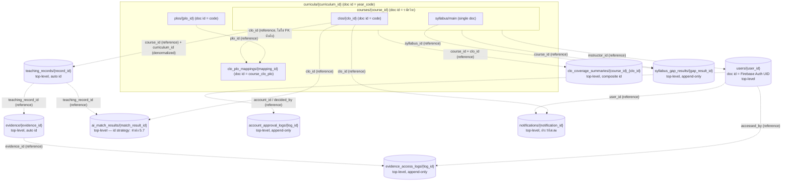

# API Spec + Database Schema (Conceptual): ระบบติดตามความสอดคล้อง CLO/PLO (ALIGN)

> **อัปเดตใหญ่ (2026-09-05) — ปรับทั้งฉบับให้เข้ากับ Cloud Firestore**: [[align-tech-stack|align-tech-stack]] ยืนยันแล้ว (รอบที่ 3) ว่าโปรเจกต์นี้**ต้องใช้ Firebase ทั้ง suite** (Firebase Authentication, Cloud Firestore, Cloud Storage, Firebase Hosting) เป็นข้อกำหนดบังคับ ไม่ใช่ทางเลือกทางเทคนิคอีกต่อไป — Firestore เป็น **NoSQL document/collection store** ที่ไม่มีกลไก FK, JOIN, unique constraint ข้าม document, partial index เหมือนฐานข้อมูลเชิงสัมพันธ์ที่เอกสารฉบับก่อนหน้าตั้งสมมติฐานไว้ (PostgreSQL ผ่าน Supabase) — เอกสารนี้จึงถูกออกแบบใหม่ทั้งฉบับให้ตรงกับข้อจำกัด/ความสามารถจริงของ Firestore โดย**คงเนื้อหาทางธุรกิจทั้งหมดไว้ไม่เปลี่ยนแปลง** (ความหมายของฟิลด์, กฎทางธุรกิจที่ผูกกับแต่ละ entity, PDPA flag, การตัดสินใจ soft-delete/append-only ที่ยืนยันไปแล้วในหัวข้อ 5 เดิม) — เปลี่ยนเฉพาะ**กลไกการเก็บ/บังคับใช้ระดับ storage** ให้เข้ากับโมเดล NoSQL เท่านั้น
>
> **สิ่งที่ยังไม่ยืนยันจากการปรับรอบนี้** (ดูรายละเอียดเต็มที่หัวข้อ 5.6–5.7): (1) โครงสร้าง collection/subcollection ที่แท้จริง (nest ใต้ curriculum ทั้งหมด vs top-level ล้วน vs hybrid) — เอกสารนี้ใช้ **hybrid เป็น default [ข้อเสนอ — ยังไม่ยืนยัน]**, (2) รูปแบบ document ID ของ `ai_match_result` (auto-generated ต่อครั้งที่รัน AI ใหม่ vs composite key ต่อคู่ teaching_record×clo) — ใช้ **auto-generated เป็น default [ข้อเสนอ — ยังไม่ยืนยัน]** — เครื่องมือถามผู้ใช้แบบเลือกตัวเลือก (`AskUserQuestion`) ไม่พร้อมใช้งานในบริบทนี้ จึงบันทึกเป็นคำถามเปิดในเอกสารแทนตามกฎของ agent นี้ ห้ามถือว่าทั้งสองจุดนี้เป็นการตัดสินใจสุดท้าย

เอกสารนี้เป็น**ระดับแนวคิด (conceptual)** ของโครงสร้าง collection/subcollection, รายละเอียดฟิลด์ต่อ entity, และ API Spec — ตั้งใจ**ไม่ผูกมัดกับ technical stack ใดๆ** ยกเว้นข้อจำกัดเชิงโครงสร้างของ Firestore เอง (document/collection model, ไม่มี join ระดับ engine) ซึ่งเป็นข้อกำหนดบังคับที่ [[align-tech-stack|align-tech-stack]] ยืนยันแล้วและมีผลต่อ "รูปแบบการเก็บข้อมูล" โดยตรง (ต่างจาก database engine ยี่ห้อ/เวอร์ชัน/ภาษาโปรแกรม/cloud region ที่ยังคงไม่ระบุในเอกสารนี้) — คำถาม "จะ implement/deploy ด้วยอะไร" (เช่น เวอร์ชัน SDK, ภาษาที่เขียน Cloud Function) อยู่ที่ [[align-tech-stack|align-tech-stack]] แทน

**ความสัมพันธ์กับเอกสารอื่น**:
- [[align-high-level-architecture|align-high-level-architecture]] — ชั้นแนวคิดที่มาก่อน ใช้ชื่อ logical component (เช่น "ประตูควบคุมสิทธิ์และสถานะบัญชี", "แกนประสานงานและบังคับใช้กฎทางธุรกิจ", "กลไกจับคู่/วิเคราะห์ด้วย AI") เอกสารนี้อ้างอิงชื่อเดียวกันเวลาระบุว่า endpoint ไหนอยู่ในความรับผิดชอบของ component ไหน
- [[align-technical-design|align-technical-design]] §2 (Database Schema) และ §3 (API Design) — **ยังเป็นโมเดลเชิงสัมพันธ์เดิม (PostgreSQL) ที่ยังไม่ถูกปรับตามการเปลี่ยน stack นี้** ณ วันที่เขียนเอกสารนี้ (2026-09-05) — ดูหมายเหตุท้ายเอกสารสำหรับสิ่งที่ควรส่งต่อให้ `technical-designer` ปรับตาม เอกสารนี้เป็นฐานอ้างอิงล่าสุดสำหรับโมเดลข้อมูลที่ตรงกับ Firestore จริง ไม่ใช่ align-technical-design.md §2/§3 อีกต่อไป
- [[align-tech-stack|align-tech-stack]] §2.2/§2.3/§2.5/§2.7 — ข้อกำหนดบังคับ Firebase ที่เอกสารนี้ต่อยอดโดยตรง
- [[../01-prototypes/align-app-screens|align-app-screens]] และ [[../01-prototypes/align-program-admin-screens|align-program-admin-screens]] — ใช้ตรวจว่า schema/API รองรับทุก field/flow ที่หน้าจอต้องการจริง
- [[../../01-requirements/02-plan/product-backlog|product-backlog]] — ทุก endpoint/entity อ้าง AC ที่เกี่ยวข้อง

> หมายเหตุคุมทั้งเอกสาร (สืบทอดจากฉบับเดิม): ทุกที่ที่มีคำว่า **หลักสูตร (curriculum)** หมายถึงกลุ่มหลักสูตร **2565** หรือ **2570** เท่านั้น ห้ามมี collection/query ใดที่ผสาน/จับคู่ข้อมูลข้าม 2 กลุ่มนี้ — Firestore ไม่มี FK บังคับให้อัตโนมัติเหมือน SQL จึงต้องอาศัย **โครงสร้าง collection + การตรวจที่ชั้น Cloud Function/Server เป็นหลัก** (ดูหัวข้อ 2) แทนการพึ่ง constraint ระดับ database engine

---

## 1. Conceptual Data Model (ภาพรวม)

ระบบ ALIGN เก็บข้อมูลเป็น 7 กลุ่มหลักที่เกี่ยวโยงกันตามลำดับการใช้งานจริง (E1 → E6) — **กลุ่มเดียวกันกับฉบับเดิมทุกประการ** เปลี่ยนแค่คำว่า "ตาราง" เป็น "collection" และ "แถว" เป็น "document":

1. **กลุ่มโครงสร้างหลักสูตร** (`curriculum`, `plo`, `clo`, `clo_plo_mapping`) — เป็นข้อมูลตั้งต้นที่ต้องมีก่อนสิ่งอื่นทั้งหมด แยกขาดกันเด็ดขาดระหว่างกลุ่มหลักสูตร 2565/2570 (ทั้ง `plo` และ `clo` ต้องรู้ตัวเองว่าอยู่กลุ่มไหนเสมอ และการผูก `clo_plo_mapping` ทำได้เฉพาะภายในกลุ่มเดียวกัน) — **ในโมเดล Firestore กลุ่มนี้คือกลุ่มที่ได้ประโยชน์มากที่สุดจากการ nest เป็น subcollection ใต้ curriculum** (ดูหัวข้อ 2.2) เพราะทำให้ isolation เป็นจริงเชิงโครงสร้าง ไม่ใช่แค่ social convention
2. **กลุ่มรายวิชาและแผนการสอน** (`course`, `syllabus`) — รายวิชาแต่ละวิชาสังกัดกลุ่มหลักสูตรเดียวและมีอาจารย์ผู้สอนหลัก 1 คน, syllabus ผูกกับรายวิชาแบบ 1:1 เก็บทั้งไฟล์ทางการ (อ้างอิงเฉยๆ) และหัวข้อรายสัปดาห์ (ใช้วิเคราะห์ gap จริง) — ใน Firestore ความสัมพันธ์ 1:1 นี้ทำได้เป็นธรรมชาติด้วย single-document subcollection (ดูหัวข้อ 2.3)
3. **กลุ่มหลักฐานการสอนจริง** (`teaching_record`, `evidence`) — ข้อมูลที่อาจารย์บันทึกหลังสอนจริงแต่ละครั้ง พร้อมไฟล์แนบที่อาจมีข้อมูลส่วนบุคคลของนักศึกษาปะปน (ต้องควบคุมสิทธิ์ตาม PDPA)
4. **กลุ่มผลลัพธ์จาก AI (draft/confirmed)** (`ai_match_result`, `clo_coverage_summary`, `syllabus_gap_result`) — ทุก entity ในกลุ่มนี้ต้องมี state แยก draft/confirmed ชัดเจนตามกฎ #3 เพราะเป็นค่าตั้งต้นที่ต้องผ่านการยืนยันของอาจารย์ก่อนใช้เป็นข้อมูลจริง — `clo_coverage_summary` เป็นค่าที่ derived มาจาก `ai_match_result` ที่ confirmed เท่านั้น จึงสืบทอด "ความน่าเชื่อถือ" มาโดยอัตโนมัติแต่ไม่ต้องมี state ของตัวเองซ้ำอีกชั้น
5. **กลุ่มบัญชีผู้ใช้และการอนุมัติ** (`user`, `account_approval_log`) — 2 บทบาทเท่านั้น (`instructor`/`program_admin`) พร้อมสถานะบัญชี (`pending`/`approved`/`rejected`) ที่ gate การเข้าถึงทุกอย่างข้างต้น — `account_approval_log` เป็น audit trail แบบ append-only ของทุกครั้งที่มีการอนุมัติ/ปฏิเสธบัญชี (AB-26) แยกจากฟิลด์ `approved_by`/`approved_at` บน `user` ที่เก็บเฉพาะการตัดสินใจ**ล่าสุด**เพื่อให้ UI อ่านได้เร็วโดยไม่ต้อง join (ยิ่งสำคัญใน Firestore เพราะไม่มี join ให้พึ่งเลย)
6. **กลุ่ม audit trail ของ PDPA** (`evidence_access_log`) — บันทึกทุกครั้งที่มีการเข้าถึงไฟล์หลักฐาน แยกจากข้อมูลหลักเพื่อไม่ให้ปนกับ business data
7. **กลุ่มการแจ้งเตือน** (`notification`) — ผูกกับกฎทางธุรกิจ #2 โดยตรง (แจ้งเตือน CLO ที่ยังไม่มีหลักฐานทันทีที่ตรวจพบ, AB-12) ส่งถึงอาจารย์เจ้าของวิชาที่ CLO นั้นสังกัด — สถานะวงจรชีวิตของแจ้งเตือน **[ยืนยันแล้ว, หัวข้อ 5.5]**: ใช้ `is_resolved`/`resolved_at` แบบ auto-resolve ผูกกับสถานะ CLO จริง ไม่ใช่ manual read/unread — กลไกกันสร้างซ้ำ (unique ต่อ `clo_id` ขณะ unresolved) ต้องแปลงเป็นรูปแบบ Firestore ใหม่ (ดูหัวข้อ 2.6)

ทิศทางการไหลของข้อมูลคร่าวๆ เหมือนฉบับเดิมทุกประการ: กลุ่ม 1 → 2 ต้องเสร็จก่อนกลุ่ม 3 จะเริ่มได้ (กฎ #1) → กลุ่ม 3 ป้อนเข้ากลุ่ม 4 (ผ่าน AI, เป็น draft เสมอ) → อาจารย์ยืนยันกลุ่ม 4 → กลุ่ม 4 ที่ confirmed แล้วเท่านั้นถูกใช้สร้างเอกสารส่งออก (E5) — กลุ่ม 5 คร่อมทุกอย่างเป็น access gate และกลุ่ม 6 บันทึกร่องรอยการเข้าถึงกลุ่ม 3 — กลุ่ม 7 (notification) รับสัญญาณจากกลุ่ม 3 โดยตรง เพื่อแจ้งเตือนอาจารย์เจ้าของวิชานั้นทันที และ auto-resolve กลับเมื่อกลุ่ม 3/4 มีข้อมูลรองรับแล้ว — **ความแตกต่างสำคัญจากฉบับเดิม**: ทุกจุดที่เคยเขียนว่า "บังคับที่ระดับ application/insert-time" ในฉบับ SQL เดิม ในฉบับ Firestore นี้**ต้องเข้าใจว่าเป็นภาระของ Cloud Function/Server layer ทั้งหมด ไม่มีทางเลือกอื่น** เพราะ Firestore เองไม่มี CHECK constraint, ไม่มี FK, ไม่มี trigger ระดับ database engine ให้พึ่งพาเลย (ต่างจาก PostgreSQL ที่อย่างน้อยยังมี CHECK/FK/RLS เป็นชั้นป้องกันที่สองได้)

---

## 2. โครงสร้าง Collection/Subcollection (แทน ER Diagram เชิงสัมพันธ์เดิม)

### 2.1 หลักการทั่วไปที่ใช้แทนกลไกเชิงสัมพันธ์ทั้งหมด

Firestore ไม่มีกลไกต่อไปนี้ที่ฉบับเดิมพึ่งพา — ตารางด้านล่างสรุปว่าใช้อะไรแทน:

| กลไกเชิงสัมพันธ์เดิม | ไม่มีใน Firestore เพราะ | ใช้อะไรแทน |
|---|---|---|
| Foreign Key (FK) บังคับ | ไม่มี constraint ระดับ document ที่ตรวจการมีอยู่ของ document อื่นให้อัตโนมัติ | **Reference field**: เก็บ document ID ของปลายทางเป็น string (หรือ Firestore `DocumentReference` type) — ต้องตรวจการมีอยู่จริง/ความถูกต้อง (เช่น อยู่ curriculum เดียวกันหรือไม่) ที่ **Cloud Function/Server layer** ก่อนเขียนทุกครั้ง |
| JOIN ข้าม table | ไม่มี query engine ที่รวมหลาย collection ในคำสั่งเดียว | **Denormalization**: เก็บ field ที่ query ร่วมบ่อยซ้ำไว้ใน document โดยตรง (เช่น `curriculum_id` ซ้ำใน `clo`/`notification`) — ดูหัวข้อ 2.5 |
| Unique constraint (ทั้งแบบเต็มและ partial) | ไม่มี unique index ที่ Firestore บังคับเอง ยกเว้น document ID ภายใน collection/subcollection เดียวกัน | **Document ID strategy**: ใช้ natural key หรือ composite key เป็น document ID เพื่อให้ Firestore ปฏิเสธ write ซ้ำเองผ่าน `create()` — สำหรับ partial-unique (เช่น notification) ต้องใช้ transaction query-then-write แทน (ดูหัวข้อ 2.6) |
| CHECK constraint / Trigger ระดับ DB | ไม่มีกลไกฝั่ง database engine ที่รันโค้ดตรวจก่อน/หลัง write | **Cloud Function เป็นจุดบังคับใช้กฎทางธุรกิจเดียว** (ตรงกับที่ [[align-tech-stack|align-tech-stack]] §2.2 ยืนยันแล้วว่าการบังคับใช้กฎหลักอยู่ที่โค้ด server ไม่ใช่ security rules) — **Firestore Security Rules เป็น defense-in-depth ชั้นที่สองเท่านั้น** (ดูหัวข้อ 2.8) |
| Transaction ระดับ SQL (multi-table) | ไม่มี SQL transaction ข้าม table หลายตัวแบบเดิม | **Firestore transaction (`runTransaction`)** สำหรับ read-then-write ที่ต้อง atomic และ **batched write (`writeBatch`)** สำหรับหลาย write พร้อมกันที่ไม่ต้องอ่านก่อน (ดูหัวข้อ 2.7) |

### 2.2 โครงสร้าง Collection Hierarchy — **[ข้อเสนอ — ยังไม่ยืนยัน, รายละเอียดเต็มที่หัวข้อ 5.6]**

นี่คือการตัดสินใจที่กระทบทั้งเอกสารมากที่สุด เพราะกฎที่สำคัญที่สุดของระบบคือ "ห้าม query/merge ข้ามกลุ่มหลักสูตร" — เอกสารนี้เสนอ 3 ทางเลือก (รายละเอียดตาราง/ข้อดี-ข้อเสียเต็มอยู่ที่หัวข้อ 5.6) และ**ใช้ทางเลือกที่ 3 (Hybrid) เป็น default ระหว่างรอการยืนยัน**:

**โครงสร้างที่ใช้ตลอดทั้งเอกสารนี้ (Hybrid — ทางเลือกที่ 3):**

```
curricula/{curriculum_id}                          ← doc id = year_code เช่น "2565", "2570"
  plos/{plo_id}                                     ← doc id = code เช่น "PLO1" (unique ภายใน curriculum โดยอัตโนมัติ)
  courses/{course_id}                               ← doc id = รหัสวิชาจริง เช่น "127121"
    clos/{clo_id}                                   ← doc id = code เช่น "CLO1" (unique ภายใน course โดยอัตโนมัติ)
    syllabus/main                                   ← single document เสมอ (บังคับ 1:1 โดยโครงสร้าง)
  clo_plo_mappings/{mapping_id}                     ← doc id = "{course_id}_{clo_code}_{plo_code}" (composite, อยู่ระดับ curriculum ไม่ใช่ระดับ course เพราะอ้างถึงทั้ง clo และ plo)

teaching_records/{record_id}                        ← top-level, auto id, มี course_id + curriculum_id denormalized
evidence/{evidence_id}                              ← top-level, auto id, มี teaching_record_id + course_id + curriculum_id denormalized
evidence_access_logs/{log_id}                       ← top-level, auto id, append-only
ai_match_results/{match_result_id}                  ← top-level, auto id (ดูหัวข้อ 5.7), มี course_id + curriculum_id denormalized
clo_coverage_summaries/{course_id}_{clo_id}          ← top-level, composite id
syllabus_gap_results/{gap_result_id}                ← top-level, auto id, append-only
users/{user_id}                                     ← top-level, doc id = Firebase Auth UID
account_approval_logs/{log_id}                      ← top-level, auto id, append-only
notifications/{notification_id}                     ← top-level, auto id (ประวัติสะสม)
```

**เหตุผลที่เลือก hybrid เป็น default**: nest เฉพาะ 4 entity ที่กฎ curriculum-isolation เข้มงวดที่สุด (`plo`, `course`, `clo`, `clo_plo_mapping`) ไว้ใต้ `curricula/{curriculum_id}` เพื่อให้**เป็นไปไม่ได้ทางโครงสร้าง**ที่จะเขียน/อ่านข้าม curriculum โดยไม่ตั้งใจ (ต้องระบุ `curriculum_id` ใน path เสมอ) ตรงกับ entity กลุ่ม 1 ในหัวข้อ 1 ที่ระบุว่า "ได้ประโยชน์มากที่สุดจากการ nest" — ส่วน entity ที่เหลือ (กลุ่ม 3–7) เก็บเป็น top-level แบบเดิม เพราะ (ก) ถูกเข้าถึงผ่าน `course_id`/`clo_id` เป็นหลักอยู่แล้วไม่ใช่ผ่าน curriculum โดยตรง (ข) มี use case ที่ต้อง query ข้าม curriculum โดยชอบธรรม (เช่น ผู้บริหารหลักสูตรที่ดูแลทั้ง 2565/2570 ต้องการ dashboard รวม, `GET /admin/accounts` ต้องเห็นทุกบัญชีไม่จำกัด curriculum) ซึ่งจะทำยากขึ้นถ้า nest ลึกทั้งหมด — **นี่เป็นเพียงข้อเสนอ ไม่ใช่การตัดสินใจสุดท้าย** ทั้งฉบับเอกสาร (ตาราง §3, endpoint §4, security rules §2.8) เขียนโดยอิงโครงสร้างนี้ ถ้าผู้ใช้เลือกทางเลือกอื่นในหัวข้อ 5.6 ภายหลัง ต้องปรับ path ที่อ้างอิงใน §3/§4 ตามไปด้วย

### 2.3 Document ID Strategy ต่อ Entity (สรุปตาราง)

| Entity | Document ID | เหตุผล |
|---|---|---|
| `curriculum` | `year_code` (เช่น `"2565"`) | natural key ที่ path ของ API ใช้อยู่แล้ว (`/curricula/{year}/...`) — Firestore บังคับ uniqueness ให้อัตโนมัติ ไม่ต้องมี unique index แยก |
| `plo` | `code` (เช่น `"PLO1"`) ภายใต้ subcollection ของ curriculum นั้น | เพราะ nest ใต้ curriculum แล้ว การใช้ `code` เป็น doc id ทำให้ "unique ภายใน curriculum เดียวกัน" เป็นจริงโดยอัตโนมัติ (คนละ curriculum ใช้ code ซ้ำกันได้เพราะอยู่คนละ subcollection) |
| `course` | รหัสวิชาจริง (เช่น `"127121"`) ภายใต้ subcollection ของ curriculum นั้น | รหัสวิชาจริงไม่ซ้ำข้าม 2 หลักสูตรตามข้อมูลจริงอยู่แล้ว (`plo-course-master-data`) — แต่เพราะ nest ใต้ curriculum, Firestore การันตี uniqueness แค่**ภายใน curriculum เดียวกัน**เท่านั้น ไม่ใช่ทั่วทั้งระบบ — **ส่วนที่เหลือ (unique ทั่วทั้งระบบตาม §3.5 เดิม) ต้องตรวจเพิ่มที่ Cloud Function ด้วย collectionGroup query ข้ามทั้ง 2 curriculum subtree ก่อน create เสมอ** (ไม่ใช่ constraint อัตโนมัติอีกต่อไป) |
| `clo` | `code` (เช่น `"CLO1"`) ภายใต้ subcollection ของ course นั้น | unique ภายใน course โดยอัตโนมัติจากโครงสร้าง nest |
| `clo_plo_mapping` | `"{course_id}_{clo_code}_{plo_code}"` ภายใต้ subcollection ของ curriculum | composite key ทำให้คู่ (clo, plo) ซ้ำกันไม่ได้โดยอัตโนมัติ — เขียนด้วย `create()` (ไม่ใช่ `set()`) เพื่อให้ Firestore ปฏิเสธ write ที่ id ซ้ำ (แปลว่าคู่นี้เคยผูกไปแล้ว) |
| `syllabus` | ค่าคงที่ `"main"` ภายใต้ subcollection ของ course นั้น | มี slot เดียวตายตัวต่อ course หนึ่งวิชา — บังคับ 1:1 โดยไม่ต้องมี unique index |
| `teaching_record` | auto-generated | ไม่มี natural key ที่เหมาะสม (หลายบันทึกต่อวิชา/สัปดาห์ได้) |
| `evidence` | auto-generated | แนบได้หลายไฟล์ต่อบันทึกการสอนเดียว |
| `evidence_access_log` | auto-generated | append-only, ไม่มี uniqueness ที่ต้องบังคับ |
| `ai_match_result` | auto-generated **[ข้อเสนอ — ยังไม่ยืนยัน, ดูหัวข้อ 5.7]** | ยังไม่ชัดว่าการรัน AI ซ้ำสำหรับคู่ teaching_record×clo เดิมควรสร้าง document ใหม่ (ประวัติ) หรืออัปเดต document เดิม (composite id) — ดูหัวข้อ 5.7 |
| `clo_coverage_summary` | `"{course_id}_{clo_id}"` | composite key ตรงกับที่ฉบับเดิมระบุว่า "ไม่มี PK ของตัวเองแยกต่างหาก" อยู่แล้ว — เหมาะกับ Firestore doc id พอดี |
| `syllabus_gap_result` | auto-generated | append-only history ตามที่ยืนยันแล้ว (§3.11) |
| `user` | Firebase Auth UID | ผูกกับ Firebase Authentication โดยตรงตามที่ [[align-tech-stack|align-tech-stack]] §2.7 ระบุไว้ — ทำให้ Security Rules อ้าง `request.auth.uid` แล้ว lookup `users/{uid}` ได้ทันทีโดยไม่ต้อง query หา |
| `account_approval_log` | auto-generated | append-only, ไม่มี uniqueness ที่ต้องบังคับ |
| `notification` | auto-generated (ต่อประวัติ 1 รายการ) | ดูกลไกกันสร้างซ้ำที่หัวข้อ 2.6 (ใช้ transaction ไม่ใช่ document ID pattern) |

> **แนวปฏิบัติเสริม**: ทุก entity ควรเก็บค่าเดียวกับ document ID ซ้ำเป็น field ภายใน document ด้วย (เช่น `plo.plo_id` เก็บค่าเดียวกับ `plo` document's id) เพราะผลลัพธ์จาก `collectionGroup` query หรือการส่งข้อมูลเป็น array กลับไปที่ frontend มักต้องการ id แบบ flat โดยไม่ต้องพึ่ง `snapshot.ref.path` เสมอไป — ไม่ถือเป็นข้อมูลซ้ำซ้อนที่ต้อง sync (ค่าคงที่ตลอดอายุ document)

### 2.4 Diagram โครงสร้าง Collection/Reference (แทน ER Diagram เดิม)



**อ่านไดอะแกรมนี้อย่างไร**:
- เส้นทึบ/subgraph (กล่องซ้อนกัน) = ความสัมพันธ์แบบ **subcollection จริง** (path บังคับให้ต้องผ่าน parent เสมอ — เช่น จะอ่าน `clo` ต้องรู้ `course_id` และ `curriculum_id` ก่อนเสมอ ไม่มีทางอ่านข้าม curriculum โดยไม่ตั้งใจ)
- เส้นประ (`-.->`) = **reference field ธรรมดา ไม่ใช่ FK บังคับที่ระดับ storage** — Firestore ไม่ตรวจให้ว่าปลายทางมีอยู่จริงหรือไม่ ไม่ตรวจว่า curriculum ตรงกันหรือไม่ — ทุกเส้นประเหล่านี้ต้องถูกตรวจที่ Cloud Function/Server layer ก่อนเขียนเสมอ (ตามหัวข้อ 2.1)
- `curriculum_id` ที่ปรากฏเป็น denormalized field ใน `teaching_record`/`ai_match_result`/`notification` (และ entity อื่นในกลุ่ม top-level) **ไม่ใช่ subcollection path** เป็นเพียง field ธรรมดาที่ใช้กรอง query/ตรวจสิทธิ์เท่านั้น — ต่างจาก `plo`/`course`/`clo`/`clo_plo_mapping` ที่ curriculum เป็นส่วนหนึ่งของ path จริง
- ทุก entity ที่กล่าวถึงในเอกสารนี้ (15 entity ทางธุรกิจ ไม่นับ document ID/collection ที่เป็นกลไก implementation) ปรากฏในไดอะแกรมข้างต้นครบทุกตัว

### 2.5 Denormalization ที่ต้องเพิ่มเข้าไปอีก (นอกเหนือจาก `curriculum_id` ที่มีอยู่แล้ว)

เนื่องจาก Firestore ไม่มี JOIN ทุก field ที่หน้าจอ/endpoint ต้องแสดงร่วมกับข้อมูลจาก collection อื่นต้อง denormalize เก็บซ้ำ ไม่ใช่แค่ที่ `notification.curriculum_id` ที่เคยระบุไว้แล้ว — ตรวจสอบทุก endpoint ใน §4 แล้วพบจุดเพิ่มเติมดังนี้:

| Entity | Field ที่ต้อง denormalize เพิ่ม | เหตุผล (endpoint ที่ต้องใช้) |
|---|---|---|
| `teaching_record` | `curriculum_id` (สืบทอดจาก `course.curriculum_id`) | ตรวจ curriculum scope ก่อนเขียน/อ่าน โดยไม่ต้องอ่าน `course` document เพิ่ม — ใช้ใน Security Rules (§2.8) และ query ระดับหลักสูตรใน E4 |
| `evidence` | `course_id`, `curriculum_id` (สืบทอดผ่าน `teaching_record`) | `GET /admin/evidence-access-log` (§4.5) และ Security Rules ต้องตรวจ scope ของ evidence โดยไม่ join ผ่าน `teaching_record` ก่อนเสมอ (ลด `get()` เพิ่มใน security rules ที่มี cost/limit ต่อการประเมิน 1 ครั้ง) |
| `evidence_access_log` | `course_id`, `curriculum_id` (สืบทอดผ่าน `evidence`) | `GET /admin/evidence-access-log` กรองตาม `curriculum_id`/`course_id` โดยตรง (query parameter `curriculum_id?`, `course_id?` ตาม §4.5) โดยไม่ต้องอ่าน `evidence` เพิ่มทีละแถว |
| `ai_match_result` | `course_id`, `curriculum_id` (สืบทอดผ่าน `teaching_record`) | `GET .../clo-coverage`, แดชบอร์ดระดับหลักสูตร (E4) กรองตาม curriculum ได้โดยตรง |
| `clo_coverage_summary` | `curriculum_id` (สืบทอดจาก `course.curriculum_id`) | `GET /curricula/{year}/dashboard` (E4) ต้อง query สรุประดับหลักสูตรโดยไม่ join ผ่าน `course` |
| `syllabus_gap_result` | `curriculum_id` (สืบทอดจาก `course.curriculum_id`) | เหตุผลเดียวกับ `clo_coverage_summary` |
| `account_approval_log` | *(ไม่ต้องเพิ่ม)* — ไม่มี curriculum scope เกี่ยวข้อง (บัญชีผู้ใช้ไม่ผูกกับ curriculum เดียว) | — |

> หลักการทั่วไป: **field ใดก็ตามที่ปรากฏเป็นเงื่อนไข query parameter ของ endpoint ใน §4 (`curriculum_id?`, `course_id?`) ต้องมี field นั้นอยู่ใน document จริงเสมอ** ไม่ derive สดจาก parent เพราะไม่มี join — นี่คือ trade-off ที่ [[align-tech-stack|align-tech-stack]] §2.3 ระบุไว้แล้วว่าเป็นความเสี่ยง/ภาระที่ต้องยอมรับจากการย้ายมาใช้ Firestore

### 2.6 แทนที่ Unique Constraint ที่ Firestore ไม่มีกลไกเทียบเท่าโดยตรง

**(ก) `clo_plo_mapping` unique pair (clo_id, plo_id)** — แก้แล้วโดยใช้ **document ID = `"{course_id}_{clo_code}_{plo_code}"`** (หัวข้อ 2.3) — เขียนด้วย `create()` (ไม่ใช่ `set()`) เพื่อให้ Firestore ปฏิเสธ write อัตโนมัติถ้า document นี้มีอยู่แล้ว (error `ALREADY_EXISTS`) — Cloud Function จับ error นี้แล้วตอบ 409/200 idempotent ตามที่ทีมพัฒนาออกแบบ UX

**(ข) `notification` partial unique index (`clo_id` WHERE `is_resolved=false`)** — ไม่มี partial index ใน Firestore ให้พึ่ง เสนอ 2 แนวทาง (เลือกแนวทาง A เป็น default เพราะทีมพัฒนาเล็ก/ไม่ใช่โปรแกรมเมอร์มืออาชีพตามที่ [[align-tech-stack|align-tech-stack]] ระบุ — ไม่ใช่คำถามเปิดที่ต้องรอผู้ใช้ยืนยัน เพราะเป็นรายละเอียด implementation pattern ไม่ใช่ business ambiguity):
  - **A. Transaction query-then-write (แนะนำ/default)**: เมื่อ background job (T-042) ตรวจพบ CLO ที่ยังไม่มีหลักฐาน ให้เปิด Firestore transaction ที่ (1) query `notifications` where `clo_id == X AND is_resolved == false` (ต้องมี composite index บน `(clo_id, is_resolved)`), (2) ถ้าไม่พบแถวใด ให้ `set()` เอกสารใหม่ภายใน transaction เดียวกัน — Firestore transaction รับประกัน atomicity ของ read+write นี้ ป้องกัน race condition จากการรัน job ซ้อนกัน — ข้อดี: ไม่ต้องเพิ่ม collection ใหม่, เข้าใจง่ายสำหรับทีมเล็ก ข้อเสีย: ต้องมี composite index เตรียมไว้ล่วงหน้า และ transaction ที่มี query ข้างในมีข้อจำกัดบางประการของ Firestore (ต้องอ่านให้ครบก่อนเขียน) ซึ่งทีมพัฒนาต้องทดสอบ concurrency จริงก่อนใช้งาน
  - **B. Sentinel/pointer document**: เพิ่ม collection แยก เช่น `active_gap_notifications/{clo_id}` (doc id = `clo_id` ตรงๆ) เป็น "ตัวล็อก" — สร้างด้วย `create()` เมื่อพบ gap (ล้มเหลวอัตโนมัติถ้ามีอยู่แล้ว = มีแจ้งเตือนที่ยัง unresolved อยู่) และลบ document นี้ทิ้งเมื่อ auto-resolve (ปลดล็อกให้สร้างแจ้งเตือนใหม่ได้ในรอบถัดไป) — ข้อดี: อาศัย `create()` semantics ล้วนๆ ไม่ต้องพึ่ง query+transaction ที่ซับซ้อนกว่า ข้อเสีย: เพิ่ม collection ใหม่ 1 ตัวที่ไม่มีความหมายทางธุรกิจของตัวเอง (เป็นแค่กลไก technical) เพิ่มจุดที่ต้อง sync ให้ตรงกับ `notifications` เสมอ (ลบ pointer ไม่ตรงจังหวะกับการ resolve notification จริงจะทำให้ค้าง/ปลดล็อกผิดจังหวะ)

**(ค) PLO code unique ภายใน curriculum เดียวกัน** — แก้แล้วอัตโนมัติโดยการ nest `plo` เป็น subcollection ใต้ `curricula/{curriculum_id}` และใช้ `code` เป็น document ID (หัวข้อ 2.3) — ไม่ต้องเขียนโค้ดตรวจเพิ่มเลย เพราะ Firestore ปฏิเสธ document ID ซ้ำใน subcollection เดียวกันให้อัตโนมัติ

**(ง) Course code unique ทั่วทั้งระบบ (ข้ามทั้ง 2 curriculum)** — เพราะ nest `course` ใต้ curriculum แล้ว Firestore การันตี unique แค่ภายใน curriculum เดียวกัน — ต้องเพิ่มการตรวจที่ Cloud Function ก่อน `create()`: รัน `collectionGroup('courses')` query กรอง `where('course_id', '==', code)` ข้ามทั้ง 2 curriculum subtree ก่อนสร้างเสมอ (ต้องมี collectionGroup index เตรียมไว้) — ยอมรับเป็นความเสี่ยง race แบบเดียวกับข้อ (ก)/(ข) หากมี 2 คำร้องพร้อมกันเป๊ะ (ความน่าจะเป็นต่ำมากสำหรับระบบขนาดสาขาเดียว)

**(จ) `user.email` unique** — Firebase Authentication บังคับ unique email ให้อัตโนมัติอยู่แล้วที่ชั้น auth provider (ปฏิเสธสมัครซ้ำด้วย error code ของ Firebase Auth เอง) ก่อนที่ Cloud Function จะสร้าง document ใน `users` collection ด้วยซ้ำ — ไม่ต้องมีกลไกเพิ่มเติมที่ชั้น Firestore

### 2.7 จุดที่ต้องใช้ Firestore Transaction / Batched Write (แทน "single SQL transaction" เดิม)

| การกระทำ | เดิม (SQL transaction เดียว) | Firestore |
|---|---|---|
| อนุมัติ/ปฏิเสธบัญชี (§3.14, §4.6) | `UPDATE user ... ; INSERT account_approval_log ...` ในทรานแซกชันเดียว | **`runTransaction`**: อ่าน `users/{uid}` ปัจจุบัน (ตรวจ state transition ถูกต้อง) → เขียนอัปเดต `users/{uid}.account_status/approved_by/approved_at` + สร้าง document ใหม่ใน `account_approval_logs` พร้อมกันในทรานแซกชันเดียว |
| ยืนยันผล AI แล้ว auto-resolve notification (§3.9, §3.15) | `UPDATE ai_match_result ...; UPDATE notification SET is_resolved=true ...` | **`runTransaction`**: อัปเดต `ai_match_results/{id}.state='confirmed'` → query `notifications` where `clo_id==X AND is_resolved==false` ภายในทรานแซกชันเดียวกัน → ถ้าพบ ให้อัปเดต `is_resolved=true, resolved_at=now()` (ถ้าใช้แนวทาง B ของหัวข้อ 2.6 ต้องลบ sentinel document เพิ่มในทรานแซกชันเดียวกันด้วย) |
| สร้างบันทึกการสอน (ต้องผ่าน `clo_plo_ready` ก่อน — กฎ #1) | `SELECT clo_plo_ready FROM course WHERE ... ; INSERT teaching_record ...` (มักอาศัย row lock/constraint ของ SQL) | อ่าน `courses/{id}.clo_plo_ready` ก่อน (นอก/ใน transaction ก็ได้) แล้วเขียน `teaching_records` ใหม่ — ยอมรับ**ความเสี่ยง race แบบเบาบาง**ถ้ามีคนลบ mapping สุดท้ายพร้อมกันเป๊ะกับตอนสร้างบันทึกการสอน (ความน่าจะเป็นต่ำมาก ไม่คุ้มความซับซ้อนของ transaction เต็มรูปแบบสำหรับ MVP นี้ — ทีมพัฒนาปรับเป็น transaction เต็มรูปแบบภายหลังได้ถ้าพบปัญหาจริง) |
| Soft-delete `plo`/`clo` ที่กระทบ `clo_plo_ready`/`total_clo_count` (§3.2/§3.3) | `UPDATE plo/clo SET is_deleted=true ...; UPDATE course SET clo_plo_ready=... ; UPDATE clo_coverage_summary ...` | **`runTransaction`**: อ่านสถานะ mapping/CLO ที่เหลือก่อนตัดสินใจค่าใหม่ของ `clo_plo_ready` → เขียน `is_deleted=true` บน `plo`/`clo` + อัปเดต `courses/{id}.clo_plo_ready` พร้อมกัน (ถ้ากระทบหลาย `clo_coverage_summary` document ให้ตามด้วย **`writeBatch`** แยกต่างหากสำหรับ document จำนวนมากที่ไม่ต้องอ่านก่อนเขียน) |
| ผูก/ปลด `clo_plo_mapping` (§3.4) | `INSERT/DELETE clo_plo_mapping ...; UPDATE course SET clo_plo_ready=...` | **`runTransaction`**: ตรวจ `create()` (ผูกใหม่) หรือ `delete()` (ปลด) mapping document พร้อมกับอ่าน/เขียน `courses/{id}.clo_plo_ready` ในทรานแซกชันเดียวกัน |
| ตรวจจับ CLO ที่ยังไม่มีหลักฐาน (T-042, สร้าง `notification`) | background job รัน query แล้ว insert แถวใหม่ | ดูหัวข้อ 2.6 (ก) — **`runTransaction`** เดียวกับกลไกกันสร้างซ้ำ |
| ออกเอกสาร Word (E5) | อ่านอย่างเดียว ไม่มี transaction | ไม่เปลี่ยนแปลง — read-only, อ่านหลาย collection ตามลำดับได้โดยไม่ต้อง transaction |

### 2.8 Firestore Security Rules (Defense-in-Depth ชั้นที่สอง — เชิงแนวคิด)

ตรงตามหลักการที่ [[align-tech-stack|align-tech-stack]] §2.2 ยืนยันแล้วว่า **การบังคับใช้กฎทางธุรกิจหลักอยู่ที่ Cloud Function/Server layer เสมอ ไม่ใช่ Security Rules** (เพราะกฎ #1/#3 ซับซ้อนเกินกว่าจะเขียนเป็น rule ล้วนๆ ให้ปลอดภัยสำหรับทีมเล็ก) — Security Rules ด้านล่างจึงเป็นเพียง**ชั้นป้องกันที่สอง** กันกรณีมี bug ในโค้ด server หรือมีการเรียก Firestore ตรงจาก client โดยไม่ผ่าน Cloud Function (ไม่ควรเกิดขึ้นตามสถาปัตยกรรมที่ตั้งใจไว้ แต่ Security Rules ยังต้องครอบคลุมไว้เผื่อ):

```
// Pseudocode เชิงแนวคิด — ไม่ใช่ syntax จริงของ Firestore Security Rules

function isSignedIn() { return request.auth != null }
function myProfile()  { return get(/databases/$db/documents/users/$(request.auth.uid)).data }
function isApproved()  { return isSignedIn() && myProfile().account_status == 'approved' && myProfile().is_deleted == false }
function isProgramAdmin() { return isApproved() && myProfile().role == 'program_admin' }
function curriculumInScope(curriculumId) { return curriculumId in myProfile().program_admin_curriculum_scope }

// กฎ #6 — ทุก collection ต้องผ่าน isApproved() ก่อนเสมอ ยกเว้น users/{ตัวเอง} ตอนอ่านสถานะบัญชีของตัวเอง (E6)
match /users/{userId} {
  allow read: if isSignedIn() && (request.auth.uid == userId || isProgramAdmin())
  allow write: if false  // เขียนเฉพาะผ่าน Cloud Function เท่านั้น (approve/reject/register)
}

// กลุ่มโครงสร้างหลักสูตร — nest ใต้ curriculum ตามหัวข้อ 2.2
match /curricula/{curriculumId} {
  match /plos/{ploId} {
    allow read: if isApproved()
    allow write: if isProgramAdmin() && curriculumInScope(curriculumId)  // เฉพาะ program_admin ตาม §4.1
  }
  match /courses/{courseId} {
    allow read: if isApproved()
    match /clos/{cloId} {
      allow read: if isApproved()
      allow write: if isApproved() && get(/.../courses/$(courseId)).data.instructor_id == request.auth.uid
    }
    match /syllabus/main {
      allow read, write: if isApproved() && get(/.../courses/$(courseId)).data.instructor_id == request.auth.uid
    }
  }
  match /clo_plo_mappings/{mappingId} {
    allow read: if isApproved()
    allow write: if isApproved()  // instructor เจ้าของวิชานั้น — ตรวจผ่าน course.instructor_id เช่นเดียวกับ clos
  }
}

// กฎ #5 (PDPA) — evidence: เฉพาะ instructor เจ้าของวิชา หรือ program_admin ที่ curriculum ตรง scope
match /evidence/{evidenceId} {
  allow read, write: if isApproved() && (
    get(/databases/$db/documents/teaching_records/$(resource.data.teaching_record_id)).data.created_by == request.auth.uid
    || (isProgramAdmin() && curriculumInScope(resource.data.curriculum_id))
  )
  // หมายเหตุ: ต้องใช้ field curriculum_id ที่ denormalize ไว้แล้ว (หัวข้อ 2.5) แทนการ get() ซ้อนหลายชั้น
  // เพื่อลดจำนวน get() ต่อการประเมิน 1 ครั้ง (Firestore Security Rules มีข้อจำกัดจำนวน get() ต่อ request)
}

match /evidence_access_logs/{logId} {
  allow read: if isProgramAdmin() && curriculumInScope(resource.data.curriculum_id)
  allow write: if false  // เขียนเฉพาะผ่าน Cloud Function เท่านั้น (ทุกครั้งที่เข้าถึง evidence สำเร็จ)
}

// กลุ่มผลลัพธ์ AI — เฉพาะ instructor เจ้าของวิชายืนยันได้ (ไม่ใช่ program_admin — ตาม §4.3)
match /ai_match_results/{id} {
  allow read: if isApproved()
  allow write: if isApproved()  // ตรวจ instructor_id ผ่าน course เช่นเดียวกับข้างต้น — ไม่อนุญาต program_admin เขียน
}

// audit log ล้วนๆ — เขียนเฉพาะผ่าน Cloud Function
match /account_approval_logs/{id} { allow read: if isProgramAdmin(); allow write: if false }
match /notifications/{id} { allow read: if isApproved() && resource.data.user_id == request.auth.uid; allow write: if false }
```

**ข้อจำกัดที่ต้องระวัง (เพิ่มจากฉบับ SQL เดิม)**: Firestore Security Rules มีข้อจำกัดจำนวนการเรียก `get()`/`exists()` ต่อการประเมิน 1 request (ปัจจุบันจำกัดที่หลักสิบครั้ง) — กฎที่ต้อง "ไล่ตาม" reference หลายชั้น (เช่น evidence → teaching_record → course → curriculum) ควรลดจำนวนชั้นด้วยการ denormalize field ที่จำเป็นไว้ในตัว document เอง (ตามหัวข้อ 2.5) แทนการ `get()` ซ้อนกันหลายรอบ — นี่คืออีกเหตุผลหนึ่งที่ต้อง denormalize `curriculum_id`/`course_id` ไว้ในทุก entity ที่เกี่ยวข้องกับ evidence

---

## 3. รายละเอียดแต่ละ Collection (Per-Entity Detail)

ทุกตารางด้านล่างมีคอลัมน์ **PDPA/Draft-Confirmed** เหมือนฉบับเดิมทุกประการ — เขียน "—" เมื่อไม่เกี่ยวข้อง — คอลัมน์ **Constraint** เปลี่ยนถ้อยคำจาก "FK/unique ระดับ DB" เป็นกลไก Firestore จริงตามหัวข้อ 2 (reference field/document ID strategy/Cloud Function check) แต่**ความหมายทางธุรกิจของทุกฟิลด์ไม่เปลี่ยนแปลงจากฉบับเดิมแม้แต่จุดเดียว**

### 3.1 `curriculum` → collection `curricula` (top-level)

| ฟิลด์ | ชนิดเชิงแนวคิด | Constraint (Firestore) | ความสัมพันธ์ | PDPA/Draft-Confirmed |
|---|---|---|---|---|
| *(document id)* | = `year_code` | Firestore บังคับ unique ให้อัตโนมัติ (ไม่ต้องมี unique index แยก) | เป็น parent path ของ `plos`, `courses`, `clo_plo_mappings` (subcollection) | — |
| curriculum_id | string, เก็บซ้ำเท่ากับ document id | required (denormalize id เข้าไปในตัว document ตามหัวข้อ 2.3) | ใช้เป็น reference field จาก `teaching_record`, `notification` ฯลฯ (top-level ที่ไม่ nest) | — |
| year_code | enum('2565','2570') | ค่าคงที่ 2 ค่าตามสเปค ห้ามเพิ่มค่าใหม่โดยไม่ยืนยันกับสเปคก่อน | เท่ากับ document id เสมอ | — |
| name | string | required | ชื่อหลักสูตรเต็ม | — |
| is_active | boolean | required, default true | ใช้กรองหลักสูตรที่ยังใช้งานอยู่ | — |

**Indexing เชิงแนวคิด**: ไม่จำเป็นต้องมี composite index เพิ่ม — การอ่านทำผ่าน document ID โดยตรง (`doc(year_code).get()`) เร็วที่สุดเท่าที่ทำได้อยู่แล้ว

### 3.2 `plo` → subcollection `curricula/{curriculum_id}/plos`

| ฟิลด์ | ชนิดเชิงแนวคิด | Constraint (Firestore) | ความสัมพันธ์ | PDPA/Draft-Confirmed |
|---|---|---|---|---|
| *(document id)* | = `code` | Firestore บังคับ unique ภายใน curriculum เดียวกันให้อัตโนมัติ (แก้ปัญหา "unique ภายใน curriculum_id เดียวกัน" ของฉบับเดิมโดยไม่ต้องเขียนโค้ดตรวจเอง) | — | — |
| plo_id | string, เก็บซ้ำเท่ากับ document id | required | reference field ที่ `clo_plo_mapping` ใช้อ้างถึง | — |
| curriculum_id | string | **required, ห้ามแก้ไขหลังสร้าง** — ตรวจที่ Cloud Function (Firestore เองไม่ห้ามแก้ field ได้ ต้องอาศัยโค้ด server ปฏิเสธ update บน field นี้) | ซ้ำกับ parent path เพื่อให้ query แบบ `collectionGroup('plos')` กรอง curriculum ได้โดยไม่ต้อง parse path | — |
| code | string | เท่ากับ document id เสมอ | — | — |
| description | text | required | — | — |
| is_deleted | boolean | required, default `false` | **[ยืนยันแล้ว — หัวข้อ 5.1]** ธง soft-delete — ไม่เปลี่ยนแปลงจากฉบับเดิม | — |
| deleted_at | datetime, nullable | ต้อง not-null คู่กับ `is_deleted = true` | — | — |

**Indexing เชิงแนวคิด**: composite index บน `(curriculum_id, is_deleted)` ถ้าต้อง query ผ่าน `collectionGroup('plos')` ข้าม curriculum (เช่น admin dashboard ที่ดูแลทั้ง 2 กลุ่ม) — ถ้า query ผ่าน subcollection path ตรง (`curricula/{year}/plos where is_deleted==false`) ไม่ต้องมี composite index เพิ่มเพราะ path เองกรอง curriculum ให้แล้ว

**Delete/Deactivate — [ยืนยันแล้ว, หัวข้อ 5.1] — ไม่เปลี่ยนแปลงจากฉบับเดิม**: `DELETE /curricula/{year}/plos/{plo_id}` เป็น soft-delete เสมอ (`is_deleted=true`, `deleted_at=now()`) — ผลข้างเคียงต่อ `clo_plo_ready`/mapping ยังคงเหมือนเดิมทุกประการ เปลี่ยนแค่กลไก: การ re-evaluate `courses/{id}.clo_plo_ready` ต้องทำผ่าน **Firestore transaction** (อ่าน mapping ที่เหลือ + เขียน field ใหม่พร้อมกัน — ดูหัวข้อ 2.7) แทนที่จะเป็น SQL transaction เดิม

### 3.3 `clo` → subcollection `curricula/{curriculum_id}/courses/{course_id}/clos`

| ฟิลด์ | ชนิดเชิงแนวคิด | Constraint (Firestore) | ความสัมพันธ์ | PDPA/Draft-Confirmed |
|---|---|---|---|---|
| *(document id)* | = `code` | unique ภายใน course เดียวกันโดยอัตโนมัติจากโครงสร้าง nest | — | — |
| clo_id | string, เก็บซ้ำเท่ากับ document id | required | reference field จาก `clo_plo_mapping`, `ai_match_result`, `clo_coverage_summary`, `notification` (ทั้งหมดเป็น top-level ที่ไม่ nest ใต้ course) | — |
| course_id | string | required, **ห้ามแก้ไขหลังสร้าง** (ตรวจที่ Cloud Function) | ซ้ำกับ parent path — เก็บไว้เพื่อให้ entity top-level อื่น (`ai_match_result` ฯลฯ) อ้างอิงได้โดยไม่ต้อง parse path | — |
| curriculum_id | string | required, **denormalized จาก parent path** — เก็บไว้เพื่อให้ `notification`/`ai_match_result` (top-level) กรอง curriculum ได้โดยไม่ต้องไล่ path 2 ชั้น | ต้องตรงกับ curriculum ใน path เสมอ (ตรวจตอน insert) | — |
| code | string | เท่ากับ document id เสมอ | — | — |
| description | text | required | — | — |
| is_deleted | boolean | required, default `false` | **[ยืนยันแล้ว — หัวข้อ 5.1]** ไม่เปลี่ยนแปลง | — |
| deleted_at | datetime, nullable | ต้อง not-null คู่กับ `is_deleted = true` | — | — |

**Indexing เชิงแนวคิด**: composite index บน `(course_id, is_deleted)` ถ้าต้อง `collectionGroup('clos')` ข้าม course (ไม่ค่อยจำเป็นเพราะ CLO มักถูกอ่านผ่าน course path ตรงอยู่แล้ว) — composite index บน `(curriculum_id, is_deleted)` สำหรับ `collectionGroup` ระดับหลักสูตร (เช่น dashboard นับ CLO รวมทั้งหลักสูตร)

**Delete — [ยืนยันแล้ว, หัวข้อ 5.1] — ไม่เปลี่ยนแปลง**: เหมือน §3.2 เปลี่ยนแค่กลไก transaction ตามหัวข้อ 2.7

### 3.4 `clo_plo_mapping` → subcollection `curricula/{curriculum_id}/clo_plo_mappings`

| ฟิลด์ | ชนิดเชิงแนวคิด | Constraint (Firestore) | ความสัมพันธ์ | PDPA/Draft-Confirmed |
|---|---|---|---|---|
| *(document id)* | = `"{course_id}_{clo_code}_{plo_code}"` | composite key ทำให้คู่ (clo, plo) unique อัตโนมัติ — เขียนด้วย `create()` เสมอ | — | — |
| mapping_id | string, เก็บซ้ำเท่ากับ document id | required | — | — |
| clo_id | string | required — **ตรวจที่ Cloud Function ก่อนเขียนว่า `clo` นี้อยู่ curriculum เดียวกับ path จริง** (ไม่มี FK บังคับให้ตรวจอัตโนมัติ) | reference field → `clos` subcollection | — |
| plo_id | string | required — ตรวจเช่นเดียวกับ `clo_id` | reference field → `plos` subcollection | — |
| confirmed_by | string (Firebase Auth UID) | required | ผู้ยืนยันการผูก (อาจารย์ผู้สอนวิชานั้น) — reference field → `users` | — |
| created_at | datetime | required | — | — |

**Constraint สำคัญที่สุดของเอนทิตีนี้ (ไม่เปลี่ยนจากฉบับเดิม แต่กลไกบังคับเปลี่ยน)**: `clo_plo_mapping.clo.curriculum_id == clo_plo_mapping.plo.curriculum_id` เสมอ — เพราะ mapping ถูก nest ใต้ curriculum เดียวกับทั้ง `clo` (ผ่าน `course`) และ `plo` อยู่แล้ว **ความเป็นไปได้ที่จะผูกข้าม curriculum แทบเป็นศูนย์ทางโครงสร้าง** (จะต้องระบุ `clo_id` ที่จริงๆ อยู่ curriculum อื่นเข้ามาโดยเจตนา) — Cloud Function ยังต้องตรวจซ้ำอีกชั้นว่า `clo_id` ที่ระบุมาอยู่ภายใต้ `course` ของ curriculum เดียวกันจริง (กัน bug ที่ระบุ id ผิดจาก client)

**Uniqueness**: แก้แล้วด้วย document ID composite (หัวข้อ 2.3/2.6-ก) — ผูกซ้ำคู่เดิม `create()` จะล้มเหลว (`ALREADY_EXISTS`) โดยอัตโนมัติ ไม่ต้องเขียนโค้ดตรวจซ้ำเพิ่ม

**Indexing เชิงแนวคิด**: composite index บน `clo_id` (เช็ค `clo_plo_ready` ต้องนับจำนวน mapping ต่อ CLO บ่อย — query `where('clo_id','==',X)` ภายใน subcollection เดียวกัน ไม่ต้องมี index พิเศษถ้าเป็น single-field query) และ `plo_id` (แสดง "PLO นี้ถูกผูกจาก CLO ใดบ้าง")

**Delete — ไม่เปลี่ยนแปลงจากฉบับเดิม**: hard-delete แถวนี้ได้ปกติเมื่อ unlink (`clo_plo_mapping` ไม่อยู่ใน 5 entity ที่ soft-delete ตามหัวข้อ 5.1) — backend ต้อง re-evaluate `courses/{id}.clo_plo_ready` ทันทีหลัง unlink ผ่าน Firestore transaction (หัวข้อ 2.7) — หมายเหตุเพิ่มเติมเรื่อง mapping ที่ชี้ไปยัง `plo`/`clo` ที่ถูก soft-delete ภายหลัง ยังคงใช้ตรรกะเดิมทุกประการ (ไม่นับเป็นส่วนหนึ่งของ `clo_plo_ready` อีกต่อไป)

### 3.5 `course` → subcollection `curricula/{curriculum_id}/courses`

| ฟิลด์ | ชนิดเชิงแนวคิด | Constraint (Firestore) | ความสัมพันธ์ | PDPA/Draft-Confirmed |
|---|---|---|---|---|
| *(document id)* | = รหัสวิชาจริง (เช่น `"127121"`) | unique **ภายใน curriculum เดียวกัน**โดยอัตโนมัติ — unique **ทั่วทั้งระบบ** (ข้าม 2 curriculum) ต้องตรวจเพิ่มที่ Cloud Function ด้วย `collectionGroup` query (หัวข้อ 2.6-ง) | เป็น parent path ของ `clos`, `syllabus` (subcollection) | — |
| course_id | string, เก็บซ้ำเท่ากับ document id | required | reference field จาก `teaching_record`, `evidence`, `ai_match_result` ฯลฯ (top-level) | — |
| curriculum_id | string | **required, ห้ามแก้ไขหลังสร้าง** | ซ้ำกับ parent path — denormalize ไว้ให้ entity top-level อ้างอิงได้ | — |
| code | string | เท่ากับ document id เสมอ | — | — |
| name | string | required | — | — |
| instructor_id | string (Firebase Auth UID) | required, `users.role = 'instructor'` เท่านั้น — ตรวจที่ Cloud Function | reference field → `users` — ใช้ตรวจสิทธิ์ PDPA เข้าถึง `evidence` ของวิชานี้ | — |
| clo_plo_ready | boolean (computed) | ไม่ใช่ input ตรง — คำนวณจาก query `clo_plo_mappings` ที่มี `clo_id` อยู่ในเซตของ `clos` ภายใต้ course นี้ (ไม่มี `COUNT()` ของ SQL ให้ใช้ ต้อง query แล้วนับที่ Cloud Function หรือเก็บเป็น counter field ที่ maintain เอง) | ใช้เป็นเงื่อนไข gate ก่อนบันทึกการสอน (กฎ #1) | — |
| created_at / updated_at | datetime | required | — | — |

**Indexing เชิงแนวคิด**: composite index บน `(curriculum_id, is_deleted)`? *(course ไม่มี soft-delete ตามหัวข้อ 5.1 — ไม่ต้องมี field นี้)* — composite index บน `instructor_id` สำหรับ `collectionGroup('courses')` (หน้า "รายวิชาของฉัน" ที่อาจารย์คนหนึ่งสอนได้ทั้ง 2 curriculum พร้อมกัน — ต้องอ่านข้าม curriculum ได้ในกรณีนี้โดยชอบธรรม) — collectionGroup index บน `course_id` เพื่อรองรับการตรวจ uniqueness ข้ามระบบ (หัวข้อ 2.6-ง)

> **หมายเหตุ**: `GET /me/courses` (§4.1) ของอาจารย์ที่สอนทั้ง 2 หลักสูตรพร้อมกันเป็นตัวอย่างที่ต้องใช้ **`collectionGroup('courses')` query กรอง `instructor_id`** แทนการอ่านผ่าน subcollection path เดียว — เป็นเหตุผลเพิ่มเติมที่สนับสนุนว่าทำไมไม่ nest ลึกไปกว่านี้ (เช่น nest evidence ใต้ course ด้วย) เพราะจะทำให้ collectionGroup query สำหรับ endpoint ลักษณะนี้ซับซ้อนขึ้นเรื่อยๆ ตามความลึก

### 3.6 `syllabus` → single document `curricula/{curriculum_id}/courses/{course_id}/syllabus/main`

| ฟิลด์ | ชนิดเชิงแนวคิด | Constraint (Firestore) | ความสัมพันธ์ | PDPA/Draft-Confirmed |
|---|---|---|---|---|
| *(document id)* | ค่าคงที่ `"main"` เสมอ | บังคับ 1:1 โดยโครงสร้าง (มี slot เดียวต่อ course หนึ่งวิชา ไม่ต้องมี unique index) | — | — |
| syllabus_id | string, เก็บซ้ำเท่ากับ `course_id` (เพราะ 1:1) | required | ไม่มี `curriculum_id` แยก — สืบทอด scope จาก path | — |
| content | list ของ `{week_no, topic, detail}` | required เมื่อใช้เป็น input gap analysis (ไม่บังคับตอนสร้างครั้งแรก) | Firestore เก็บ array-of-map field ได้โดยตรงในเอกสารเดียว (ไม่ต้องแยก subcollection ถ้าจำนวนสัปดาห์ไม่เกินขีดจำกัดขนาด document 1 MiB — เพียงพอสำหรับ syllabus 1 ภาคเรียน) | — |
| origin_file_ref | ตัวชี้ไฟล์ (Cloud Storage path) | **required** | ชี้ไฟล์ใน Firebase Cloud Storage — **ไม่ถูก parse อัตโนมัติ** | ไม่ใช่ชิ้นงานนักศึกษา — ไม่ต้องมี flag PII |
| updated_by | string (Firebase Auth UID) | required | reference field → `users` | — |
| updated_at | datetime | required | update-in-place ไม่มี version history (Accepted Risk — คงเดิม) | — |

**Indexing เชิงแนวคิด**: ไม่จำเป็น — อ่านผ่าน document ID คงที่โดยตรงเสมอ

### 3.7 `teaching_record` → top-level collection `teaching_records`

| ฟิลด์ | ชนิดเชิงแนวคิด | Constraint (Firestore) | ความสัมพันธ์ | PDPA/Draft-Confirmed |
|---|---|---|---|---|
| *(document id)* | auto-generated | ไม่มี natural key ที่เหมาะสม | — | — |
| record_id | string, เก็บซ้ำเท่ากับ document id | required | reference field จาก `evidence`, `ai_match_result` | — |
| course_id | string | required — Cloud Function ต้องปฏิเสธ create ถ้า `courses/{course_id}.clo_plo_ready = false` (กฎ #1) | reference field → `courses` subcollection (ต้องรู้ `curriculum_id` ด้วยเพื่อประกอบ path เต็มตอนอ่าน `course` เพื่อตรวจ) | — |
| curriculum_id | string | required — **denormalized เพิ่มใหม่** (ดูหัวข้อ 2.5) จาก `course.curriculum_id` เพื่อ query/ตรวจ scope ได้โดยไม่ต้องอ่าน `course` document ซ้อน | — | — |
| topic | string | required | หัวข้อการสอนจริง — ใช้เป็น input เทียบกับ `syllabus.content` | ไม่ใช่ข้อมูลส่วนบุคคลของนักศึกษา |
| week_no | integer | required | ใช้ทำแผนที่ CLO×สัปดาห์ | — |
| taught_at | date | required, ค่าเริ่มต้น = วันนี้ ไม่รับวันที่ในอนาคต (validate ที่ Cloud Function) | — | — |
| created_by | string (Firebase Auth UID) | required, ต้องเป็น `instructor_id` เดียวกับ `course.instructor_id` | reference field → `users` | — |
| status | enum('draft_ai_pending','confirmed') | required, default `draft_ai_pending` | สถานะการยืนยันผล AI ของบันทึกนี้โดยรวม | ระบุ state ระดับบันทึกการสอน |
| is_deleted | boolean | required, default `false` | **[ยืนยันแล้ว — หัวข้อ 5.1]** ไม่เปลี่ยนแปลง | — |
| deleted_at | datetime, nullable | ต้อง not-null คู่กับ `is_deleted = true` | — | — |

**Indexing เชิงแนวคิด**: composite index บน `(course_id, is_deleted)`, `(course_id, week_no)`, และ `(curriculum_id, is_deleted)` (สำหรับ dashboard ระดับหลักสูตร — ไม่ต้อง `collectionGroup` เพราะ collection นี้เป็น top-level อยู่แล้ว)

**Delete — [ยืนยันแล้ว, หัวข้อ 5.1] — ไม่เปลี่ยนแปลง**: soft-delete เสมอ — logic เดิมทั้งหมดยังใช้ได้ (กรอง `is_deleted=false` ก่อนคำนวณแผนที่ CLO×สัปดาห์/`clo_coverage_summary`)

### 3.8 `evidence` → top-level collection `evidence`

| ฟิลด์ | ชนิดเชิงแนวคิด | Constraint (Firestore) | ความสัมพันธ์ | PDPA/Draft-Confirmed |
|---|---|---|---|---|
| *(document id)* | auto-generated | — | เป้าหมาย reference จาก `evidence_access_log` | — |
| evidence_id | string, เก็บซ้ำเท่ากับ document id | required | — | — |
| teaching_record_id | string | required | reference field → `teaching_records` — แนบได้หลายไฟล์ต่อ 1 บันทึกการสอน | — |
| course_id, curriculum_id | string | required — **denormalized เพิ่มใหม่** (หัวข้อ 2.5) จาก `teaching_record` เพื่อลด `get()` ซ้อนใน Security Rules และรองรับ `GET /admin/evidence-access-log` | — | — |
| file_ref | ตัวชี้ไฟล์ (Firebase Cloud Storage path) | required | ชี้ไฟล์ใน Firebase Cloud Storage ควบคุมสิทธิ์ตาม PDPA ผ่าน Storage Security Rules คู่ขนานกับ Firestore Security Rules — ไม่เก็บไฟล์จริงใน Firestore document | **PDPA: สูง** |
| file_name | string | required | — | **PDPA: กลาง–สูง** |
| uploaded_by | string (Firebase Auth UID) | required | reference field → `users` | — |
| uploaded_at | datetime | required | — | — |
| contains_student_pii | boolean | required, default `true` | — | **PDPA: ฟิลด์ตัวกำกับหลักของทั้งเอนทิตี** |
| is_deleted | boolean | required, default `false` | **[ยืนยันแล้ว — หัวข้อ 5.1]** ไม่เปลี่ยนแปลง | **PDPA: ต้องยังคงบังคับสิทธิ์เข้าถึงเดิมแม้ `is_deleted=true` แล้ว** |
| deleted_at | datetime, nullable | ต้อง not-null คู่กับ `is_deleted = true` | — | — |

**Indexing เชิงแนวคิด**: composite index บน `(teaching_record_id, is_deleted)`, `(curriculum_id, is_deleted)`

**Access control**: เหมือนฉบับเดิมทุกประการ (กฎ #5) — ตรวจที่ Cloud Function ทุกครั้งที่ return ไฟล์/signed URL **และ** ที่ Firebase Cloud Storage Security Rules คู่ขนาน (สอง defense-in-depth: Firestore document metadata + Storage object เอง) — Storage Security Rules ต้องอ้าง `request.auth` ชุดเดียวกับ Firebase Authentication ตาม [[align-tech-stack|align-tech-stack]] §2.5

**Delete — [ยืนยันแล้ว, หัวข้อ 5.1] — ไม่เปลี่ยนแปลง**: soft-delete metadata ใน Firestore เสมอ — การลบไฟล์จริงใน Cloud Storage (ถ้าต้องการ) เป็นรายละเอียด implementation แยกต่างหาก (เช่น scheduled Cloud Function ลบไฟล์จริงหลังพ้นระยะเวลาที่กำหนด) เหมือนที่ระบุไว้เดิม

### 3.9 `ai_match_result` → top-level collection `ai_match_results`

| ฟิลด์ | ชนิดเชิงแนวคิด | Constraint (Firestore) | ความสัมพันธ์ | PDPA/Draft-Confirmed |
|---|---|---|---|---|
| *(document id)* | **auto-generated [ข้อเสนอ — ยังไม่ยืนยัน, ดูหัวข้อ 5.7]** | ทางเลือกอื่น: composite `"{teaching_record_id}_{clo_id}"` — ดูหัวข้อ 5.7 | — | — |
| match_result_id | string, เก็บซ้ำเท่ากับ document id | required | — | — |
| teaching_record_id | string | required | reference field → `teaching_records` | — |
| course_id, curriculum_id | string | required — **denormalized เพิ่มใหม่** (หัวข้อ 2.5) | — | — |
| clo_id | string | required — Cloud Function ตรวจว่าอยู่ curriculum เดียวกับ `course` ของ `teaching_record` ก่อนเขียนเสมอ (ป้องกันข้ามหลักสูตร ตาม AB-08 — ไม่มี FK บังคับอัตโนมัติ) | reference field → `clos` (nested subcollection — ต้องรู้ `course_id`/`curriculum_id` ประกอบ path เต็มตอนอ่าน) | — |
| match_confidence | decimal (0–100 หรือ 0–1) | required | ค่าความมั่นใจของ AI ต่อคู่นี้โดยเฉพาะ | **Draft-Confirmed: ค่าตั้งต้นจาก AI** |
| linked_plo_ids | array of string (denormalized) | required, ทุก PLO ต้องอยู่ curriculum เดียวกัน | **[ยืนยันแล้ว, หัวข้อ 5.3]** เก็บเป็น array field ในเอกสารนี้เอง — เป็น **snapshot ถาวรทันทีที่ `state` เปลี่ยนเป็น `confirmed`** (ไม่เปลี่ยนแปลงจากฉบับเดิม — array field ใน Firestore เก็บ string list ได้ตรงไปตรงมา ไม่ต้องมีกลไกพิเศษเพิ่ม) | — |
| state | enum('draft','edited','confirmed','rejected') | required, default `draft` | **Draft-Confirmed: ฟิลด์ state หลัก — พลาดไม่ได้ตามกฎ #3** | **Draft-Confirmed: พลาดไม่ได้ตามกฎ #3** |
| confirmed_by | string (Firebase Auth UID), nullable | ต้อง not-null เมื่อ `state = 'confirmed'` — ตรวจที่ Cloud Function ว่าเป็น instructor เจ้าของวิชาเท่านั้น | reference field → `users` | — |
| confirmed_at | datetime, nullable | คู่กับ `confirmed_by` | — | — |

**กฎสำคัญที่สุด — ไม่เปลี่ยนแปลง**: เฉพาะ `state = 'confirmed'` เท่านั้นที่ถูกนับเป็น "การแมทช์" ใน `clo_coverage_summary`, แผนที่ CLO×สัปดาห์, และเอกสาร Word export

**Indexing เชิงแนวคิด**: composite index บน `(teaching_record_id)`, `(clo_id, state)` (คำนวณ `clo_coverage_summary` ต้อง query "CLO นี้มีกี่แถวที่ confirmed" บ่อยที่สุดในระบบ), `(curriculum_id, state)` สำหรับ dashboard ระดับหลักสูตร

### 3.10 `clo_coverage_summary` → top-level collection `clo_coverage_summaries`

| ฟิลด์ | ชนิดเชิงแนวคิด | Constraint (Firestore) | ความสัมพันธ์ | PDPA/Draft-Confirmed |
|---|---|---|---|---|
| *(document id)* | = `"{course_id}_{clo_id}"` | composite key — Firestore การันตี 1 document ต่อคู่ course+clo โดยอัตโนมัติ (ตรงกับที่ฉบับเดิมระบุว่า "ไม่มี PK ของตัวเองแยก") | — | — |
| course_id | string | required | ขอบเขตการคำนวณ = รายวิชา | — |
| clo_id | string | required, ต้องอยู่ curriculum เดียวกับ course | — | — |
| curriculum_id | string | required — **denormalized เพิ่มใหม่** (หัวข้อ 2.5) สำหรับ `GET /curricula/{year}/dashboard` | — | — |
| total_clo_count | integer | required, เท่ากันทุก document ของ course เดียวกัน | ต้องคำนวณด้วยการ query `clos` (นับเฉพาะ `is_deleted=false`) แล้วเขียนกลับ ไม่มี `COUNT()` ของ SQL ให้พึ่ง | — |
| match_frequency | integer | required, default 0 | นับจาก `ai_match_results` ที่ `state='confirmed'` — สะสมไม่ reset (AB-21) | **Draft-Confirmed: สืบทอดจาก ai_match_result.state='confirmed'** |
| total_teaching_record_count | integer | required, default 0 | นับจาก `teaching_records` ที่ `is_deleted=false` ของ course นี้ | — |
| match_frequency_percent (derived) | decimal | เมื่อ `total_teaching_record_count = 0` แสดง "ไม่มีข้อมูล" | = (`match_frequency` ÷ `total_teaching_record_count`) × 100 | **Draft-Confirmed: สืบทอด** |
| is_matched (derived) | boolean | `true` เมื่อ `match_frequency > 0` | — | — |
| coverage_percent (derived) | decimal | = (จำนวน CLO ที่ `is_matched=true` ÷ `total_clo_count`) × 100 | **Draft-Confirmed: เช่นเดียวกับข้างต้น** | **Draft-Confirmed** |

**Implementation note (ไม่ผูก stack)**: เอนทิตีนี้ recompute เป็นระยะโดย Cloud Function (trigger จาก write ของ `ai_match_results`/`teaching_records`/`clos` ที่เกี่ยวข้อง) หรือ query สดตอนอ่านก็ได้ — เอกสารนี้ไม่ฟันธงวิธี (เหมือนฉบับเดิม) — **ข้อควรระวังเฉพาะ Firestore**: ถ้าใช้ Cloud Function trigger แบบ on-write ต้องระวัง infinite trigger loop (เขียน `clo_coverage_summaries` ไม่ควร trigger ตัวเองซ้ำ)

**Indexing เชิงแนวคิด**: composite index บน `(course_id)`, `(curriculum_id)`

### 3.11 `syllabus_gap_result` → top-level collection `syllabus_gap_results` (append-only)

| ฟิลด์ | ชนิดเชิงแนวคิด | Constraint (Firestore) | ความสัมพันธ์ | PDPA/Draft-Confirmed |
|---|---|---|---|---|
| *(document id)* | auto-generated | append-only — ห้าม update/ลบ ไม่ว่ากรณีใด | — | — |
| gap_result_id | string, เก็บซ้ำเท่ากับ document id | required | — | — |
| course_id | string | required | reference field → `courses` | — |
| curriculum_id | string | required — **denormalized เพิ่มใหม่** (หัวข้อ 2.5) | — | — |
| syllabus_id | string | required, ต้องเป็น syllabus ของ course เดียวกัน (= `course_id` เสมอ เพราะ syllabus เป็น 1:1 กับ course) | reference field → `syllabus/main` | — |
| missing_topics | array of struct | required (อาจว่างได้) | — | ไม่ใช่ข้อมูลส่วนบุคคล |
| extra_topics | array of struct | required (อาจว่างได้) | — | เช่นเดียวกับข้างต้น |
| generated_at | datetime | required | เวลาที่ AI ประมวลผลรอบนี้ — ใช้เป็นตัวระบุลำดับเวลาหาแถว "ล่าสุด" | — |
| state | enum('draft','edited','confirmed','rejected') | required, default `draft` | รูปแบบเดียวกับ `ai_match_result` | **Draft-Confirmed: พลาดไม่ได้ตามกฎ #3** |
| confirmed_by | string, nullable | ต้อง not-null เมื่อ `state = 'confirmed'` | — | — |
| confirmed_at | datetime, nullable | คู่กับ `confirmed_by` | — | — |

**การเก็บประวัติหลายรอบ — [ยืนยันแล้ว] — ไม่เปลี่ยนแปลง**: append-only/insert-only history — ทุกครั้งที่รัน gap analysis ใหม่ให้สร้าง document ใหม่เสมอ (`add()`/auto-id) ห้าม update/ลบแถวเดิม — ไม่มี `is_deleted`/`deleted_at`

**Indexing เชิงแนวคิด**: composite index บน `(course_id, generated_at DESC)` **จำเป็นเสมอ** — Firestore ต้องมี composite index นี้ประกาศไว้ล่วงหน้าก่อนใช้งานจริง (ต่างจาก SQL ที่ optimizer เลือกให้อัตโนมัติ — Firestore ปฏิเสธ query ที่ไม่มี index รองรับด้วย error ชัดเจนตอน dev เท่านั้น ไม่ silent fail)

### 3.12 `user` → top-level collection `users`

| ฟิลด์ | ชนิดเชิงแนวคิด | Constraint (Firestore) | ความสัมพันธ์ | PDPA/Draft-Confirmed |
|---|---|---|---|---|
| *(document id)* | = Firebase Authentication UID | ผูกกับ identity provider โดยตรงตาม [[align-tech-stack|align-tech-stack]] §2.7 | — | — |
| user_id | string, เก็บซ้ำเท่ากับ document id (= UID) | required | reference field จากแทบทุก entity | — |
| name | string | required | — | ข้อมูลส่วนบุคคลของผู้ใช้ระบบ ไม่ใช่นักศึกษา |
| email | string | required — **unique บังคับโดย Firebase Authentication เอง** (ปฏิเสธสมัครซ้ำที่ชั้น auth provider ก่อนถึง Firestore ด้วยซ้ำ) ไม่ต้องมี unique index ใน Firestore | — | เช่นเดียวกับข้างต้น |
| password_hash | *(ไม่จัดเก็บใน Firestore อีกต่อไป)* | Firebase Authentication จัดการ credential เองทั้งหมด — ไม่มีฟิลด์นี้ใน `users` document | — | — |
| role | enum('instructor','program_admin') | required | ห้ามเพิ่มค่า `qa` หรือค่าอื่นใด (Out of Scope) | — |
| account_status | enum('pending','approved','rejected') | required, default `pending` | gate การเข้าถึงทุก endpoint ที่ต้อง login (กฎ #6) — ตรวจผ่าน Security Rules helper `isApproved()` (หัวข้อ 2.8) | — |
| approved_by | string (Firebase Auth UID), nullable | ต้อง not-null เมื่อ `account_status != 'pending'` | reference field → `users` (self-referencing) | — |
| approved_at | datetime, nullable | คู่กับ `approved_by` | — | — |
| rejection_reason | text, nullable | ไม่บังคับกรอก | — | — |
| program_admin_curriculum_scope | array of string (curriculum_id) | เฉพาะ `role = 'program_admin'` | ใช้จำกัด scope การเข้าถึงข้อมูล/หลักฐานข้ามหลักสูตร — Security Rules อ่าน array นี้ตรงได้ (`in` operator) | — |
| created_at | datetime | required | — | — |
| is_deleted | boolean | required, default `false` | **[ยืนยันแล้ว — หัวข้อ 5.1]** ไม่เปลี่ยนแปลง | ข้อมูลบัญชีผู้ใช้ระบบ ไม่ใช่นักศึกษา แต่ยังต้องรักษา audit trail |
| deleted_at | datetime, nullable | ต้อง not-null คู่กับ `is_deleted = true` | — | — |

**ข้อควรระวังเพิ่มเติมเฉพาะ Firestore**: ถ้า soft-delete บัญชี (`is_deleted=true`) ต้องพิจารณาว่าจะ **revoke Firebase Authentication session/token ทันทีด้วยหรือไม่** — เพราะ Firestore Security Rules ที่อ่านค่า `is_deleted` จาก `users/{uid}` ทำงานถูกต้องเฉพาะตอนที่มีการเรียก Firestore ครั้งใหม่ (rules ประเมินทุกครั้งที่มี request) แต่ **Firebase Authentication session/JWT ที่ออกไปแล้วยังคง valid จนกว่าจะหมดอายุเอง หรือถูก revoke ด้วย Admin SDK explicit** — ทีมพัฒนาต้องเรียก `revokeRefreshTokens()` ของ Firebase Admin SDK คู่กับการ set `is_deleted=true` เสมอ เพื่อให้ session เก่าใช้ไม่ได้ทันที (ไม่ใช่แค่รอ token หมดอายุ) — นี่เป็นรายละเอียดที่ไม่มีในฉบับ SQL เดิมเพราะ session ผูกกับ DB โดยตรงกว่า

**Indexing เชิงแนวคิด**: composite index บน `(account_status)`, `(role)`, `(is_deleted)`, `(role, account_status)` (คิวอนุมัติกรองทั้งสองพร้อมกัน)

### 3.13 `evidence_access_log` → top-level collection `evidence_access_logs`

| ฟิลด์ | ชนิดเชิงแนวคิด | Constraint (Firestore) | ความสัมพันธ์ | PDPA/Draft-Confirmed |
|---|---|---|---|---|
| *(document id)* | auto-generated | append-only | — | — |
| log_id | string, เก็บซ้ำเท่ากับ document id | required | — | — |
| evidence_id | string | required | reference field → `evidence` | — |
| course_id, curriculum_id | string | required — **denormalized เพิ่มใหม่** (หัวข้อ 2.5) จาก `evidence` เพื่อรองรับ `GET /admin/evidence-access-log` โดยตรง | — | — |
| accessed_by | string (Firebase Auth UID) | required | reference field → `users` | ข้อมูลระบุตัวผู้ใช้ระบบ — **กลไก PDPA หลัก** |
| accessed_at | datetime | required | — | — |
| action | enum('view','download') | required | — | — |

**Indexing เชิงแนวคิด**: composite index บน `(evidence_id)`, `(accessed_by)`, `(curriculum_id, accessed_at DESC)` (หน้าจอ Evidence Access Log ของผู้บริหารหลักสูตรกรองตามช่วงวันที่ + curriculum scope)

**Retention — ไม่เปลี่ยนแปลง**: write-only, append-only — ไม่มีเหตุผลทางธุรกิจให้แก้ไข/ลบ

### 3.14 `account_approval_log` → top-level collection `account_approval_logs`

| ฟิลด์ | ชนิดเชิงแนวคิด | Constraint (Firestore) | ความสัมพันธ์ | PDPA/Draft-Confirmed |
|---|---|---|---|---|
| *(document id)* | auto-generated | insert-only | — | — |
| log_id | string, เก็บซ้ำเท่ากับ document id | required | — | — |
| account_id | string (Firebase Auth UID) | required | reference field → `users` (บัญชีที่ถูกอนุมัติ/ปฏิเสธ) | ข้อมูลบัญชีผู้ใช้ระบบ ไม่ใช่นักศึกษา |
| action | enum('approve','reject') | required | — | — |
| decided_by | string (Firebase Auth UID) | required, `users.role = 'program_admin'` เท่านั้น (ตรวจที่ Cloud Function) | reference field → `users` | — |
| decided_at | datetime | required | — | — |

**ความสัมพันธ์กับ `users.approved_by`/`approved_at` (§3.12) — ไม่เปลี่ยนแปลง**: ทุกครั้งที่ `POST /admin/accounts/{user_id}/approve`/`reject` ทำงานสำเร็จ ต้อง (1) อัปเดต `users/{uid}.account_status`/`approved_by`/`approved_at` และ (2) สร้าง document ใหม่เข้า `account_approval_logs` เสมอ — ทั้งสองอย่างในคำสั่งเดียวกันผ่าน **Firestore transaction** (หัวข้อ 2.7) แทน SQL transaction เดิม

**Delete/Update — ไม่มี soft-delete, ไม่มี hard-delete — ไม่เปลี่ยนแปลง**

**Indexing เชิงแนวคิด**: composite index บน `(account_id)`, `(decided_by)`

### 3.15 `notification` → top-level collection `notifications`

| ฟิลด์ | ชนิดเชิงแนวคิด | Constraint (Firestore) | ความสัมพันธ์ | PDPA/Draft-Confirmed |
|---|---|---|---|---|
| *(document id)* | auto-generated (ต่อประวัติ 1 รายการ) | กันสร้างซ้ำผ่าน **transaction query-then-write** (หัวข้อ 2.6-ข) ไม่ใช่ document ID pattern เพราะต้องรองรับหลายแถวสะสมต่อ CLO ตลอดอายุการใช้งาน | — | — |
| notification_id | string, เก็บซ้ำเท่ากับ document id | required | — | — |
| user_id | string (Firebase Auth UID) | required | ผู้รับการแจ้งเตือน — ต้องเป็นอาจารย์ผู้สอน (`course.instructor_id`) ของวิชาที่ CLO นั้นสังกัด — reference field → `users` | ข้อมูลบัญชีผู้ใช้ระบบ ไม่ใช่นักศึกษา |
| clo_id | string | required | reference field → `clos` (nested — ต้องประกอบ path เต็มถ้าต้องอ่าน CLO จริง) | ไม่ใช่ข้อมูลส่วนบุคคลของนักศึกษา |
| curriculum_id | string, denormalized จาก `clo.curriculum_id` | required — **[ยืนยันแล้ว, หัวข้อ 5.5]** ไม่เปลี่ยนแปลง | ใช้กรองสิทธิ์ตามขอบเขตหลักสูตรได้โดยไม่ต้อง `get()` เพิ่ม | — |
| message | text | required | ข้อความสำเร็จรูปที่ Cloud Function ประกอบไว้แล้ว | ไม่ใช่ข้อมูลส่วนบุคคล |
| is_resolved | boolean | required, default false — **[ยืนยันแล้ว, หัวข้อ 5.5: แนวทาง B]** ไม่เปลี่ยนแปลง | ระบบ set ค่านี้อัตโนมัติผ่าน transaction (หัวข้อ 2.7) | — |
| resolved_at | datetime, nullable | required เป็น NULL จนกว่า `is_resolved=true` | ตั้งพร้อมกับ `is_resolved=true` ในทรานแซกชันเดียวกันเสมอ | — |
| created_at | datetime | required | เวลาที่ Cloud Function (scheduled/triggered) สร้างแจ้งเตือนนี้ | — |

**กฎสำคัญ — ไม่เปลี่ยนแปลง**: `notification` เป็นกลไกที่ทำให้กฎทางธุรกิจ #2 เป็นจริงที่ระดับ schema — กลไกตรวจจับ (T-042, สร้างแถว) และกลไก auto-resolve (ปิดแถวเมื่อ CLO มีหลักฐานแล้ว) ทั้งสองทิศทางต้อง sync กันเสมอ โดยใช้ **Firestore transaction** (หัวข้อ 2.6-ก, 2.7) แทนกลไก SQL trigger/query เดิม

**Indexing เชิงแนวคิด**: composite index บน `(user_id, is_resolved, created_at DESC)` (รายการแจ้งเตือนของอาจารย์แต่ละคน T-045), `(curriculum_id)`, และ **composite index บน `(clo_id, is_resolved)` — จำเป็นเสมอ** สำหรับกลไก transaction query-then-write ที่หัวข้อ 2.6-ก (แทน unique/partial-unique index ของฉบับเดิม)

**Delete — ไม่เปลี่ยนแปลง**: ไม่มี hard-delete/soft-delete สำหรับแถวที่ `is_resolved=true` — เก็บไว้เป็นประวัติสะสม

---

## 4. API Spec (Conceptual)

รูปแบบ REST-style เป็นแนวทางหลักเหมือนฉบับเดิม (pattern ทั่วไป ไม่ผูกยี่ห้อ framework) — **path ของ API ในหัวข้อนี้เป็น path เชิงแนวคิดสำหรับสื่อสารกับทุกฝ่าย ไม่จำเป็นต้องตรงกับ path จริงของ Firestore document/collection ในหัวข้อ 2 เป๊ะๆ** (เช่น `GET /curricula/{year}/plos` เป็น REST endpoint ที่ Cloud Function จะแปลไปอ่าน `curricula/{year}/plos` subcollection จริงเบื้องหลัง — endpoint path ไม่เปลี่ยนแม้จะเปลี่ยนโครงสร้าง storage ก็ตาม) — ทุก endpoint ที่ต้อง login ต้องผ่าน **ประตูควบคุมสิทธิ์และสถานะบัญชี** (ตรวจ `account_status='approved'` ก่อนเสมอ ยกเว้น 2 endpoint ที่ระบุไว้ใน E6) แล้วจึงตรวจสิทธิ์ตามบทบาท/ขอบเขตหลักสูตร/PDPA ต่อ — เอกสารนี้**ไม่ทำซ้ำ**ตารางที่มีอยู่แล้วครบใน [[align-technical-design#3-api-design|align-technical-design §3]] ทุกช่อง (แม้เนื้อหาฝั่งนั้นยังอิงโมเดลเชิงสัมพันธ์เดิม — ดูหมายเหตุท้ายเอกสาร) แต่จะ (ก) สรุปของเดิมแบบย่อพร้อมอ้างอิงสิทธิ์ที่ต้องตรวจชัดเจนขึ้น และ (ข) **เพิ่ม endpoint ที่ backlog/prototype ต้องการแต่ยังไม่มีในเอกสารเดิม**

### 4.0 หลักการทั่วไป (ใช้ร่วมกับทุก endpoint ด้านล่าง)

- **Pagination — [ยืนยันแล้ว, หัวข้อ 5.2]**: ยังไม่ต้องมี pagination ในชั้นนี้ — คืนรายการทั้งหมดที่ผู้ใช้มีสิทธิ์เห็นในการเรียกครั้งเดียว **หมายเหตุเพิ่มเติมเฉพาะ Firestore**: การอ่าน document ทุกใบใน collection มีผลต่อค่าใช้จ่าย (billing ต่อจำนวน document read ตาม [[align-tech-stack|align-tech-stack]] §2.6 ที่ระบุว่า Blaze plan คิดตามการใช้งานจริง) — ไม่ใช่แค่ประเด็น performance เหมือนฉบับ SQL เดิม แต่เป็นประเด็นต้นทุนโดยตรงด้วย ถ้าปริมาณข้อมูลโตมากควรพิจารณา pagination เร็วกว่าที่เคยประเมินไว้
- **Versioning — [ยืนยันแล้ว, หัวข้อ 5.4]**: ไม่ทำ API versioning ในชั้นนี้ — ไม่เปลี่ยนแปลง
- **Error handling ที่กระทบกฎทางธุรกิจ** (หลักการ ไม่ใช่ payload สมบูรณ์ — กลไกตรวจเปลี่ยนจาก DB constraint เป็น Cloud Function check ทั้งหมด):
  - พยายามบันทึกการสอนก่อนผูก CLO–PLO ครบ (กฎ #1) → Cloud Function อ่าน `courses/{id}.clo_plo_ready` ก่อนเขียน `teaching_records` เสมอ → ตอบ **409 Conflict** เหมือนเดิม
  - พยายามผูก `clo_plo_mapping` ข้ามกลุ่มหลักสูตร → Cloud Function ตรวจ `curriculum_id` ของ `clo`/`plo` ที่ระบุมาก่อนเขียนเสมอ (ไม่มี FK บังคับให้อัตโนมัติ) → ตอบ **422 Unprocessable Entity** เหมือนเดิม
  - เรียก endpoint ด้วยบัญชี `account_status != 'approved'` → **403 Forbidden** (`ACCOUNT_NOT_APPROVED`) — ไม่เปลี่ยนแปลง
  - เข้าถึง `evidence`/เอกสาร export โดยไม่มีสิทธิ์ PDPA scope → **403/404** ตามความเหมาะสม — ไม่เปลี่ยนแปลง
  - สร้างเอกสาร Word ในสถานะยังไม่มีข้อมูล confirmed → ตอบสำเร็จ (2xx) พร้อม empty state — ไม่เปลี่ยนแปลง
  - **เพิ่มใหม่ (เฉพาะ Firestore)**: พยายามผูก `clo_plo_mapping` ซ้ำคู่เดิม (เขียน `create()` ที่ document ID ซ้ำ) → Cloud Function จับ error `ALREADY_EXISTS` จาก Firestore แล้วแปลงเป็น **409 Conflict** ("คู่นี้ถูกผูกไว้แล้ว") แทนการ leak error message ดิบของ Firestore ให้ client เห็น
  - **เพิ่มใหม่ (เฉพาะ Firestore)**: query ที่ frontend/Cloud Function ยิงไปโดยไม่มี composite index รองรับ (เช่น เพิ่ม query parameter ใหม่ที่ไม่เคยเตรียม index ไว้) → Firestore ปฏิเสธด้วย error พร้อมลิงก์สร้าง index อัตโนมัติ — Cloud Function ต้องจับ error นี้แล้วตอบ **500 Internal Server Error** ทั่วไปกลับ client (ไม่ leak รายละเอียด index ของ Firestore ให้ client เห็น) พร้อม log ฝั่ง server ให้ทีมพัฒนาไปสร้าง index เพิ่มก่อน deploy จริง
- **Indexing เชิงแนวคิด (ภาพรวม endpoint)**: endpoint แทบทั้งหมดกรองด้วย `curriculum_id`/`course_id`/`account_status` เป็นเงื่อนไขหลัก — composite index ที่ระบุไว้ต่อ entity ในหัวข้อ 3 **ต้องถูกประกาศไว้ล่วงหน้าก่อน deploy จริง** (ต่างจาก SQL ที่ index เป็นแค่ optimization ที่เพิ่มทีหลังได้โดยไม่กระทบ query ที่ใช้งานอยู่ — Firestore query ที่ไม่มี index รองรับจะ**ใช้งานไม่ได้เลย** ไม่ใช่แค่ช้าลง)

### 4.1 E1 — ตั้งค่า CLO/PLO/Syllabus แยกตามหลักสูตร

ครบตามที่ [[align-technical-design#e1-ตั้งค่า-clo-plo-แยกตามหลักสูตร|align-technical-design §3 (E1)]] ระบุไว้แล้ว (path เชิงแนวคิดไม่เปลี่ยน) — สิทธิ์ที่ต้องตรวจทุก endpoint: `account_status='approved'` + (สำหรับ endpoint แก้ไข CLO/syllabus ของวิชา ต้องเป็น `instructor_id` ของวิชานั้น หรือ role `program_admin` สำหรับ endpoint อ่านอย่างเดียวอย่าง status-overview)

**เพิ่มเติมจากเอกสารเดิม (เติมช่องว่างที่ prototype ต้องการแต่ align-technical-design.md ยังไม่มี endpoint รองรับ — ไม่เปลี่ยนแปลงจากฉบับก่อนหน้า):**

| Method & Path | จุดประสงค์ | Request/Response สำคัญ | สิทธิ์ที่ต้องตรวจ |
|---|---|---|---|
| `GET /me/courses` | รายวิชาของฉัน — **ฝั่ง Firestore ต้อง query ผ่าน `collectionGroup('courses')` กรอง `instructor_id`** (ดูหมายเหตุ §3.5 — อาจารย์คนหนึ่งสอนได้ทั้ง 2 curriculum) | res: `[{course_id, code, name, curriculum_year, clo_plo_ready}]` | `account_status='approved'`, กรองเฉพาะ `instructor_id = ตนเอง` |
| `GET /courses/{id}` | รายละเอียดวิชา 1 รายการ | res: `{course_id, code, name, curriculum_id, curriculum_year, instructor_id, clo_plo_ready}` | `account_status='approved'` + (`instructor_id`ตรงกับตนเอง หรือ `program_admin` ที่ curriculum อยู่ใน scope) |
| `PUT /curricula/{year}/plos/{plo_id}` | แก้ไข PLO — ปฏิเสธถ้า `is_deleted=true` | req: `{code?, description?}` — **หมายเหตุ**: ถ้าเปลี่ยน `code` เท่ากับเปลี่ยน document ID ใน Firestore (ID immutable) — ต้องทำเป็น "ลบ document เดิม + สร้างใหม่" ภายใน transaction แทนการ `update()` ตรงๆ ถ้าอนุญาตให้แก้ `code` ได้ (ทีมพัฒนาอาจเลือกห้ามแก้ `code` หลังสร้างไปเลยเพื่อเลี่ยงความซับซ้อนนี้) | `account_status='approved'`, role `program_admin` เท่านั้น, curriculum ตรง scope |
| `DELETE /curricula/{year}/plos/{plo_id}` | **[ยืนยันแล้ว, หัวข้อ 5.1]** soft-delete PLO | res: `{plo_id, is_deleted: true, deleted_at}` | เช่นเดียวกับข้างต้น |
| `PUT /courses/{id}/clos/{clo_id}` | แก้ไข CLO — เงื่อนไข `code` เหมือน PLO ข้างต้น (document ID immutable) | req: `{code?, description?}` | `account_status='approved'`, `instructor_id` ของวิชานั้นเท่านั้น |
| `DELETE /courses/{id}/clos/{clo_id}` | **[ยืนยันแล้ว, หัวข้อ 5.1]** soft-delete CLO | res: `{clo_id, is_deleted: true, deleted_at}` | เช่นเดียวกับข้างต้น |
| `DELETE /courses/{id}/clo-plo-mappings/{mapping_id}` | ปลดการผูก CLO–PLO (hard-delete document จริง) | — | `account_status='approved'`, `instructor_id` ของวิชานั้น — สำเร็จแล้วต้อง re-evaluate `clo_plo_ready` ผ่าน transaction ทันที |

### 4.2 E2 — บันทึกการสอน + แนบหลักฐาน

ครบตามที่ [[align-technical-design#e2-บันทึกการสอน-แนบหลักฐาน|align-technical-design §3 (E2)]] ระบุไว้แล้ว — สิทธิ์ที่ต้องตรวจทุก endpoint: `account_status='approved'` + `instructor_id` ของวิชานั้นเท่านั้น — `POST /courses/{id}/teaching-records` ต้องตอบ **409** เมื่อ `clo_plo_ready=false` (Cloud Function อ่าน field นี้จาก `courses` document ก่อนเขียนเสมอ — ไม่มี DB constraint ให้พึ่งเหมือนฉบับ SQL เดิม) — ไม่มี endpoint ใหม่ที่จำเป็นสำหรับ E2 นอกเหนือจากที่มีอยู่แล้ว — endpoint แนบไฟล์ (`POST .../evidence`) ต้องเขียน 2 จุดพร้อมกัน (ไม่จำเป็นต้องเป็น transaction เดียวเพราะเป็นคนละระบบ): (1) upload ไฟล์จริงเข้า Firebase Cloud Storage และ (2) สร้าง `evidence` document metadata ใน Firestore — ถ้าขั้นตอนใดขั้นตอนหนึ่งล้มเหลวต้อง rollback อีกฝั่ง (เช่น ลบไฟล์ที่ upload สำเร็จแล้วถ้าเขียน Firestore document ไม่สำเร็จ) เพราะ Firestore transaction ครอบคลุมเฉพาะ Firestore เอง ไม่ครอบคลุม Cloud Storage

### 4.3 E3 — AI ประมวลผลจับคู่ CLO/PLO + วิเคราะห์ gap เทียบ syllabus

ครบตามที่ [[align-technical-design#e3-ai-ประมวลผลจับคู่-clo-plo-วิเคราะห์-gap-เทียบ-course-syllabus|align-technical-design §3 (E3)]] ระบุไว้แล้ว — สิทธิ์ที่ต้องตรวจ: `account_status='approved'` + `instructor_id` ของวิชานั้นเท่านั้น — `POST /ai-match-results/{id}/confirm` ที่เรียกซ้ำกับรายการที่ `state` เป็น `confirmed`/`rejected` ไปแล้ว ตอบ **409 Conflict** (Cloud Function อ่าน `state` ปัจจุบันก่อนอนุญาตเปลี่ยน — ควรทำผ่าน transaction เพื่อกัน race ถ้าเรียกซ้อนกันพอดี) — `GET /courses/{id}/syllabus-gap-results` ยังคงดึงเฉพาะแถวล่าสุด (**[ยืนยันแล้ว, หัวข้อ 3.11]**) ด้วย query `where('course_id','==',id).orderBy('generated_at','desc').limit(1)` (ต้องมี composite index ตามหัวข้อ 3.11)

### 4.4 E4 — แดชบอร์ดและแจ้งเตือน

ครบตามที่ [[align-technical-design#e4-แดชบอร์ดและแจ้งเตือน|align-technical-design §3 (E4)]] ระบุไว้แล้ว — สิทธิ์ที่ต้องตรวจ: `account_status='approved'` เสมอ + (`instructor_id`ของตนเองสำหรับ endpoint ระดับวิชา, หรือ `program_admin_curriculum_scope` ตรงกับ `{year}` สำหรับ endpoint ระดับหลักสูตร — ถ้า admin ดูแลทั้ง 2565/2570 ต้องรวมผลจาก 2 curriculum subtree เข้าด้วยกันที่ชั้น Cloud Function เพราะไม่มี query เดียวที่ join ข้าม curriculum ได้)

**เพิ่มเติม (เติม endpoint สำหรับ entity `notification` ที่ §3.15):**

| Method & Path | จุดประสงค์ | Request/Response สำคัญ | สิทธิ์ที่ต้องตรวจ |
|---|---|---|---|
| `GET /me/notifications` | รายการแจ้งเตือนของอาจารย์ผู้ล็อกอินปัจจุบัน — เรียงตาม `created_at` ใหม่สุดก่อน — default กรองเฉพาะ `is_resolved=false` (composite index `(user_id, is_resolved, created_at DESC)` ตามหัวข้อ 3.15) | req query: `{include_resolved?: boolean}` (default false) → res: `[{notification_id, clo_id, curriculum_id, curriculum_year, message, is_resolved, resolved_at, created_at}]` | `account_status='approved'`, กรองเฉพาะ `user_id = ตนเอง` เท่านั้น |

**หมายเหตุ — ไม่เปลี่ยนแปลง**: ไม่มี endpoint สำหรับ "ทำเครื่องหมายว่าอ่านแล้ว" แบบ manual เพราะแนวทาง B (auto-resolve) ให้ระบบ (Cloud Function ผ่าน transaction) เป็นผู้ set ค่าเอง

### 4.5 E5 — ออกเอกสาร Word

ครบตามที่ [[align-technical-design#e5-ออกเอกสาร-word|align-technical-design §3 (E5)]] ระบุไว้แล้ว — สิทธิ์ที่ต้องตรวจ: `account_status='approved'` + (`instructor_id`ของวิชา, `program_admin_curriculum_scope` สำหรับ endpoint ระดับหลักสูตร) — การประกอบเอกสาร Word ต้องอ่านหลาย top-level collection ตามลำดับ (`courses` → `clos` (nested) → `ai_match_results` where confirmed → `evidence` where not deleted) ซึ่งเป็น read-only ไม่ต้องใช้ transaction แต่ควรพิจารณาใช้ `Promise.all`/batched get เพื่อลดเวลารวมของหลาย round-trip read

**เพิ่มเติมจากเอกสารเดิม:**

| Method & Path | จุดประสงค์ | Request/Response สำคัญ | สิทธิ์ที่ต้องตรวจ |
|---|---|---|---|
| `GET /admin/evidence-access-log` | ผู้บริหารหลักสูตรดูประวัติการเข้าถึงหลักฐาน (AB-07) พร้อมตัวกรอง — query ผ่าน composite index `(curriculum_id, accessed_at DESC)` (§3.13) | req query: `{curriculum_id?, course_id?, date_from?, date_to?}` → res: `[{log_id, accessed_by_name, accessed_by_role, action, accessed_at, course_id, curriculum_year}]` — ไม่รวม `file_name` | `account_status='approved'`, role `program_admin` เท่านั้น — กรองผลลัพธ์เฉพาะ course ที่อยู่ใน `program_admin_curriculum_scope` |

### 4.6 E6 — สมัครและอนุมัติบัญชีผู้ใช้

ครบตามที่ [[align-technical-design#e6-สมัครและอนุมัติบัญชีผู้ใช้-user-registration-approval|align-technical-design §3 (E6)]] ระบุไว้แล้ว — เป็น 2 endpoint เดียวในทั้งระบบที่ยกเว้นการตรวจ `account_status='approved'` (`POST /auth/register`, `GET /auth/me/account-status`) — `POST /auth/register` ต้อง (1) เรียก Firebase Authentication สร้าง user identity ก่อน (ปฏิเสธ email ซ้ำที่ชั้นนี้) แล้ว (2) สร้าง `users/{uid}` document ด้วย `account_status='pending'` — สอง step นี้เป็นคนละระบบ (Auth vs Firestore) จึงไม่ใช่ transaction เดียว ต้องมี error handling ถ้า step (2) ล้มเหลวหลัง step (1) สำเร็จ (เช่น retry สร้าง Firestore document, หรือลบ Auth user ทิ้งถ้าจำเป็น) — `GET /admin/accounts` และ endpoint approve/reject ต้องตรวจ role `program_admin` เท่านั้น

**เพิ่มเติม (เติมผลข้างเคียงต่อ `account_approval_log` ที่ §3.14):**

`POST /admin/accounts/{user_id}/approve` และ `POST /admin/accounts/{user_id}/reject` ต้องเขียน **`users/{user_id}` + `account_approval_logs` ใหม่ 1 document ในทรานแซกชันเดียวกันเสมอ** (หัวข้อ 2.7) — ไม่ใช่ endpoint ใหม่ แต่เป็นข้อกำหนดเพิ่มเติมต่อ 2 endpoint ที่มีอยู่แล้ว

---

## 5. ประเด็นที่เคยเป็น/ยังเป็นคำถามเปิด

หัวข้อนี้เก็บ**การตัดสินใจที่ยืนยันแล้วทั้ง 5 ข้อจากฉบับก่อนหน้า (5.1–5.5) ไว้ครบทุกประการ ไม่ลบทิ้ง** (ปรับเฉพาะถ้อยคำที่พูดถึงกลไกบังคับใช้ให้ตรงกับ Firestore ที่จุดที่เกี่ยวข้องเท่านั้น เนื้อหาการตัดสินใจทางธุรกิจไม่เปลี่ยน) และ**เพิ่ม 2 คำถามใหม่ (5.6–5.7) ที่เกิดขึ้นจากการแปลงเป็น Firestore โดยเฉพาะ** — ทั้งสองข้อนี้**ได้รับการยืนยันจากผู้ใช้แล้วเมื่อ 2026-09-05** (ตรงกับ default ที่เอกสารทั้งฉบับใช้อยู่แล้วพอดี ไม่มีการเปลี่ยนแปลงเนื้อหาใดๆ ในเอกสารนี้)

### 5.1 Soft-delete หรือ Hard-delete สำหรับ entity ที่มีผลย้อนหลัง — **[ยืนยันแล้ว: แนวทาง A — ไม่เปลี่ยนแปลงในรอบนี้]**

ผู้ใช้เลือก **แนวทาง A — soft-delete ทุก entity ที่มีผลย้อนหลัง** สำหรับ `plo`, `clo`, `teaching_record`, `evidence`, `user` (ดูรายละเอียดที่ §3.2/3.3/3.7/3.8/3.12) — **การตัดสินใจนี้ไม่เปลี่ยนแปลงจากการย้ายมาใช้ Firestore**: ฟิลด์ `is_deleted`/`deleted_at` เป็น field ธรรมดาที่ Firestore เก็บได้ตรงไปตรงมาเหมือน SQL เดิม เปลี่ยนแค่วิธี query กรอง (`where('is_deleted','==',false)` แทน `WHERE is_deleted = false`) และต้องมี composite index รองรับ (ระบุไว้ต่อ entity ในหัวข้อ 3)

### 5.2 กลยุทธ์ Pagination — **[ยืนยันแล้ว: แนวทาง C — ไม่เปลี่ยนแปลง แต่มีข้อพิจารณาต้นทุนเพิ่มเติมเฉพาะ Firestore]**

ผู้ใช้เลือก **แนวทาง C — ยังไม่ต้องมี pagination ในชั้นนี้** — ยังคงยืนตามเดิม แต่หัวข้อ 4.0 เพิ่มหมายเหตุว่า Firestore คิดค่าใช้จ่ายตามจำนวน document read จริง (ต่างจาก PostgreSQL ที่ instance เดียวคงที่ไม่ผูกกับจำนวน row ที่อ่าน) — ถ้าในอนาคตต้องเพิ่ม pagination ก็ยังทำได้แบบ backward-compatible เหมือนเดิม (เพิ่ม query parameter ใหม่)

### 5.3 Normalize หรือ Denormalize `linked_plo_ids` ใน `ai_match_result` — **[ยืนยันแล้ว: แนวทาง A — ไม่เปลี่ยนแปลง]**

ผู้ใช้เลือก **แนวทาง A — เก็บเป็น array field ในเอกสารเดียว** — Firestore array field รองรับรูปแบบนี้ได้ตรงไปตรงมากว่า SQL เสียอีก (ไม่ต้องคิดว่าจะเก็บเป็น "array column" แบบ non-standard ของ Postgres หรือไม่ — Firestore array เป็น native type) — ไม่มี entity ใหม่ (`ai_match_result_plo_link`) เพิ่มเข้าโครงสร้าง collection ในหัวข้อ 2

### 5.4 กลยุทธ์ Versioning ของ API — **[ยืนยันแล้ว: แนวทาง A — ไม่เปลี่ยนแปลง]**

ผู้ใช้เลือก **แนวทาง A — ไม่ทำ API versioning เลยในชั้นนี้** — ไม่กระทบจากการเปลี่ยน storage engine เพราะ versioning เป็นเรื่องของ API contract ชั้นบนสุด ไม่ผูกกับ Firestore/PostgreSQL

### 5.5 สถานะวงจรชีวิตของ `notification` (read/resolved) — **[ยืนยันแล้ว: แนวทาง B — ไม่เปลี่ยนแปลงเชิงธุรกิจ, กลไกกันสร้างซ้ำเปลี่ยนใหม่]**

ผู้ใช้เลือก **แนวทาง B — Auto-resolve ผูกสถานะ CLO จริง** (`is_resolved`/`resolved_at`, unique ต่อ `(user_id, clo_id)` ขณะ unresolved) — **เนื้อหาทางธุรกิจไม่เปลี่ยนแปลง** — เปลี่ยนเฉพาะกลไกกันสร้างซ้ำ: ฉบับ SQL เดิมใช้ partial unique index บน `clo_id` WHERE `is_resolved=false` ได้ตรงๆ แต่ Firestore ไม่มีกลไกนี้ จึงต้องใช้ **transaction query-then-write** แทน (ดูรายละเอียดเต็มที่หัวข้อ 2.6-ข และ §3.15) — นี่ไม่ใช่การเปิดคำถามใหม่ (คำตอบเชิงธุรกิจยังเหมือนเดิมทุกประการ) เป็นเพียงการปรับกลไก implementation ให้ตรงกับ Firestore

### 5.6 โครงสร้าง Collection Hierarchy — **[ยืนยันแล้ว 2026-09-05: แนวทาง Hybrid (ทางเลือกที่ 3) — ตรงกับ default ที่ใช้ในเอกสารนี้อยู่แล้ว ไม่มีอะไรเปลี่ยน]**

**บริบท**: นี่คือคำถามใหม่ที่เกิดจากการแปลงเอกสารเป็น Firestore โดยตรง — ไม่มีอยู่ในฉบับ SQL เดิมเพราะ SQL ไม่มีแนวคิด "nest table ใต้ table อื่น" — กระทบทั้งฉบับเอกสาร (โครงสร้างใน §2.2, path ของทุก entity ใน §3, การเขียน Security Rules ใน §2.8) — **นี่คือกฎที่สำคัญที่สุดข้อหนึ่งของทั้งระบบ ("ห้าม query/merge ข้ามกลุ่มหลักสูตร") ที่การออกแบบ Firestore ต้องแก้ปัญหาให้ได้โดยไม่มี JOIN/FK บังคับให้พึ่ง**

| แนวทาง | ข้อดี | ข้อเสีย |
|---|---|---|
| **1. Top-level ล้วน (flat)** — ทุก collection อยู่ระดับบนสุด (`curricula`, `plos`, `courses`, `clos`, `clo_plo_mappings`, `teaching_records`, ฯลฯ) ทุก entity มี `curriculum_id` denormalized เป็น field ธรรมดา | Query ข้าม curriculum ทำได้ตรงไปตรงมาที่สุด (เช่น admin ดูแลทั้ง 2565/2570); โครงสร้างเดียวทั้งระบบ ไม่ต้องจำว่า entity ไหน nest ไหนไม่ nest; path สั้น เข้าใจง่ายสำหรับทีมเล็ก | Isolation ระหว่าง curriculum พึ่ง**วินัยของโค้ด**ล้วนๆ (ต้องกรอง `where('curriculum_id','==',X)` ทุก query/rule โดยไม่มีทางลืมได้อย่างปลอดภัย — ถ้าลืมกรองแม้แต่จุดเดียวจะเกิด cross-curriculum leak ทันทีโดยไม่มีอะไรเตือน); ขัดกับเจตนาของสเปคที่ต้องการ "เป็นไปไม่ได้ทางโครงสร้าง" มากที่สุดในบรรดา 3 ทางเลือก |
| **2. Nest เต็มรูปแบบใต้ curriculum → course** — ทุก entity (รวม `teaching_record`, `evidence`, `ai_match_result`, `syllabus_gap_result`, `clo_coverage_summary`) nest ลึกใต้ `curricula/{cid}/courses/{coid}/...` ทั้งหมด ยกเว้น `user`/`notification`/`account_approval_log`/`evidence_access_log` ที่เป็น global อยู่แล้ว | Isolation ถูกบังคับโดยโครงสร้าง 100% สำหรับข้อมูลเกือบทั้งหมดของระบบ (ไม่ใช่แค่ 4 entity อย่าง hybrid) — ตรงกับ "เป็นไปไม่ได้ทางโครงสร้าง" มากที่สุด | Path ลึกมาก (5–6 ชั้น) ทำให้ Security Rules ซับซ้อนขึ้นมาก (ต้องเขียน rule ซ้อนกันหลายชั้น); admin dashboard/evidence-log ที่ต้องดูข้าม curriculum (E4/E5) ต้องใช้ `collectionGroup` query ทุกจุดที่เคยเป็น top-level query ธรรมดา เพิ่มความซับซ้อนให้ทีมเล็ก/ไม่ใช่โปรแกรมเมอร์มืออาชีพ (ตาม [[align-tech-stack|align-tech-stack]] ข้อ 1.1/1.3) มากที่สุดในบรรดา 3 ทางเลือก |
| **3. Hybrid (default ที่ใช้ในเอกสารนี้)** — nest เฉพาะ `plo`, `course`, `clo`, `clo_plo_mapping` ใต้ curriculum (กลุ่มที่กฎ isolation เข้มงวดที่สุด) ส่วนที่เหลือ (`teaching_record`, `evidence`, `ai_match_result`, `clo_coverage_summary`, `syllabus_gap_result`, `syllabus`, `user`, `notification`, `account_approval_log`, `evidence_access_log`) เป็น top-level พร้อม `curriculum_id`/`course_id` denormalized | สมดุล: ป้องกัน isolation เชิงโครงสร้างตรงจุดที่เสี่ยงที่สุด (การผูก CLO–PLO ข้าม curriculum) โดยไม่เพิ่มความซับซ้อนให้ entity ที่ต้อง query ข้าม curriculum โดยชอบธรรมอยู่แล้ว (dashboard, evidence log) | 2 มาตรฐานอยู่ในระบบเดียวกัน (บาง entity nest บาง entity flat) — ทีมพัฒนาต้องจำให้แม่นว่า entity ไหนอยู่รูปแบบไหน (เอกสารนี้ช่วยลดความเสี่ยงด้วยตารางหัวข้อ 2.2/2.3 แต่ยังต้องอาศัยวินัยในระยะยาว); entity ที่เป็น top-level (เช่น `teaching_record`) ยังพึ่งวินัยกรอง `curriculum_id` เหมือนทางเลือกที่ 1 อยู่บางส่วน ไม่ได้ป้องกัน 100% เท่าทางเลือกที่ 2 |

**สถานะปัจจุบัน**: **ยืนยันแล้วเมื่อ 2026-09-05** — ผู้ใช้เลือก **ทางเลือกที่ 3 (Hybrid)** ตรงกับ default ที่เอกสารนี้ใช้อยู่แล้วตลอดทั้งฉบับ (§2.2–2.8, §3, §4) เพราะสมดุลระหว่างความปลอดภัยเชิงโครงสร้างกับความซับซ้อนที่ทีมเล็ก (1–2 คน, ไม่ใช่โปรแกรมเมอร์มืออาชีพ ตาม [[align-tech-stack|align-tech-stack]]) รับไหว — ไม่ต้องแก้ path/diagram/Security Rules ใดๆ ในหัวข้อ 2–4 เพราะตรงกับที่ออกแบบไว้แล้ว

### 5.7 Document ID Strategy ของ `ai_match_result` — **[ยืนยันแล้ว 2026-09-05: แนวทาง A — Auto-generated ต่อครั้งที่ AI รัน — ตรงกับ default ที่ใช้ในเอกสารนี้อยู่แล้ว ไม่มีอะไรเปลี่ยน]**

**บริบท**: คำถามใหม่ที่เกิดจากการแปลงเป็น Firestore — ฉบับ SQL เดิมใช้ auto-increment PK โดยไม่ต้องคิดเรื่องนี้ (หลายแถวต่อคู่ teaching_record×clo ได้ตามธรรมชาติของ SQL row) แต่ Firestore ที่เลือกใช้ document ID เป็น natural/composite key ในหลายจุดของเอกสารนี้ทำให้เกิดคำถามว่า `ai_match_result` ควรเป็นแบบไหน — กระทบว่าการรัน AI ซ้ำสำหรับคู่เดิม (เช่น อาจารย์แก้ `teaching_record.topic` แล้วรอ AI จับคู่ใหม่) ควรสร้างประวัติใหม่หรืออัปเดตของเดิม

| แนวทาง | ข้อดี | ข้อเสีย |
|---|---|---|
| **A. Auto-generated document ID (default ที่ใช้อยู่ในเอกสารนี้ตอนนี้)** — ทุกครั้งที่ AI รันจับคู่คู่ teaching_record×clo (แม้เป็นคู่เดิม) สร้าง document ใหม่เสมอ | เก็บประวัติทุกรอบที่ AI เคยจับคู่ไว้ครบ (คล้าย `syllabus_gap_result` ที่เป็น append-only) เป็นประโยชน์ต่อ auditability; ไม่มีความเสี่ยง "เขียนทับ" ผลที่เคย `confirmed` ไปแล้วโดยไม่ตั้งใจถ้า AI รันซ้ำ | ต้อง query "เอาผลล่าสุดของคู่นี้" ทุกครั้งที่แสดงผล (เพิ่ม field/ดัชนีคล้าย `syllabus_gap_result`) แทนที่จะ get ตรงด้วย known id; ถ้า `confirmed` ไปแล้วและ AI รันซ้ำ ต้องมีตรรกะชัดเจนว่าจะสร้างแถว `draft` ใหม่คู่ขนานกับแถว `confirmed` เดิมหรือไม่ (ไม่มีการนิยามชัดเจนในสเปคเดิมว่าอนุญาตหรือไม่) |
| **B. Composite document ID `"{teaching_record_id}_{clo_id}"`** — 1 document ต่อ 1 คู่เท่านั้น การรัน AI ซ้ำจะ `update()`/`set()` ทับ document เดิม | อ่าน/เขียนตรงด้วย known id ได้ทันที ไม่ต้อง query หา "ล่าสุด"; ป้องกันข้อมูลซ้ำซ้อนของคู่เดียวกันโดยอัตโนมัติ (ตรงกับ pattern composite key ที่ใช้กับ `clo_plo_mapping`/`clo_coverage_summary` ในเอกสารนี้แล้ว) | **เสี่ยงเขียนทับผล `confirmed` ที่อาจารย์เคยยืนยันไปแล้วถ้า AI รันซ้ำโดยไม่ตั้งใจ** (ต้องมี guard เพิ่มที่ Cloud Function ห้าม overwrite document ที่ `state='confirmed'` แล้ว) ซึ่งเพิ่มความซับซ้อนของ logic การเขียน; ไม่มีประวัติว่า AI เคยจับคู่คู่นี้กี่รอบ/ค่า confidence เปลี่ยนไปอย่างไรก่อนหน้า |
| **C. Composite ID เฉพาะช่วงที่ยัง draft/edited (ยังไม่ confirm) แล้วเปลี่ยนไปใช้ auto-generated ใหม่ทุกครั้งที่ confirm สำเร็จ (hybrid)** | ได้ทั้งสองอย่าง: ระหว่างที่ยังไม่ยืนยัน การรัน AI ซ้ำ/แก้ไขจะอัปเดต document เดิมสะดวก (ไม่สร้างขยะ draft ซ้ำซ้อน); พอ confirm แล้วจะ "ล็อก" เป็นประวัติถาวรแยกจากรอบถัดไปที่อาจรันใหม่ | Logic ซับซ้อนที่สุดในบรรดา 3 ทางเลือก (ต้องมีการ "ย้าย" จาก composite id ไปเป็น auto id ตอน confirm ซึ่ง Firestore ไม่มีกลไก "rename" document ID ต้อง copy+delete เอง); ต้องนิยามให้ชัดว่าถ้ามีมากกว่า 1 รอบ confirmed สำหรับคู่เดียวกัน (unlink แล้วจับคู่ใหม่ภายหลัง) จะจัดการอย่างไร |

**สถานะปัจจุบัน**: **ยืนยันแล้วเมื่อ 2026-09-05** — ผู้ใช้เลือก **แนวทาง A (auto-generated)** ตรงกับ default ที่เอกสารนี้ใช้อยู่แล้ว เพราะปลอดภัยที่สุดต่อข้อมูลที่ `confirmed` แล้ว (ไม่มีความเสี่ยง overwrite โดยไม่ตั้งใจ) แม้จะต้องมี query "หาแถวล่าสุด/ที่ confirmed ของคู่นี้" เพิ่มก็ตาม (composite index บน `(teaching_record_id, clo_id, state)` ตามหัวข้อ 3.9) — ไม่ต้องแก้ตาราง §3.9 (document id) หรือ index ที่เกี่ยวข้อง เพราะตรงกับที่ออกแบบไว้แล้ว

---

## 6. สิ่งที่ควรส่งต่อให้ `technical-designer` ปรับ `align-technical-design.md`

เอกสาร [[align-technical-design|align-technical-design]] §2 (Database Schema) และ §3 (API Design) **ยังคงเขียนด้วยสมมติฐานเชิงสัมพันธ์ (PostgreSQL) เดิมทั้งหมด** ณ วันที่เขียนเอกสารนี้ (2026-09-05) แม้ §5 (Tech Stack) ของเอกสารเดียวกันจะถูกปรับให้ชี้ไปที่ [[align-tech-stack|align-tech-stack]] ที่ยืนยัน Firebase แล้วก็ตาม — เกิดความไม่สอดคล้องภายในเอกสารเดียวกัน (§2/§3 อิง Postgres, §5 อิง Firebase) — **ประเด็นที่ควรแจ้งให้ `technical-designer` ปรับ**:

1. §2.1–2.15 (Database Schema) ควรอ้างอิงโครงสร้าง collection/document ที่เอกสารนี้ (§2–§3) ออกแบบไว้แทนตาราง SQL เดิมทั้งหมด — โดยเฉพาะการลบคำว่า "FK", "unique index", "CHECK constraint" ที่ไม่มีอยู่จริงใน Firestore ออกจากคำอธิบาย
2. §3 (API Design) ควรเพิ่มหมายเหตุเรื่อง Firestore transaction/batched write ที่จุดที่เคยเขียนว่า "SQL transaction เดียว" (approve/reject account, confirm ai_match_result + auto-resolve notification) ตามที่เอกสารนี้ระบุไว้ในหัวข้อ 2.7
3. §6 (PDPA/Security Note) ควรเพิ่มอ้างอิงถึง Firestore Security Rules + Cloud Storage Security Rules คู่ขนาน (หัวข้อ 2.8 ของเอกสารนี้) แทนการอ้างอิง RLS ของ PostgreSQL เพียงอย่างเดียว
4. ทั้ง §2/§3/§6 ควรเพิ่มลิงก์ชี้มาที่เอกสารนี้ ([[align-api-schema-design|align-api-schema-design]]) เป็นแหล่งอ้างอิงหลักสำหรับรายละเอียด schema/API ที่ตรงกับ Firestore จริง เช่นเดียวกับที่ §5 ชี้ไปที่ [[align-tech-stack|align-tech-stack]] ไปแล้ว

---

เชื่อมโยง: [[align-technical-design|align-technical-design]] · [[align-high-level-architecture|align-high-level-architecture]] · [[align-tech-stack|align-tech-stack]] · [[../01-prototypes/align-app-screens|align-app-screens]] · [[../01-prototypes/align-program-admin-screens|align-program-admin-screens]] · [[../../01-requirements/01-spec/requirement-align|requirement-align]] · [[../../01-requirements/02-plan/product-backlog|product-backlog]] · [[../../01-requirements/01-spec/plo-course-master-data|plo-course-master-data]]

ส่งต่อไปวางแผนการทดสอบใน [[../../03-testing/01-test-plan/index|01-test-plan]]
