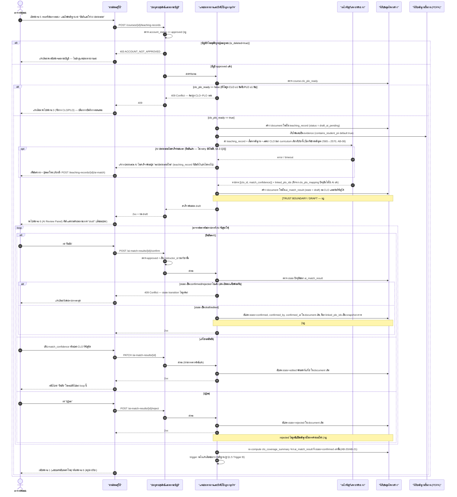
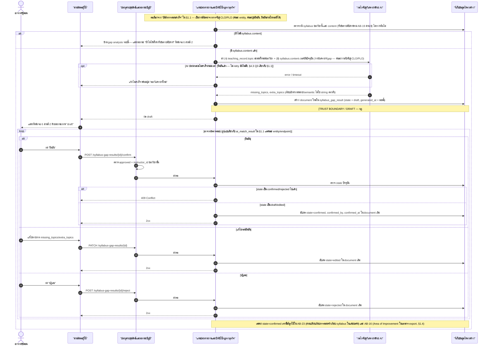
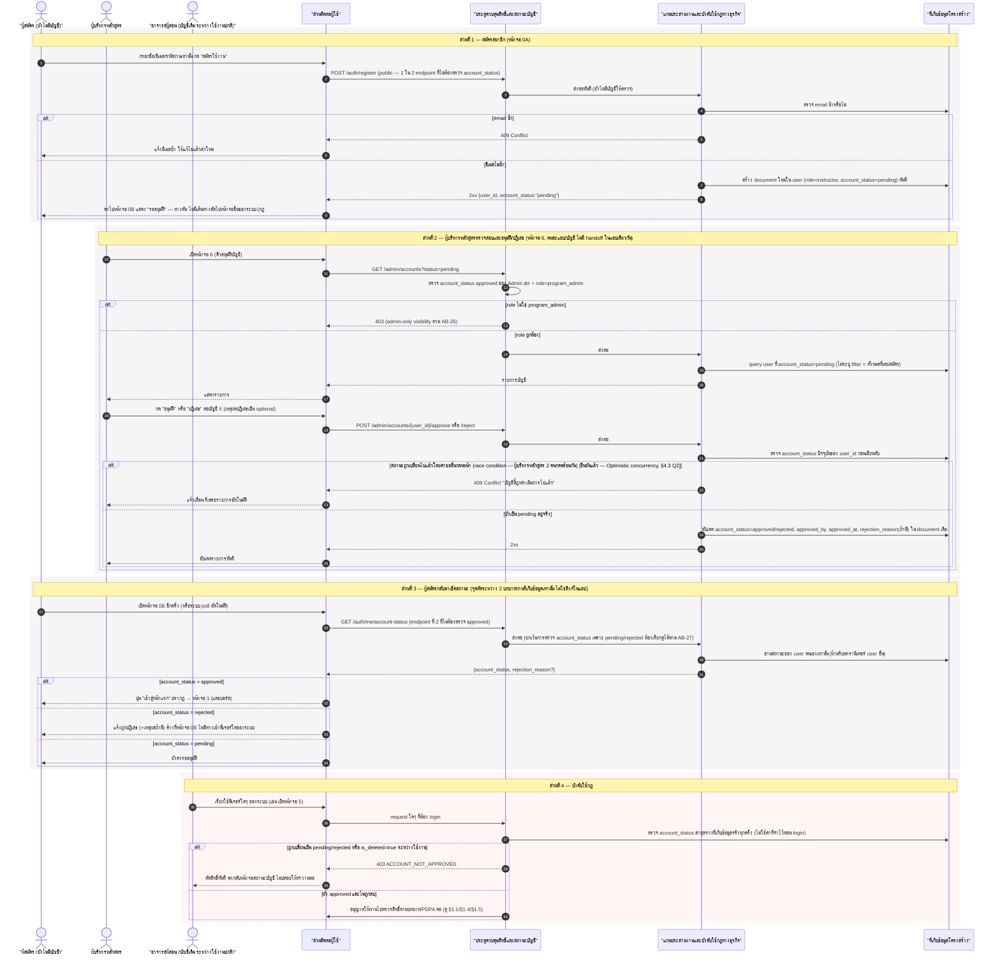
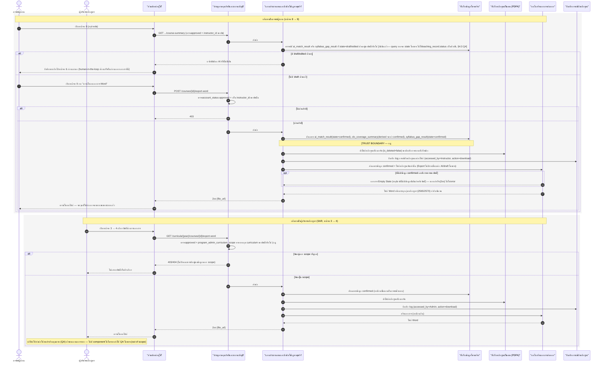
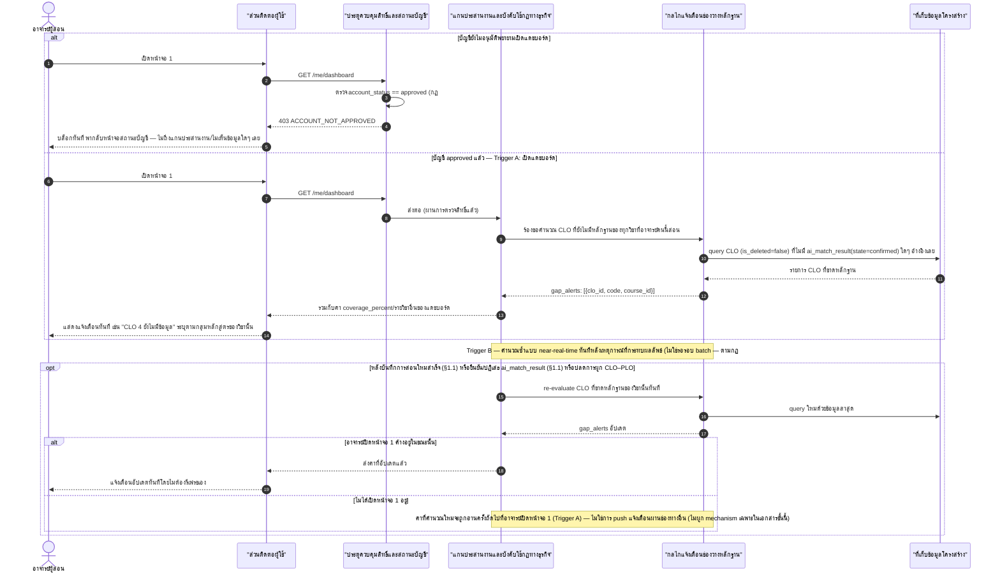
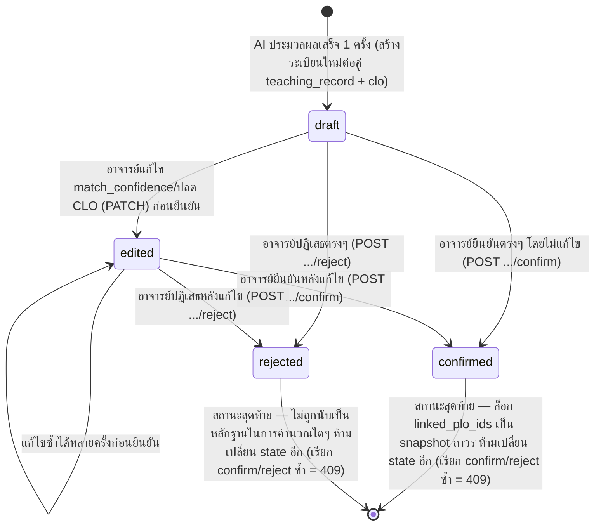
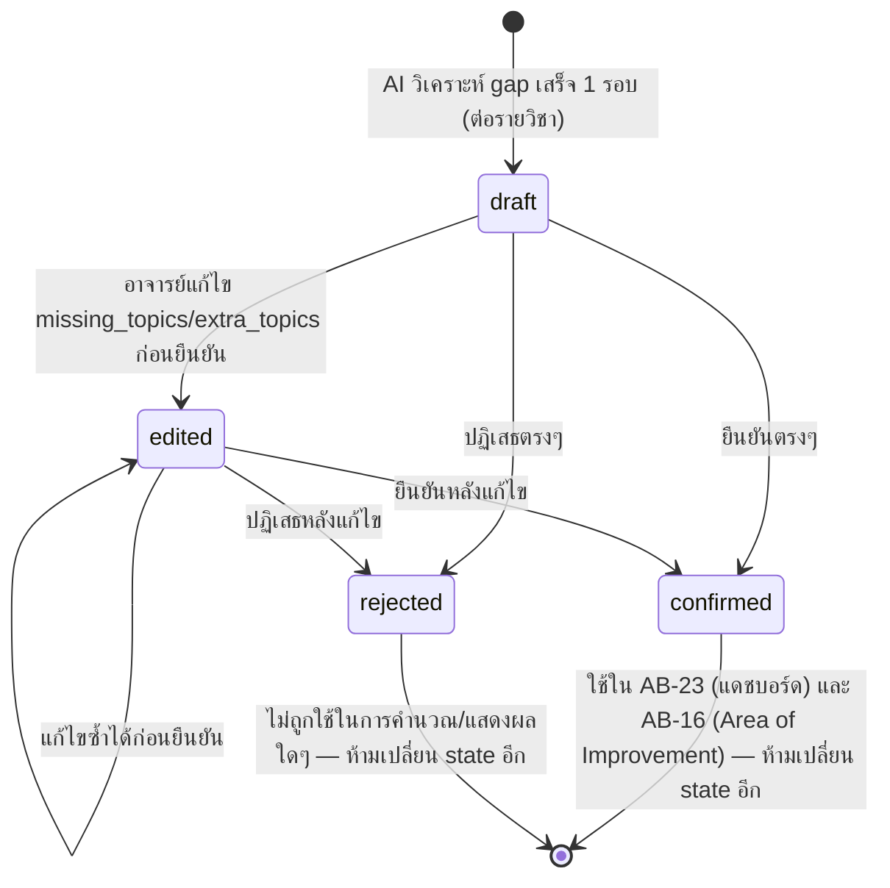
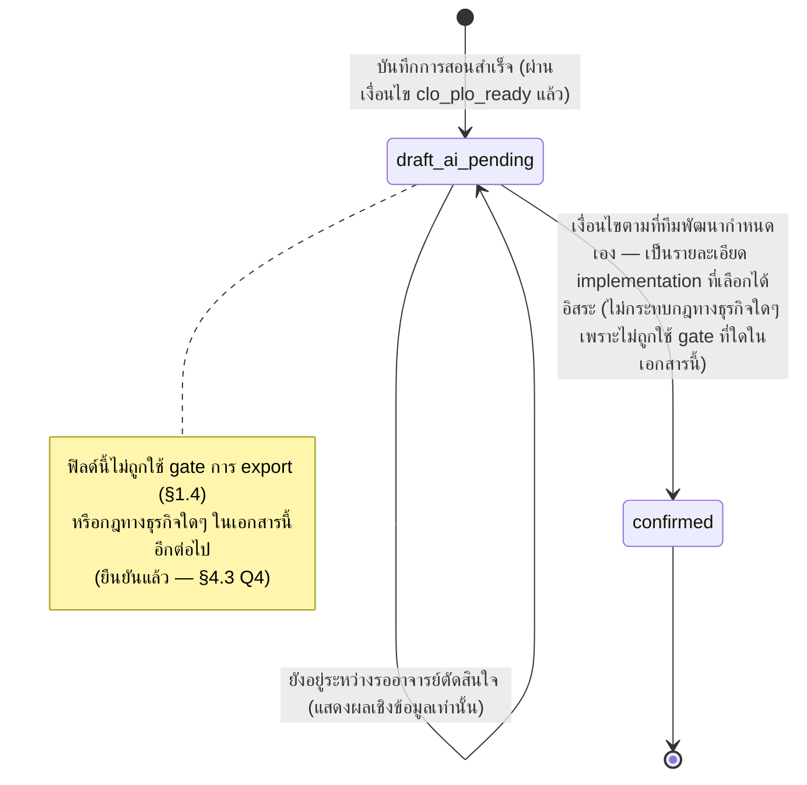
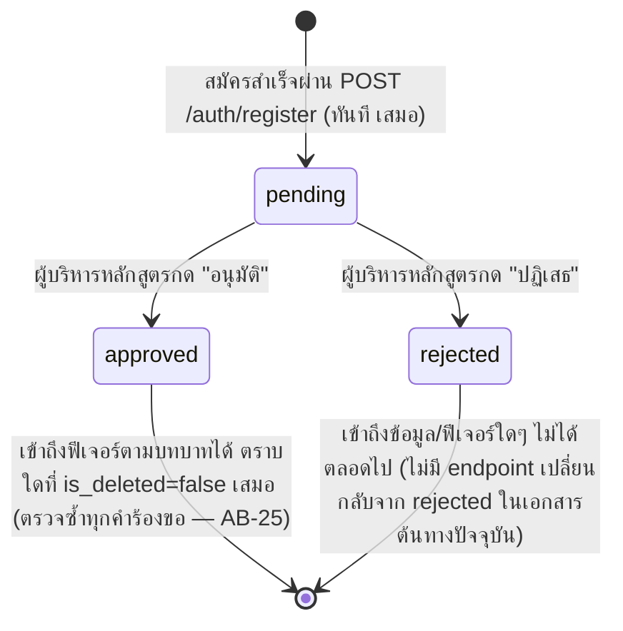

# Detailed Design (Conceptual): ระบบติดตามความสอดคล้อง CLO/PLO (ALIGN)

เอกสารนี้เป็น**ชั้นแนวคิดที่ละเอียดกว่า** [[align-high-level-architecture|align-high-level-architecture]] (ซึ่งบอกแค่ "มี component อะไรบ้าง ข้อมูลไหลยังไงในภาพกว้าง") และละเอียดกว่า [[align-api-schema-design|align-api-schema-design]] (ซึ่งบอกแค่ "มี entity/endpoint อะไรบ้าง") — เอกสารนี้ตอบคำถาม **"ทีละขั้นตอน เกิดอะไรขึ้นบ้าง ใครเรียกใคร ถ้าพลาดจะเกิดอะไรขึ้น"** โดยลง sequence (Mermaid `sequenceDiagram`) และวงจรสถานะ (Mermaid `stateDiagram-v2`) ของ scenario หลักทั้งหมด — ตั้งใจ**ไม่ผูกมัดกับ technical stack ใดๆ** เช่นเดียวกับเอกสารสองฉบับข้างต้น (ไม่มีชื่อภาษาโปรแกรม, framework, database engine, message queue, cloud provider)

**ความสัมพันธ์กับเอกสารอื่น**:
- [[align-high-level-architecture|align-high-level-architecture]] — เป็นแหล่งชื่อ **logical component** ที่เอกสารนี้ใช้เป็น participant ใน sequence diagram ทุกตัว (ไม่คิดชื่อใหม่)
- [[align-api-schema-design|align-api-schema-design]] — เป็นแหล่งชื่อ **entity/field/state/endpoint** ที่เอกสารนี้อ้างอิงตรงเป๊ะ (เช่น `ai_match_result.state`, `POST /ai-match-results/{id}/confirm`)
- [[align-technical-design|align-technical-design]] §4 (แนวทาง AI Matching และ Gap Analysis) — เป็นฐาน input/output/state contract ของกลไก AI ที่เอกสารนี้แตกเป็น sequence step ที่ละเอียดกว่า ไม่ขัดแย้งกัน
- [[../01-prototypes/align-user-journey|align-user-journey]] และ [[../01-prototypes/align-navigation-flow|align-navigation-flow]] — เป็นฐานของลำดับเหตุการณ์/หมายเลขหน้าจอที่ sequence diagram ทุกอันอ้างอิงตรงๆ ไม่ได้แต่ง flow ใหม่

---

## 0. Legend — Participant/Actor ที่ใช้ร่วมกันทุก Sequence Diagram

ชื่อด้านล่างตรงกับ**ชื่อ logical component เป๊ะ**ตาม [[align-high-level-architecture#2-logical-components|align-high-level-architecture §2]] เพื่อไม่ให้เกิดชื่อใหม่ที่ขัดกัน:

| Alias ในไดอะแกรม | ชื่อเต็ม (ตรงกับ high-level-architecture) |
|---|---|
| `Instructor` / `Admin` / `Applicant` | อาจารย์ผู้สอน / ผู้บริหารหลักสูตร / ผู้สมัคร (ยังไม่มีบัญชี) — actor ที่มี login จริงมีแค่ 2 บทบาทแรก |
| `UI` | ส่วนติดต่อผู้ใช้ (User-Facing Interface) — untrusted, ไม่ตัดสินใจเอง |
| `Gate` | ประตูควบคุมสิทธิ์และสถานะบัญชี (Access Gate) — trust boundary หลัก |
| `Core` | แกนประสานงานและบังคับใช้กฎทางธุรกิจ (Core Orchestration) |
| `AI` | กลไกจับคู่/วิเคราะห์ด้วย AI (AI Matching & Gap-Analysis Engine) — 1 component ที่ทำ 2 งานอิสระจากกัน (จับคู่ CLO/PLO และวิเคราะห์ gap) |
| `DB` | ที่เก็บข้อมูลโครงสร้าง (Structured Data Store) |
| `Evid` | ที่เก็บหลักฐาน/ชิ้นงานควบคุมสิทธิ์ตาม PDPA (Access-Controlled Evidence Repository) |
| `GapNotify` | กลไกแจ้งเตือนช่องว่างหลักฐาน (Gap Notification Mechanism) — อ่านอย่างเดียว |
| `Export` | กลไกสร้างเอกสารส่งออก (Document Export Generator) |
| `AuditLog` | บันทึกการเข้าถึงหลักฐาน (Access Audit Log) |

ทุกไดอะแกรมใช้ `autonumber` เพื่อให้อ้างอิง step ได้ง่าย แต่ตารางบังคับใช้กฎในแต่ละหัวข้อจะอ้างอิงด้วย**คำอธิบายขั้นตอน**แทนเลข step ตรงๆ (กันความคลาดเคลื่อนถ้ามีการแก้ไขไดอะแกรมภายหลัง)

---

## 1. Sequence Flows

### 1.1 บันทึกการสอน → AI จับคู่ CLO/PLO → อาจารย์ยืนยัน/แก้ไข/ปฏิเสธ

อ้างอิง: [[align-high-level-architecture#31-บันทึกการสอน-→-ai-จับคู่-cloplo-→-อาจารย์ยืนยันแก้ไขปฏิเสธ|align-high-level-architecture §3.1]], journey แถว "ระหว่างเทอม — หลังสอนแต่ละคาบ", navigation-flow เส้นทาง `5 → 6 → 1`

**จุดบังคับใช้กฎทางธุรกิจในลำดับนี้**

| ขั้นตอน | กฎที่บังคับใช้ | รายละเอียด |
|---|---|---|
| ตรวจ `account_status == approved` ก่อนเข้าสู่แกนประสานงาน | กฎ #6 | เกิดที่ **ประตูควบคุมสิทธิ์** ก่อนแตะ business logic ใดๆ ทั้งสิ้น — ไม่ใช่แค่ตอน login |
| ตรวจ `course.clo_plo_ready` ก่อนสร้าง document ใหม่ใน `teaching_record` | กฎ #1 | บังคับที่ฝั่งระบบ (แกนประสานงาน) เสมอ ไม่ใช่เชื่อปุ่ม UI ที่ disable ไว้ฝั่งเดียว |
| เขียน `ai_match_result` เป็น `state=draft` เท่านั้นหลัง AI คืนผล | กฎ #3 (ข้อบังคับที่พลาดไม่ได้ที่สุด) | ไม่มีเส้นทางใดที่ AI เขียนตรงเป็น `confirmed` ได้ |
| `POST /ai-match-results/{id}/confirm` เปลี่ยน state → `confirmed` | กฎ #3 | จุดเดียวในทั้งระบบที่ผล AI กลายเป็นข้อมูลจริง ต้องมาจากคำสั่งอาจารย์ผู้สอนวิชานั้นเท่านั้น |
| เก็บไฟล์แนบผ่าน **ที่เก็บหลักฐาน/ชิ้นงาน (PDPA)** แทนที่จะให้ UI เขียนตรง | กฎ #5 | ทุกการเข้าถึงไฟล์ในภายหลังต้องผ่านแกนประสานงานตรวจสิทธิ์ก่อนเสมอ |
| `re-compute clo_coverage_summary` อ่านเฉพาะ `state=confirmed` | กฎ #3, #4 | ค่าที่แสดงในแดชบอร์ดสืบทอดความน่าเชื่อถือจากค่าที่ยืนยันแล้วเท่านั้น |

---

### 1.2 วิเคราะห์ Gap เทียบ Course Syllabus (แยกจาก CLO/PLO matching)

อ้างอิง: [[align-high-level-architecture#32-วิเคราะห์-gap-เทียบ-course-syllabus-แยกจาก-cloplo-matching|align-high-level-architecture §3.2]], `align-technical-design.md` §4.3, AB-19/AB-22/AB-23

**จุดบังคับใช้กฎทางธุรกิจในลำดับนี้**

| ขั้นตอน | กฎที่บังคับใช้ | รายละเอียด |
|---|---|---|
| ผลจาก AI เขียนเป็น `syllabus_gap_result.state=draft` เท่านั้น | กฎ #3 | เช่นเดียวกับ `ai_match_result` — คนละ entity แต่หลักการเดียวกัน |
| แยกกล่อง/ปุ่มยืนยันจากผลจับคู่ CLO/PLO ส่วนที่ 1 อย่างชัดเจน | กฎ #3 (ความชัดเจนของ human-in-the-loop) | อาจารย์ต้องแยกแยะได้ว่ากำลังยืนยัน "อะไร" — ไม่ปนกันจนกดยืนยันผิดรายการ |
| `POST /syllabus-gap-results/{id}/confirm` | กฎ #3 | จุดเดียวที่ผลวิเคราะห์ gap กลายเป็นข้อมูลจริงที่ใช้ในแดชบอร์ด/เอกสารได้ |
| ใช้เฉพาะ `state=confirmed` ใน AB-23/AB-16 | กฎ #3, #4 | ห้าม component ปลายทางอ่าน draft |

---

### 1.3 สมัครสมาชิก → รออนุมัติ → ผู้บริหารหลักสูตรอนุมัติ/ปฏิเสธ (E6)

อ้างอิง: [[align-high-level-architecture#33-สมัครสมาชิก-→-รออนุมัติ-→-ผู้บริหารหลักสูตรอนุมัติปฏิเสธ-e6|align-high-level-architecture §3.3]], journey "ก่อนเริ่มใช้งาน — สมัครและรออนุมัติบัญชี" / "ต้นปีการศึกษา — อนุมัติบัญชีอาจารย์ผู้สอนใหม่", navigation-flow หัวข้อ 0 และ 3

**จุดบังคับใช้กฎทางธุรกิจในลำดับนี้**

| ขั้นตอน | กฎที่บังคับใช้ | รายละเอียด |
|---|---|---|
| `POST /auth/register` สร้างบัญชีด้วย `account_status=pending` เสมอ | กฎ #6 | ไม่มีเส้นทางใดที่สมัครแล้วได้ `approved` ทันที |
| ไม่ออก token/สิทธิ์ใดๆ หลังสมัครสำเร็จ | กฎ #6 | หน้าจอ 0B เป็นทางตันโดยเจตนา |
| `GET /admin/accounts` และ approve/reject ตรวจ `role=program_admin` เท่านั้น | admin-only visibility (AB-26) | อาจารย์ผู้สอนเรียก endpoint นี้ต้องได้ 403 |
| ตรวจ `account_status` ปัจจุบันก่อนเขียนทับตอน approve/reject | กฎ #6 + ความถูกต้องของข้อมูล | ป้องกันเขียนทับสถานะที่มีคนดำเนินการไปแล้ว (ดู Q2) |
| `GET /auth/me/account-status` ยกเว้นการตรวจ `approved` | AB-27 | 1 ใน 2 endpoint พิเศษที่บัญชี pending/rejected ต้องเรียกได้ |
| ตรวจ `account_status`/`is_deleted` ซ้ำทุกคำร้องขอหลัง approved | กฎ #6 (AB-25) | ไม่ใช่ตรวจครั้งเดียวตอน login — ถูกเปลี่ยนสถานะระหว่างใช้งานต้องตัดสิทธิ์ทันที |

---

### 1.4 ออกเอกสาร Word ที่อ้างอิงเฉพาะข้อมูลยืนยันแล้ว

อ้างอิง: [[align-high-level-architecture#34-ออกเอกสาร-word-ที่อ้างอิงเฉพาะข้อมูลยืนยันแล้ว|align-high-level-architecture §3.4]], journey "ปลายภาคการศึกษา — จัดทำหลักฐานประกันคุณภาพ/มคอ." และ "ปลายภาค/ปลายปี — จัดทำ SAR", navigation-flow เส้นทาง `8→9` และ `3→4`

**จุดบังคับใช้กฎทางธุรกิจในลำดับนี้**

| ขั้นตอน | กฎที่บังคับใช้ | รายละเอียด |
|---|---|---|
| ตรวจ draft ค้างก่อนเปิดหน้าจอ 9 | กฎ #3 | บังคับให้ human-in-the-loop เสร็จสิ้นก่อนออกเอกสารได้ (ตรวจจาก `ai_match_result`/`syllabus_gap_result.state` โดยตรงเสมอ ไม่ใช้ `teaching_record.status` — ยืนยันแล้วตาม §4.3 Q4) |
| Core ดึงเฉพาะ `state=confirmed` ส่งให้ Export | กฎ #3, #4 | Export ไม่มีทางเชื่อมต่อ AI/draft โดยตรงตามสถาปัตยกรรม |
| ดึงไฟล์หลักฐานเฉพาะที่แนบจริง (`is_deleted=false`) | กฎ #4 | ห้ามสร้างข้อมูลอ้างอิงที่ไม่มีไฟล์จริงรองรับ |
| เขียน `evidence_access_log` ทุกครั้งที่อ้างอิง/แนบหลักฐาน | กฎ #5 | ตรวจสอบย้อนหลังได้ตาม PDPA |
| ตรวจ `program_admin_curriculum_scope` ก่อนตอบฝั่งผู้บริหารหลักสูตร | กฎ #5 | จำกัดสิทธิ์เฉพาะหลักสูตรที่ดูแล |
| ไม่มี component ในระบบส่งไฟล์ให้ QA โดยตรง | Out of Scope | QA รับไฟล์นอกระบบเท่านั้น |

---

### 1.5 การแจ้งเตือน CLO ที่ยังไม่มีหลักฐาน (Gap Notification Mechanism)

อ้างอิง: [[align-high-level-architecture#2-logical-components|align-high-level-architecture §2]] (แถวกลไกแจ้งเตือนช่องว่างหลักฐาน), AB-12, กฎทางธุรกิจ #2

**จุดบังคับใช้กฎทางธุรกิจในลำดับนี้**

| ขั้นตอน | กฎที่บังคับใช้ | รายละเอียด |
|---|---|---|
| ตรวจ `account_status` ก่อนคำนวณ gap ใดๆ | กฎ #6 | บัญชีไม่อนุมัติเห็นข้อมูลอะไรไม่ได้เลย รวมถึงการแจ้งเตือน |
| คำนวณแบบ near-real-time ทุกครั้งที่เปิดแดชบอร์ด/มีเหตุการณ์เกี่ยวข้อง | กฎ #2 | ห้ามเป็น batch job รายวัน — ต้อง "ทันที" ตามสเปค |
| นับเฉพาะ CLO ที่ `is_deleted=false` และไม่มี `ai_match_result(state=confirmed)` | กฎ #2, #3 | ไม่นับ draft เป็น "มีหลักฐานแล้ว" |
| `GapNotify` เป็น component อ่านอย่างเดียว | ความสอดคล้องสถาปัตยกรรม | ไม่มีสิทธิ์เขียนข้อมูลใดๆ |

---

## 2. State Machine

### 2.1 `ai_match_result.state`

### 2.2 `syllabus_gap_result.state`

รูปแบบเดียวกับ `ai_match_result` (2.1) แต่คนละ entity/endpoint (§1.2) — คงไว้เป็นไดอะแกรมแยกเพื่อย้ำว่าเป็นวงจรสถานะอิสระจากกันจริง (ยืนยัน/ปฏิเสธแยกกันได้อิสระ):

### 2.3 `teaching_record.status` — ข้อมูลเสริมเชิงแสดงผล ไม่ใช่ตัวบังคับกฎทางธุรกิจใดๆ ในเอกสารนี้อีกต่อไป

**[ยืนยันแล้ว, §4.3 Q4]** ผู้ใช้เลือกไม่ใช้ฟิลด์นี้เป็นตัวเช็ค "มี draft ค้างหรือไม่" ที่จุดใดในระบบ — ทุกจุดที่ต้องเช็คสถานะ human-in-the-loop (เช่น §1.4 ก่อนออกเอกสาร Word) ต้อง**query สดจาก `ai_match_result.state`/`syllabus_gap_result.state` โดยตรงเสมอ** ไม่อ้างอิงฟิลด์นี้ — `teaching_record.status` จึงเหลือบทบาทเป็น**ข้อมูลเสริมเชิงแสดงผลเท่านั้น** (เช่น badge สรุปในหน้ารายการบันทึกการสอน) ไม่กระทบความถูกต้องของการบังคับใช้กฎ #3/#4 ที่จุดใดเลย เพราะการ gate จริงไม่ได้พึ่งฟิลด์นี้ (ตัดสินใจแล้ว — ไม่ใช้แนวทาง A/B เดิมที่เคยเสนอไว้เป็นตัวเช็ค gate)

### 2.4 `user.account_status`

> **หมายเหตุ cross-cutting**: `is_deleted` (soft-delete ตาม [[align-api-schema-design#51-soft-delete-หรือ-hard-delete|align-api-schema-design §5.1]]) เป็นฟิลด์แยกจาก `account_status` โดยสิ้นเชิง — ถ้า `is_deleted=true` บัญชีถูกปฏิเสธการ login ทันทีไม่ว่า `account_status` จะเป็นค่าใดก็ตาม (ดู §1.3 ส่วนที่ 4)

---

## 3. จุดบังคับใช้กฎทางธุรกิจต่อ Sequence — ตารางรวม (Cross-Reference)

| กฎทางธุรกิจ | Sequence ที่บังคับใช้ | จุดบังคับใช้หลัก |
|---|---|---|
| #1 ผูก CLO–PLO ก่อนบันทึกการสอน | §1.1 | Core ตรวจ `course.clo_plo_ready` ก่อนสร้าง document ใหม่ใน `teaching_record` ทุกครั้ง (409 ถ้าไม่ครบ) |
| #2 แจ้งเตือน CLO ไม่มีหลักฐานทันที | §1.5 | คำนวณ near-real-time ทุกครั้งที่เปิดแดชบอร์ด (Trigger A) หรือมีเหตุการณ์เกี่ยวข้อง (Trigger B) — ไม่ใช่ batch job |
| #3 AI เป็นค่าตั้งต้น ไม่ใช่ค่าบังคับ | §1.1, §1.2 | ผล AI ทุกงาน (จับคู่ CLO/PLO และวิเคราะห์ gap) เขียนเป็น `state=draft` เสมอ ต้องรอคำสั่งยืนยันจากอาจารย์เท่านั้นจึงเปลี่ยนเป็น `confirmed` |
| #4 เอกสารส่งออกอ้างอิงหลักฐานจริงเท่านั้น | §1.4 | Export อ่านเฉพาะข้อมูล `state=confirmed` + ไฟล์หลักฐานที่แนบจริง ไม่มีทางเชื่อมต่อ draft/AI โดยตรง |
| #5 PDPA — จำกัดสิทธิ์เข้าถึงข้อมูลส่วนบุคคล | §1.4 | ตรวจ `instructor_id`/`program_admin_curriculum_scope` ก่อน return ไฟล์หลักฐานเสมอ + เขียน `evidence_access_log` ทุกครั้งที่เข้าถึงสำเร็จ |
| #6 บัญชีต้องผ่านการอนุมัติก่อนเสมอ | §1.1, §1.3, §1.4, §1.5 | ประตูควบคุมสิทธิ์ตรวจ `account_status=='approved'` + `is_deleted==false` ก่อนทุก endpoint ที่ต้อง login (ยกเว้น `POST /auth/register`, `GET /auth/me/account-status`) — ตรวจซ้ำทุกคำร้องขอ ไม่ใช่ครั้งเดียวตอน login |
| Out of Scope — QA ไม่ใช่ user | §1.4 | ไม่มี component ใดส่งไฟล์ให้ QA โดยตรง — ผู้บริหารหลักสูตรส่งต่อเองนอกระบบเสมอ |
| Cross-cutting — แยกกลุ่มหลักสูตร 2565/2570 | §1.1 (AB-08), §1.4 | Core ส่งเฉพาะ CLO ของ curriculum เดียวกับวิชานั้นให้ AI, ตรวจ `program_admin_curriculum_scope` ก่อนตอบ export ระดับหลักสูตร |

---

## 4. รายละเอียดอื่นที่จำเป็น

### 4.1 ลำดับการ validate ข้อมูลตอนบันทึกการสอน (§1.1) แบบละเอียด

ลำดับการตรวจที่ **แกนประสานงาน** ต้องทำก่อนเขียน `teaching_record` จริง (ทุกข้อบังคับที่ฝั่งระบบ ไม่ใช่แค่ UI):

1. `account_status == 'approved'` และ `is_deleted == false` ของผู้เรียก (กฎ #6) — ทำที่ **ประตูควบคุมสิทธิ์** ก่อนถึง Core เสมอ
2. ผู้เรียกเป็น `role='instructor'` และ `instructor_id` ของ `course` นั้นตรงกับผู้เรียก (ไม่ใช่ผู้บริหารหลักสูตรหรืออาจารย์ท่านอื่น)
3. `course.clo_plo_ready == true` (กฎ #1)
4. ฟิลด์บังคับของ `teaching_record` ครบ: `topic` (ไม่ว่าง), `week_no` (จำนวนเต็ม), `taught_at` (ไม่เป็นวันที่ในอนาคต — ตาม `align-api-schema-design.md` §3.7)
5. มีไฟล์หลักฐานแนบอย่างน้อย 1 ไฟล์ (ตาม AB-05) ก่อนกด "บันทึกและให้ AI ประมวลผล" จริง
6. จึงสร้าง document ใหม่ใน `teaching_record` (status=`draft_ai_pending`) และไฟล์เข้า **ที่เก็บหลักฐาน** ในขั้นตอนเดียวกัน (ไม่ใช่แยกทำสองคำร้องที่อาจไม่สำเร็จพร้อมกัน — รายละเอียดว่า transaction นี้ atomic แค่ไหนเป็นการตัดสินใจเชิง implementation ที่ไม่ผูกในเอกสารชั้นนี้)

### 4.2 Concurrency ที่กระทบกฎทางธุรกิจ

| สถานการณ์ | ผลกระทบต่อกฎทางธุรกิจ | แนวทางที่ใช้ในเอกสารนี้ |
|---|---|---|
| อาจารย์เปิดหน้าจอ 6 สองแท็บพร้อมกัน แล้วกด "ยืนยัน"/"ปฏิเสธ" ซ้ำรายการเดียวกัน | เสี่ยงเขียนทับ state ที่ terminal แล้ว (กฎ #3) | ตรวจ state ปัจจุบันก่อนอัปเดตเสมอ — ถ้าไม่ใช่ `draft`/`edited` แล้ว ตอบ 409 Conflict (ดู §1.1, §1.2) |
| ผู้บริหารหลักสูตร 2 คนกด "อนุมัติ"/"ปฏิเสธ" บัญชีเดียวกันพร้อมกัน | เสี่ยงสถานะบัญชีขัดแย้งกัน/เขียนทับกันโดยไม่รู้ตัว (กฎ #6) | **[ยืนยันแล้ว — §4.3 Q2]** Optimistic concurrency — ตรวจ `account_status` ปัจจุบันก่อนเขียนทับเสมอ คำขอที่มาถึงทีหลังได้ 409 Conflict (ดูไดอะแกรม §1.3) |
| soft-delete `plo`/`clo` ระหว่างที่มีอาจารย์กำลังบันทึกการสอนอยู่พอดี | อาจทำให้ `course.clo_plo_ready` กลับเป็น `false` ระหว่างที่อาจารย์กรอกฟอร์มอยู่ | Core ต้อง re-evaluate `clo_plo_ready` **ที่จุดตรวจจริงตอนสร้าง document ใหม่** (§4.1 ข้อ 3) ไม่ใช่เชื่อค่าที่ UI cache ไว้ตอนโหลดหน้าจอ — ถ้าเพิ่งกลายเป็น `false` ระหว่างนั้น ต้องตอบ 409 เหมือนกรณีปกติ (ตรงกับที่ `align-api-schema-design.md` §3.2/§3.4 ระบุว่าต้อง re-evaluate ทันทีหลัง soft-delete) |

### 4.3 ประเด็นที่เคยเป็นคำถามเปิด — สถานะ: ยืนยันแล้วทั้ง 4 ข้อ

> **หมายเหตุกระบวนการ**: เครื่องมือ `AskUserQuestion` ไม่พร้อมใช้งานในบริบท subagent นี้ (เช่นเดียวกับที่ agent ก่อนหน้ารายงานไว้) จึงเขียนคำถามพร้อม 3 ทางเลือก + ข้อดี/ข้อเสียไว้ในเอกสารรุ่นก่อนหน้าแทนการถามตรง ตามแนวทางเดียวกับ [[align-api-schema-design#5-ประเด็นที่เคยเป็นคำถามเปิด|align-api-schema-design §5]] และ [[align-technical-design|align-technical-design]] §4 — **ผู้ใช้ได้ตอบกลับและยืนยันแล้วทั้ง 4 ข้อ** (เลือกตัวเลือกที่ใช้เป็นค่าตั้งต้นในไดอะแกรมไว้แล้วทั้งหมด) ตารางข้อดี/ข้อเสียยังคงเก็บไว้เป็นบันทึกเหตุผลประกอบการตัดสินใจ (decision log) ไม่ลบทิ้ง — sequence/state diagram ในหัวข้อ 1/2 ได้ปรับข้อความกำกับให้ตรงกับการตัดสินใจนี้ครบทุกจุดแล้ว

#### Q1 — การเรียกกลไก AI (จับคู่ CLO/PLO และวิเคราะห์ gap) เป็นแบบ synchronous หรือ asynchronous — **[ยืนยันแล้ว: แนวทาง A]**

**บริบท**: `align-high-level-architecture.md` §4.3 ระบุไว้แล้วว่ายังไม่ฟันธงเรื่องนี้ แต่ sequence diagram (§1.1/§1.2) ต้องเลือกรูปแบบการส่งข้อความให้ชัดเจนจึงจะวาดได้

| แนวทาง | ข้อดี | ข้อเสีย |
|---|---|---|
| **A. Synchronous — Core เรียก AI แล้วรอผลก่อนตอบคำร้อง "บันทึกการสอน" กลับไป** (ใช้ในไดอะแกรม §1.1/§1.2 เป็นค่าตั้งต้น) | Sequence ตรงไปตรงมาที่สุด, ตรงกับ UX ที่ยืนยันแล้วว่าอาจารย์เห็นหน้าจอ 6 "ทันที" หลังกด บันทึก; ไม่ต้องมี endpoint สถานะงานเพิ่ม | ถ้า AI ประมวลผลช้า คำร้อง "บันทึกการสอน" จะค้างรอนาน/เสี่ยง timeout; รองรับการใช้งานพร้อมกันหลายคนได้แย่กว่า |
| **B. Asynchronous พร้อม client polling — บันทึก teaching_record สำเร็จและตอบกลับทันที ส่วนผล AI ประมวลผลเบื้องหลังแล้วให้ UI polling สถานะจนกว่าจะพร้อม** | คำร้องบันทึกตอบเร็วเสมอ; ทนทานต่อ AI ที่ประมวลผลช้าได้ดีกว่า | ต้องมี endpoint สถานะงานเพิ่ม (ยังไม่มีใน `align-api-schema-design.md`); ต้องออกแบบสถานะ "กำลังประมวลผล" ที่หน้าจอ 6 เพิ่ม ซึ่งต่างจากที่ prototype ปัจจุบันแสดงผลทันที |
| C. Asynchronous พร้อมแจ้งเตือนภายหลัง — บันทึกสำเร็จแล้วอาจารย์ทำงานอื่นต่อได้เลย ระบบแจ้งเตือนแยกต่างหากเมื่อผล AI พร้อม | อาจารย์ไม่ต้องรอหน้าจอค้างเลย | ขัดกับ flow ที่ prototype ยืนยันแล้วว่าหน้าจอ 5→6 ต่อเนื่องกันทันที (ต้องแก้ prototype ถ้าเลือกทางนี้); เพิ่มความซับซ้อนของกลไกแจ้งเตือนอีกชุดหนึ่ง |

**ผลการตัดสินใจ**: ผู้ใช้เลือก **แนวทาง A — Synchronous** ตรงกับที่ใช้วาดไดอะแกรม §1.1/§1.2 ไว้แล้ว (Core เรียก `AI` แบบ request/response เดียวจบ ไม่มีการ poll สถานะงานแยก) — ยืนยันเป็นพฤติกรรมจริงของระบบ

#### Q2 — การจัดการ race condition เมื่อผู้บริหารหลักสูตร 2 คนอนุมัติ/ปฏิเสธบัญชีเดียวกันพร้อมกัน — **[ยืนยันแล้ว: แนวทาง A]**

**บริบท**: ระบบอนุญาตหลายบัญชี `program_admin` ได้ (ไม่ได้ระบุว่ามีคนเดียว) — ยังไม่มีเอกสารต้นทางใดระบุพฤติกรรมเมื่อสองคำขอชนกัน

| แนวทาง | ข้อดี | ข้อเสีย |
|---|---|---|
| **A. Optimistic concurrency — ตรวจ state ปัจจุบันก่อนเขียนทับ คำขอที่มาทีหลังได้ 409 Conflict** (ใช้ในไดอะแกรม §1.3 เป็นค่าตั้งต้น) | สอดคล้องกับ pattern 409 ที่ใช้กับ `ai_match_result`/`syllabus_gap_result` อยู่แล้ว; implement ง่าย ไม่ต้องมี lock | ผู้บริหารหลักสูตรคนที่สองอาจงงว่าทำไมกดไม่ได้ ถ้า UI ไม่รีเฟรชสถานะให้ทันที |
| **B. Last-write-wins — คำขอที่มาทีหลังเขียนทับคำขอก่อนหน้าเสมอ** | ไม่ต้องเช็ค state ก่อนเขียน, code ง่ายที่สุด | เสี่ยงให้บัญชีที่ถูกปฏิเสธแล้วกลับเป็นอนุมัติโดยไม่ตั้งใจ (หรือกลับกัน) โดยไม่มีการแจ้งเตือนใคร ขัดกับความรอบคอบที่กฎ #6 ต้องการ |
| C. Pessimistic lock — บัญชีที่มีคนเปิดพิจารณาอยู่ถูก "ล็อก" ชั่วคราว คนอื่นเห็นสถานะ "กำลังถูกตรวจสอบโดย [ชื่อ]" จนกว่าจะปล่อย | ป้องกันการชนกันได้เต็มรูปแบบ ไม่มีทางเขียนทับกันเลย | ซับซ้อนเกินความจำเป็นสำหรับปริมาณคำขอที่คาดว่าน้อย (สาขาเดียว); ต้องออกแบบ timeout ปลดล็อกกรณีลืมปิดหน้าจอ |

**ผลการตัดสินใจ**: ผู้ใช้เลือก **แนวทาง A — Optimistic concurrency** ตรงกับที่ใช้วาดไดอะแกรม §1.3 ไว้แล้ว (ตรวจ `account_status` ปัจจุบันก่อนเขียนทับ คำขอที่มาทีหลังได้ 409 Conflict) — ยืนยันเป็นพฤติกรรมจริงของระบบ

#### Q3 — นโยบาย retry เมื่อกลไก AI ประมวลผลไม่สำเร็จ/หมดเวลา — **[ยืนยันแล้ว: แนวทาง A]**

**บริบท**: `align-technical-design.md` §4 ไม่ได้ระบุพฤติกรรมเมื่อ AI Service ล้มเหลว — sequence §1.1/§1.2 มี `opt` block ที่ต้องเลือกพฤติกรรมให้ชัด

| แนวทาง | ข้อดี | ข้อเสีย |
|---|---|---|
| **A. ไม่ retry อัตโนมัติ — พยายามครั้งเดียว ล้มเหลวแล้วแจ้งอาจารย์ทันทีพร้อมปุ่ม "ลองใหม่" ให้กดเอง** (ใช้ในไดอะแกรม §1.1/§1.2 เป็นค่าตั้งต้น) | เรียบง่ายที่สุด; อาจารย์ควบคุมจังหวะเอง ไม่เสียเวลารอ retry อัตโนมัติที่อาจไม่สำเร็จซ้ำ | ต้องให้อาจารย์กดเองทุกครั้งที่ AI ล้มเหลวชั่วคราว (transient error) เพิ่มความรำคาญเล็กน้อย |
| **B. Retry อัตโนมัติจำนวนจำกัด (เช่น สูงสุด 2 ครั้ง) ก่อนค่อยแจ้งล้มเหลวพร้อมปุ่มลองใหม่** | รองรับ transient error ได้เองโดยไม่ต้องให้อาจารย์ทำอะไร | เพิ่มเวลารอก่อนรู้ผลว่าล้มเหลวจริง; ต้องกำหนดพารามิเตอร์จำนวนครั้ง/ช่วงเวลาระหว่าง retry ซึ่งเป็นรายละเอียดที่ยังไม่มีคำตอบ |
| C. เข้าคิวงานเบื้องหลัง retry ต่อเนื่องจนสำเร็จ (หรือจนพ้นเวลาที่กำหนด เช่น 24 ชม. แล้วถือว่าล้มเหลว) แจ้งอาจารย์แบบ asynchronous เมื่อสำเร็จ/หมดเวลา | ทนทานต่อ AI Service ล่มเป็นเวลานานที่สุด อาจารย์ไม่ต้องเฝ้ารอ | ขัดกับ UX ที่ต้องเห็นผลทันทีตาม prototype (เชื่อมโยงกับ Q1 ตัวเลือก C ที่มีข้อเสียเดียวกัน); เพิ่มความซับซ้อนของระบบติดตามงานเบื้องหลัง |

**ผลการตัดสินใจ**: ผู้ใช้เลือก **แนวทาง A — ไม่ retry อัตโนมัติ + ปุ่มลองใหม่** ตรงกับที่ใช้วาดไดอะแกรม §1.1/§1.2 ไว้แล้ว (`opt` block แสดงข้อความล้มเหลว + ปุ่ม "ลองประมวลผล/วิเคราะห์ใหม่" ให้อาจารย์กดเอง ไม่มี auto-retry ใดๆ ซ่อนอยู่เบื้องหลัง) — ยืนยันเป็นพฤติกรรมจริงของระบบ

#### Q4 — เงื่อนไขที่ทำให้ `teaching_record.status` เปลี่ยนจาก `draft_ai_pending` เป็น `confirmed` — **[ยืนยันแล้ว: แนวทาง C]**

**บริบท**: `align-api-schema-design.md` §3.7 ระบุว่า "เปลี่ยนเป็น `confirmed` เมื่ออาจารย์ยืนยัน `ai_match_result` ที่เกี่ยวข้องอย่างน้อย 1 รายการ (หรือยืนยันครบตาม policy ที่ทีมพัฒนากำหนด)" — ยังไม่ฟันธง และกระทบโดยตรงต่อ §1.4 ขั้นตอน "ตรวจว่ามี draft ค้างหรือไม่ก่อน export"

| แนวทาง | ข้อดี | ข้อเสีย |
|---|---|---|
| **A. เปลี่ยนเป็น confirmed ทันทีที่มีอย่างน้อย 1 รายการ `ai_match_result` ถูกยืนยันแล้ว** | Implement ง่ายที่สุด; สะท้อนความคืบหน้าเร็ว | อาจสื่อผิดว่าบันทึกนี้ "เสร็จสมบูรณ์" ทั้งที่ยังมี CLO อื่นค้างเป็น draft — เสี่ยงให้ §1.4 ปล่อยผ่านการ export ทั้งที่ยังมี draft ค้างจริง ถ้าใช้ฟิลด์นี้เป็นตัวเช็คเพียงอย่างเดียว |
| **B. เปลี่ยนเป็น confirmed ก็ต่อเมื่อทุกรายการ `ai_match_result` ของบันทึกนั้นถูกยืนยัน/ปฏิเสธครบ (ไม่มี draft/edited เหลือ)** | ความหมายตรงไปตรงมา ใช้เช็ค "จบ human-in-the-loop แล้ว" ได้จากฟิลด์เดียว ตรงกับที่ §1.4 ต้องการเช็ค | บันทึกที่มีหลาย CLO จับคู่มาให้จะค้างที่ `draft_ai_pending` นานกว่าถ้าอาจารย์ยืนยันทีละรายการไม่ครบทันที |
| **C. ไม่ใช้ `teaching_record.status` เป็นตัวเช็ค "มี draft ค้างหรือไม่" เลย — §1.4 query `ai_match_result`/`syllabus_gap_result` ที่ state='draft'/'edited' ของวิชานั้นตรงๆ ทุกครั้ง** | ไม่ต้องกังวลเรื่อง sync สถานะสองที่ให้ตรงกันเสมอ ลดความเสี่ยงข้อมูลไม่ตรงกัน | ต้อง query เพิ่มทุกครั้งที่เช็ค (แทนอ่านฟิลด์เดียว); `teaching_record.status` ที่มีอยู่ในสคีมาเดิมจะกลายเป็นแค่ metadata ที่ไม่ได้ใช้ gate การ export จริง |

**ผลการตัดสินใจ**: ผู้ใช้เลือก **แนวทาง C — ไม่ใช้ `teaching_record.status` เป็นตัวเช็คอีกต่อไป** — §1.4 (และทุกจุดที่ต้องเช็ค "มี draft ค้างหรือไม่") query สดจาก `ai_match_result.state`/`syllabus_gap_result.state` โดยตรงเสมอ ไม่อ้างอิงฟิลด์นี้ (ตรงกับที่ใช้วาดไดอะแกรม §1.4 ไว้แล้ว) — **ผลกระทบต่อ state machine**: `teaching_record.status` (§2.3) จึงเหลือบทบาทเป็น**ข้อมูลเสริมเชิงแสดงผลเท่านั้น ไม่ใช่ตัวบังคับกฎทางธุรกิจใดๆ ในเอกสารนี้อีกต่อไป** — เงื่อนไขที่แน่นอนว่าฟิลด์นี้ควรเปลี่ยนเป็น `confirmed` เมื่อไร (ตัวเลือก A หรือ B เดิมข้างต้น) จึงไม่ใช่คำถามที่บล็อกการออกแบบใดๆ อีกต่อไป เป็นรายละเอียด implementation ที่ทีมพัฒนาเลือกได้อิสระโดยไม่กระทบความถูกต้องของกฎ #3/#4 — ดู §2.3 ที่ปรับปรุงตามการตัดสินใจนี้แล้ว

---

เชื่อมโยง: [[align-high-level-architecture|align-high-level-architecture]] · [[align-api-schema-design|align-api-schema-design]] · [[align-technical-design|align-technical-design]] · [[../01-prototypes/align-user-journey|align-user-journey]] · [[../01-prototypes/align-navigation-flow|align-navigation-flow]] · [[../../01-requirements/01-spec/requirement-align|requirement-align]] · [[../../01-requirements/02-plan/product-backlog|product-backlog]]

ส่งต่อไปวางแผนการทดสอบใน [[../../03-testing/01-test-plan/index|01-test-plan]] (ทดสอบว่าแต่ละ sequence/state ทำงานตามที่ออกแบบไว้จริง โดยเฉพาะ error/edge-case path และจุดบังคับใช้กฎทางธุรกิจในหัวข้อ 3)
